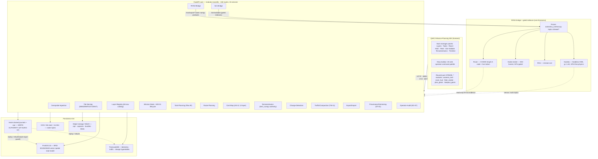

# STEWIE — Lunar Mission-Control Geospatial Intelligence Platform

**Final design deliverable · 2026-07-06**
**Scope:** turn the existing STEWIE stack (`/mnt/projects/stewie/code/`) into a mission-control geospatial intelligence layer for lunar construction autonomy — QGIS-grade map precision, ROS-compatible robot outputs, Godot/Gazebo validation, and a persistent, hash-chained world-state that tracks terrain change.

## Executive summary

**Primary design principle: STEWIE is a lunar *geographic information system for construction autonomy* — QGIS-like precision on the map side, ROS-compatible products on the robot side, Godot/Gazebo as the cross-authority validation tier, and a persistent world-state that records how the terrain changed over time.** Concretely that means four commitments held simultaneously: (1) *maps stay authoritative and metric* — every raster analysis product lives in the polar-stereographic `IAU_2015:30135` frame that already backs every DEM/slope COG (no terrestrial datum, no resample-against-the-DEM), and vector interchange goes out as RFC-7946 GeoJSON in selenographic `IAU_2015:30100`, so a QGIS/QWC2 operator gets click-sampled real values and a portable `.qgz`; (2) *robot outputs speak the frozen contract* — the numpy planner's occupancy/costmap/routed-traverse products lower onto the already-frozen `/stewie/*` topics (`nav_msgs/OccupancyGrid`, `nav_msgs/Path`, `grid_map_msgs/GridMap`) with an explicit selenographic georef anchor, so a Nav2/RViz consumer needs no lunar knowledge while a GIS consumer recovers lunar coordinates; (3) *validation is a cross-authority check, not a replacement sim* — Gazebo owns rigid-body platform dynamics + measured slip (GPU-free, headless), the mass-conserving `tier2_numpy` authority owns the terrain change, and a three-way planned-vs-simulated-vs-executed reconciliation gates the EG-05 live token; (4) *world-state is persistent and provenance-first* — the DT-01 hash-chained journals stay the tamper-evident write authority, with PostGIS/TimescaleDB/COG/object stores added underneath as rebuildable read models for spatial query, telemetry history, tile pyramids, and terrain-change tracking. The design is overwhelmingly *reuse*: ~150 real FastAPI routes, the conserved terramechanics spine, the 65-row layer catalog, the frozen ROS contract, and ~20 pure node-tested `STEWIE_*` render modules are all kept; only five genuinely-missing capabilities are built net-new.

---

## Current System Assessment

The matrix below merges the five grounded current-system assessments (`assess/backend.md`, `assess/frontend.md`, `assess/geospatial.md`, `assess/ros2sim.md`, `assess/terramech.md`, all confirmed by reading source on 2026-07-06). Each row carries a single status (**Existing** / **Partial** / **Missing**), the primary `file:line` evidence, and a recommendation tied to the lunar mission-planning / map-layer / rover-nav / perception / terramechanics / ROS2 / sim frame. Rows are grouped by subsystem; the same physical capability can appear from two layers with different verdicts (e.g. the terramechanics *solver* Existing in the backend but its *spatial renderer* Missing in the frontend) — that split is the actual finding, not a duplicate.

### Unified capability matrix

| Domain | Capability | Status | Where (file:line) | Recommendation (lunar frame) |
|---|---|---|---|---|
| Backend | Geospatial ingestion (DEM/vector at HTTP boundary) | Partial | `dart/dem_import.py:1-35`; `routers/dem.py:97,99` | Real LOLA GeoTIFF ingest exists only as a library/CLI + GeoJSON import; add `POST /ingest/dem`/`/ingest/vector` that CRS-validate to 30135/30100, COG-convert, and register in the catalog so new Artemis/PSR tiles enter the map without a rebuild. |
| Backend | Tile serving (3D Tiles + globe drape + WMS) | Existing | `routers/tiles.py:25`; `routers/layers.py:96`; `routers/ogc.py:56` | Cesium 3D Tiles + reprojected globe PNG + OGC WMS 1.3.0 are real but there is no XYZ/WMTS slippy pyramid; add a rio-tiler pyramid defined in the **lunar polar-stereo** tile-matrix (never WebMercator, which would smear an Earth projection onto the pole). |
| Backend | Layer registry (65-row catalog) | Existing | `routers/world.py:32,44,60`; `layer_catalog.json` | Single source of truth for planning/release eligibility; keep it authoritative and extend the row schema with `crs/format/producer/on_disk_path` so one registry drives both the `.qgz` builder and the backend serve. |
| Backend | Mission-state persistence (JSON + journals) | Existing | `stewie/server/objects.py`; `world_state.py` | Durable, namespaced (`live`/`sandbox`), soft-delete, per-owner cap — no SQL today; project mission metadata + site footprint into PostGIS for "which missions touch this AOI?" spatial search while the JSON blob stays the write path. |
| Backend | Task planning (Plan IR, MO-01/02 lifecycle) | Existing | `routers/plan.py:262,323,340-345` | Orders→routed plan→acceptance→typed Plan IR, fails closed on infeasible legs; only gap is retrievability — persist `PlanResult`+IR by id (`GET /plan/{id}/ir`) so a released lunar dig plan can be re-fetched, diffed, and lowered to ROS. |
| Backend | Route planning (global + local + reactive) | Existing | `routers/nav.py:209,58,161`; `lode/nav_pipeline.py` | Corridor + receding-horizon arc fan + reactive replan on the real DEM, read-only preview; persist the selected route as `SRID 30135` LineString so it serves as MVT, exports, and lowers to `nav_msgs/Path`. |
| Backend | Cost-map generation (AS-11, 12 layers) | Existing | `lode/costmap_layers.py:1-45`; `routers/nav.py:254` | Per-cell cost + impassable mask + blocking-reason grid, each wired to a real source, but surfaced only as per-term breakdowns inside routing; add dedicated `GET /costmap/{site}.tif` + blocking-reason PNG so operators see the traversability surface as a first-class lunar map layer. |
| Backend | Terramechanics calc (tier2_numpy Bekker/Janosi/Terzaghi) | Existing | `packages/stewie-forge/stewie_forge/terramechanics.py:1-40`; `stewie/physics/*` | The mass-conserving conserved authority (load-bearing, not decorative); do NOT touch the solver — bind map layers + a per-cell what-if evaluator onto it, keep `[CALIB]/[UNKNOWN]` tags honest. |
| Backend | Change detection (as-built vs pristine delta) | Partial | `routers/dem.py:156`; `routers/world.py:170`; `lode/regolith_volume.py:1` | As-built delta + provenance class map + before/after volume exist, but no automated observation-vs-observation detector; add `POST /change/detect` diffing two observed twin versions → classified excavation/deposition polygons + a change COG. |
| Backend | Traffic / compaction tracking (per-cell traversal hardening) | **Missing** | `lode/costmap_layers.py:82` (disclaims per-cell traffic) | The only outright-Missing backend capability (TW-11, task #12); build a `TrafficMemory` accumulator that folds telemetry cell-visits → cumulative-load hardening (H-09-safe, not pass-count) → `traffic.compaction` COG, so a repeatedly driven haul road hardens into a firmer future pad. |
| Backend | ROS2 bridge (translation layer + gated rclpy node) | Partial | `stewie/bridge/ros2_bridge.py:1-15,249`; `routers/rc.py:119` | Pure/tested `twist↔command`/`pose↔odom` + live `/odom` ingest through the SF-01 watchdog; the live node is host/container-gated. Add backend→`/stewie/*` egress endpoints that lower already-computed map/costmap/path products (advisory, not command). |
| Backend | Godot/Gazebo sim bridge | Partial | `routers/perception.py:412,57-70`; `ros_evidence.py` | Godot `/render` degrades to 503 when the binary is absent (never fabricated); Gazebo is an evidence surface with no live in-server producer. Add `POST /sim/validate` that replays a released plan through the gated sim tier and returns divergence vs the tier2 authority. |
| Backend | Export / import pipeline (GeoJSON/COG/mission-package) | Existing | `routers/gis_export.py:29,96,201,179` | RFC-7946 GeoJSON in selenographic lon/lat + honest-gated COG + offline mission bundle; add a GeoPackage bundle for QGIS handoff and a `rosbag2` telemetry export for offline lunar-run analysis. |
| Backend | Provenance / versioning (DT-01 hash chain) | Existing | `world_state.py:64`; `routers/twin.py:102,111`; `audit_log.py` | The system's strongest capability — hash-chained WorldTransaction log + versioned twin + TerrainMemory chain; keep it the write authority for every read model, add `GET /world/verify-chain` + a journal→projection rebuild guard. |
| Backend | Operator audit log (events.jsonl + EG-07) | Existing | `services.py:157-178`; `executive.py:333` | Durable fsync'd operator log + tamper-evident executive chain; fix the one durability defect — the EG-07 chain is in-memory per worker (`audit_log.py:15`), persist it to a journal so a restart never loses the release/SIM-run trail. |
| Frontend | Lunar basemap viewer | Existing | frontend A `app.js:12-25,141-158`; B `themes.json`; C `cockpit.js:145-202` | Three live implementations (OL 30135, QWC2 theme, Cesium globe); use A/B (2-D authoritative 30135 map) as the planning base, pull C's globe only when 3-D relief is needed. |
| Frontend | Layer panel (grouped tree) | Existing | C `contents_tree.js`; B `LayerTree` `config.json:153-172` | Lift C's pure `contents_tree.js` (framework-agnostic), driven by the 65-row catalog grouped by `source_class`, with provenance + planning/release eligibility badges per lunar layer. |
| Frontend | DEM / terrain overlays | Existing | A `app.js:40-44`; B `themes.json:188-841`; C `cockpit.js:4033-4048` | Same COGs back all three (Haworth 1 m + 8 LOLA 5 m); reuse as-is, add the work-area inset (`/dem/workarea.png`) for the dig site. |
| Frontend | Slope / illumination / shadow / hazard / traversability overlays | Existing | C `cockpit.js:4065-4112` (`sunQS()`) | The load-bearing lunar differentiator lives only in C — sun-time-parameterized shadow/hazard/PSR rasters; lift the raster-toggle + `sunQS()` pattern so scrubbing the clock re-renders the shadow map (plan a dig for when the target is lit). |
| Frontend | Terramechanics spatial overlay (renderer) | **Missing** | C `phys()` `cockpit.js:3169-3199` (constant readout only) | Backend `/world/terramechanics-layers` serves 11 solver-bound layers but no frontend draws them; build a spatial terramechanics inspector (bearing/sinkage/slip/traction/energy/compaction overlays + click-sample readout of the moduli + attribution). |
| Frontend | Rover state / HUD panel | Existing | C `rover_hud.js:56-96`; A `app.js:958-1075` | Pure `rover_hud.js` (compass/battery/drum/pose/spark) has no ROS dependency — feed it either RT-04 live state or a SIM tick; directly reusable for the lunar rover monitor. |
| Frontend | Task-assignment / fleet panel | Existing | C `fleet_render.js` + `fleet_playback.js` `cockpit.js:1164-1194` | Roster + per-vehicle allocation + makespan + space-time conflict; reuse for multi-rover lunar construction assignment (drag task→vehicle lane, re-plan updates makespan). |
| Frontend | Route / path editor | Existing | A `app.js:562-673`; C `plan_geom.js` `cockpit.js:4476+` | A's author-on-real-map→`/plan`→draw-returned-route loop + C's keep-out draw tools; reuse for authoring lunar traverses + hazard keep-outs on the 30135 map. |
| Frontend | Area-selection tools | Partial | C `keepout_geom.js`; B `config.json:463` | Box/polygon keep-out draw exists but no rubber-band "select this area to plan/analyze"; repurpose `keepout_geom.js` + QWC2 Identify-Region for survey/dig/traffic AOIs. |
| Frontend | Time / history slider | Partial | C `trainer_boards.js` `cockpit.js:1327-1393`; B TimeManager | Only a discrete leg-scrubber exists; build a continuous scrubbable mission-timeline transport whose scrub position drives `/ephemeris` sun re-parameterization of the shadow/hazard rasters. |
| Frontend | Sim-validation panel (ConOps spine) | Existing | C `cockpit.js:805-807,1194-1245,2419-2461`; A `app.js:686-913` | Validate/Rehearse/Release gates + A's non-destructive SIM-run + evidence loop; reuse to surface the three attribution channels (energy residual, mass conservation, EG-05 live token) per lunar run. |
| Frontend | Export / deploy panel | Existing | C `cockpit.js:3922-3953`; A `app.js:661-664`; B `config.json:286-295` | Map-capture PNG composer + report PDF + QWC2 Print/MapExport (PDF/GeoPDF/DXF); reuse across all three, wire "Deploy" to the director-gated Release sign-off + `/rc/plan_ros` ROS hand-off. |
| Frontend | Mission timeline / event log | Existing | C `cockpit.js:2461-2510`; A `app.js:780-807` | Combine C's persisted DT-01 world/exec timeline with A's live per-leg SSE event feed for the lunar mission record. |
| Geospatial | Lunar basemap layer | Existing | `build_project.py:849-863,149-181`; `gis_layers.py:342-348` | South-Polar Basemap COG + LROC WAC/NAC/PSR WMS drapes in the `.qgz` + backend globe drape; reuse (visual context only, non-authoritative frame). |
| Geospatial | DEM / DTM layer | Existing | `build_project.py:550-601`; `map_layers.py:31` | 8× LOLA 5 m + Haworth 1 m SfS COGs (Float32, DEFLATE, 512² tiles, 30135); the measured-terrain authority — reuse verbatim, keep 30135 to avoid resampling against the DEM. |
| Geospatial | Orthomosaic layer | Partial | `build_project.py:150-159`; `layer_catalog.json:20-30` | Only LROC NAC/WAC WMS context drapes, no local ortho COG on disk; persist a local ortho COG when it lands, WMS meanwhile. |
| Geospatial | Slope layer | Existing | `build_project.py:552,572-575`; `gis_layers.py:250-263` | 8× site slope COGs + live slope raster + the only wired value-COG export; generalize `VALUE_RASTER_KINDS` beyond slope to every physics/traffic layer. |
| Geospatial | Illumination / shadow layer | Existing | `gis_layers.py:274-301` (`dart.illumination.horizon_clip`) | Real sun-time live compute but never persisted; add epoch-stamped COG series (`{id}_{met}.tif`) so shadow windows are shareable/diffable for traverse + solar planning. |
| Geospatial | Hazard layer | Existing | `gis_layers.render` hazard `66-78` (`dart.hazard_map.build_hazard_map`) | Real cost map with physics legend; persist to COG + emit a `nav_msgs/OccupancyGrid` twin for Nav2/RViz. |
| Geospatial | Rock / crater detection layer | Partial | `layer_catalog.json:196-217`; `gis_layers.py:66-78` | Declared `observed/belief` + fused into the hazard inset but no dedicated detection store; build a GeoPackage feature layer (diameter/height/confidence + spatial index) fed by perception `RockArray`. |
| Geospatial | Regolith / terramechanics estimate layers | Existing | `layer_catalog.json:284-371`; `terramechanics_spine.py:74-101` | 11 real derived layers bound to the conserved solver, none persisted; extend `/export/cog/{id}` to persist each `physics.*` term as a Float32 COG. |
| Geospatial | Traversability cost-map layer | Existing | `layer_catalog.json:240-283`; `terramechanics_spine.py:84-85` | Derived from the 12-layer spine, planner routes on it; add a COG (GIS) + `nav_msgs/OccupancyGrid` (ROS/Nav2) egress. |
| Geospatial | Traffic-history layer | Partial | `layer_catalog.json:361-371` (catalog row only); task #12 | Catalog `physics.compaction` declared, layer not built (the TW-11 gap seen from the geospatial side); build per-cell traversal accumulation as an epoch-COG series folded into the DT-01 run chain. |
| Geospatial | Compaction / hardening layer | Partial | `terramechanics_spine.py:83`; TerrainMemory | Mass-conserving per-cell physics real, no persisted compaction raster; export ρ/Δbearing COG from the TerrainMemory `.npz`. |
| Geospatial | Excavation-change layer | Partial | `routers/dem.py:156`; `map_layers.py:75-86` | Δz delta + volume exist; persist a Δz COG + change-polygon GeoPackage/GeoJSON so the map shows the site as the mission left it. |
| Geospatial | Mission zones layer | Partial | `build_project.py:630-736`; `map_layers.py:89-98` | 8 site footprints in the `.qgz`; the Artemis-III 13-candidate-region polygons are a deferred row — add them via the registry flag. |
| Geospatial | Task polygon layers | Existing | `layer_catalog.json:438-525`; `routers/gis_export.py:29` | 8 `design.*` layers (cut/fill/berm/pad/road/trench/stockpile/sinter) authored in the cockpit + exported; add a GeoPackage typed store alongside the Plan-IR authority. |
| Geospatial | Rover path layers | Existing | `layer_catalog.json:372-415`; `routers/gis_export.py:29` | Routed traverse in GeoJSON; add the executed-track GeoPackage (vector/time) with fused-vs-dead-reckon uncertainty + lower the planned path to `nav_msgs/Path`. |
| Geospatial | ROS occupancy grid layer | Partial | `layer_catalog.json:537-547`; `stewie/interop/gridmap_geotiff.py:32,51-68` | `GridMap ↔ GeoTIFF` interop exists [BA-06] but no served egress; wire the export (GeoTIFF on disk ⇄ OccupancyGrid/GridMap on the wire). |
| Geospatial | Sim-validation output layers | Partial | `layer_catalog.json:669-723` (`runtime.*`, `evidence.rehearsal_divergence`) | Evidence bundles exist but are not surfaced as GIS layers; rasterize per-cell constraint fields → GeoTIFF → serve through the existing `/layers/raster` pipeline. |
| ROS2/Sim | Map export (DEM → `/stewie/map/dem`) | Partial | `autonomy_contract.py:133` (contract-only); `gis_export.py:29` | Backend GeoJSON/COG real; the `grid_map_msgs/GridMap` DEM topic is contract-defined with no publisher — lower the numpy DEM + a latched `MapMeta` georef anchor. |
| ROS2/Sim | Occupancy-grid export (ROS) | **Missing** | `autonomy_contract.py:134`; `stewie_mapping/node.py:15,80-91` | MappingCore keeps an internal numpy occupancy layer but publishes nothing; add `POST /ros/export/occupancy` lowering hazard/keepout → `nav_msgs/OccupancyGrid` (data already exists, no SLAM stack needed). |
| ROS2/Sim | Cost-map export (ROS `/stewie/costmap`) | **Missing** | `autonomy_contract.py:136`; `stewie_planning/node.py:1-28` (skeleton) | Planning node is an empty skeleton; collapse the 12 FORGE cost layers → one 0-100 `OccupancyGrid` + a `blocking_reason` GridMap layer (preserve the reason grid). |
| ROS2/Sim | Waypoint export (`nav_msgs/Path`) | **Missing** | `autonomy_contract.py:137`; `mission.rviz:37` (display bound, nothing publishes) | The routed traverse exists only as backend GeoJSON + Plan-IR; wire the `validation_driver`/export to publish `/stewie/plan/path` (lights up the existing RViz "Planned Path" display). |
| ROS2/Sim | Task messages (`WorkGoal`) | Partial | `stewie_msgs/msg/WorkGoal.msg`; `autonomy_contract.py:139` | Typed + frozen but no node publishes the tape; reuse `WorkGoal`, add `StewieTask`/`TaskArray` for the scheduled tape with plan-id + posture + expected cost. |
| ROS2/Sim | Rover pose / state (ROS) | Existing | `rover_executive_node.py:96,201-217`; `gz_bridge.yaml:36-40` | Graph A live `/odom`+`/tf`+`/rover/state` on a numpy FlightModel over real LOLA Haworth; reuse as the read-only evidence feed, persist to TimescaleDB. |
| ROS2/Sim | Perception detections (ROS) | Partial | `gz_bridge.yaml:52-138`; `stewie_perception/node.py:1-28` (skeleton) | Raw Gazebo sensor frames (8-cam rig + gpu_lidar points) flow; detection products (`RockArray`/`FeatureTrackArray`) have no detector — treat as read-only evidence + mapping input, truth-denial preserved. |
| ROS2/Sim | Terrain-change updates (ROS) | Partial | `autonomy_contract.py:135`; `executive.py:153-191` | Real terrain-change lives in the backend SIM world model (TerrainMemory), not on the wire; add `TerrainDelta.msg` (mass-conserving Δz + provenance + world_version) + the `/twin/resync` return loop. |
| ROS2/Sim | Excavation-progress (ROS) | Partial | `autonomy_contract.py:135` (unwired); `executive.py:194-321` | Progress exists as backend SIM leg accounting; expose as `ExcavationProgress.msg` action feedback on a new `ExcavateAction`. |
| ROS2/Sim | Mission-execution feedback (ROS) | Partial | `rover_executive_node.py:98,251-255`; `executive.py:346-372` | Graph A `/rover/leg` + backend SSE replay real; add `MissionFeedback.msg` + a `MissionExecuteAction` as the ROS analog of `/executive/run` + its SSE. |
| ROS2/Sim | Gazebo physics validation | Existing | `stewie_lunar.sdf:9-11`; `Dockerfile.gazebo:42-46`; `haworth_heightfield.sdf:24-25` | Real gz-sim8 ODE at lunar gravity, headless smoke green (no GPU needed for physics); parameterize the Haworth heightfield per-mission and use it as the GPU-free platform-dynamics validation tier. |
| ROS2/Sim | Godot viz | Partial | `compose.yml:171`; `Dockerfile.godot` (GPU + binary gated) | 503-honest without binary+GPU; keep as an optional operator review surface, never validation compute. |
| ROS2/Sim | RViz | Existing | `Dockerfile.gazebo:18`; `mission.rviz:24-102` | 14 displays bound to the frozen contract topics, container-gated; lights up for map/costmap/path as soon as the export publishers are wired. |
| ROS2/Sim | Read-only rosbridge evidence path (RT-04) | Existing | `rosbridge_collector.py:177-189`; `rosbridge_feeder.py:10` | Read-only by construction (zero publishers, command ops refused); extend the feeder's subscription set additively to mirror the map/costmap/path overlay — command-denial invariant untouched. |
| Terramech | Regolith bearing strength | Existing | `packages/stewie-forge/stewie_forge/bearing.py:36,50,58` | Terzaghi/Vesic closed form (FS=3), unit-tested; add the allowable-bearing kPa raster for structural siting (pads/berms/lander legs), not rover trafficability. |
| Terramech | Sinkage risk | Existing | `terramechanics.py:172,191`; `costmap_layers.py:79` | Bekker pressure-sinkage with burial cap; add the sinkage-mm raster + a "Lyasko reduced-g OFF → under-predicted" confidence flag (honest, never silently defaulted). |
| Terramech | Slip risk (planner costmap) | Partial | `slip.py:38,50,116`; `costmap_layers.py:94` (`tan(slope)` proxy) | The real Janosi solver runs in the drive loop, but the planner `_slip` costmap is a `tan(slope)` proxy; promote `_slip` to the real `slip_for_demand` over the grid so planned slip equals driven slip. |
| Terramech | Slope stability | Existing | `stability.py:24`; `sandpile.py`; `planner_acceptance.py:139` | Three real models (tip-over SSA, repose/avalanche CA, as-built repose gate); add the slope-hazard band raster + over-steep as-built vector overlay. |
| Terramech | Excavation resistance | Partial | `ipex_specs.py:159,167`; `terramechanics_spine.py:82` | Dig cost is a constant 4151 J/kg + a `compaction_resistance` proxy, no first-principles cutting force; add a McKyes/Reece draft-force term reconciled against the spec band (keep the counter-rotating-drum cancellation caveat). |
| Terramech | Wheel/track traffic effects | Existing | `rover.four_wheel_pass:150`; `drive.py:100` | Real 4-wheel rut carving + skid-steer scrub + CG load transfer for the wheeled IPEx; tracks not modeled (out of scope for the wheeled rover — flag deferred, don't fabricate). |
| Terramech | Drum/bucket interaction zones | Existing | `column_state.py:239,254`; `excavation_state.py:38-56` | Mass-conserving drum cut/dump + FDC drum-fill mass inference; geometry/state-accurate — add the §1.5 draft term as a zone-stress field (deliberately no net drum reaction). |
| Terramech | Compaction / hardening from repeated traffic | Partial | `terramechanics.py:295`; task #12 | Per-cell physics real but H-09-idempotent for identical passes; build the `TrafficMemory` cycle-count densification (exponential approach to the existing equilibrium) → `Dr` layer + bearing-uplift readout. |
| Terramech | Energy cost per terrain segment | Existing | `lode/autonomy.py:120,133`; `costmap_layers.py:138` | Per-leg nominal vs slip-truth energy, reconciled per run (EG-08); add the J/m raster + model-vs-truth residual readout. |
| Terramech | Dig/dump feasibility | Existing | `lode/planner_acceptance.py`; `physics_scoring.py:53` | Comprehensive realizability + siting acceptance, fails closed on infeasible legs; add a graded feasible/marginal/infeasible vector overlay attributed by binding blocking reason. |

**Merged tally: Existing 40 · Partial 24 · Missing 5.** The five outright-**Missing** capabilities are the concrete build targets: (1) backend traffic/compaction tracking (TW-11), (2) the frontend terramechanics spatial-overlay renderer, and the three ROS egress products — (3) occupancy-grid, (4) cost-map, and (5) waypoint (`nav_msgs/Path`) — all of which lower data the numpy backend already computes onto the frozen contract topics. Everything else is Existing (reuse verbatim) or Partial (a persisted format, a served route, or a thin adapter over a real producer — never new physics or new telemetry).

### What to reuse from current STEWIE (do not rebuild)

- **The `tier2_numpy` conserved terramechanics authority** (`stewie/physics/` + `stewie_forge/terramechanics.py`) — real Bekker/Janosi-Hanamoto/Terzaghi-Vesic, mass-conserving to 3e-16, load-bearing (not decorative), closed-loop, fully attributed. Bind map layers and a what-if evaluator onto it; never move the hot grid into SQL and never invent a dig cutting-force stub.
- **The DT-01 hash-chained provenance journals + TerrainMemory `.npz`** (`world_state.py:64`, `stewie/twin/*`) — the tamper-evident write authority and the system's strongest capability. Keep it the source of truth; PostGIS/TimescaleDB are rebuildable read models projected from it.
- **The ~20 pure, node-tested, CSP-safe `STEWIE_*` render modules** (`rover_hud.js`, `contents_tree.js`, `fleet_render.js`, `plan_geom.js`, `keepout_geom.js`, `regolith_estimate.js`, `trainer_boards.js`, `gantt_downsample.js`, `world_state_html.js`, `terrain_memory_html.js`, …) — framework-agnostic, lift into QWC2 with thin rebinding.
- **The 65-row `layer_catalog.json` registry + `/world/terramechanics-layers` spine** — the single declarative source of truth for what every layer means and whether it may plan/release; extend the row schema, don't fork it.
- **The IAU_2015:30135/30100 COG stack + `/export/geojson` + `/ogc/wms` + `gridmap_geotiff` interop** — the geospatial substrate (9 DEM/slope COGs + basemap, real CRS discipline, no terrestrial datum). Reuse the CRS rule verbatim: raster analysis stays 30135, vector interchange goes 30100.
- **The frozen `autonomy_contract.py` (26 topics, 9 roles, REP-103 frames, QoS classes, truth-denial) + custom `stewie_msgs` + `lower_plan_ir` + the RT-04 read-only collector** — the ROS seam is already frozen; fill it, don't reinvent it.
- **The ConOps Rehearse/Validate/Release spine + `/executive/run` reconciliation (EG-08 energy residual, PH-02 attribution, TM-04 terramechanics comparison) + the EG-05 live token** — the validation surface and its six-precondition gate.
- **The QWC2 lunar-themed IDE shell (Frontend B, live) + Frontend A's author→plan→run-SIM loop over the real backend** — the frontend base; the prior full-React rewrite black-screened, so wrap-don't-rewrite.

---

## System Architecture

The target topology is a **modular monolith + gated sidecars** that preserves everything the assessment found real and adds only the four missing substrates (spatial index, time-series store, tile pyramid, object store) plus the compute that closes the five Missing capabilities. The QWC2 IDE talks to the FastAPI core over HTTP/WMS/WMTS/XYZ/MVT/SSE; the core reads/writes the hash-chained journals (the write authority) and projects into PostGIS (spatial), TimescaleDB (telemetry/traffic/change), the COG/tile store (raster bytes), and object storage (blobs); the ROS2-Bridge and Sim-Bridge services lower already-computed products onto the frozen `/stewie/*` contract topics that feed Gazebo/Godot/RViz and the rover, while live rover evidence and Gazebo sensor/truth return read-only. The eight detailed design sections that follow the diagram specify each seam.



Below are the eight detailed design sections, in order. Each is reproduced in full — every table, schema, ASCII wireframe, DDL, and `.msg` block is preserved — with a one-line lead-in tying it to the mission-control frame.

---

> **Design section 1 of 8 — Frontend Wireframe & Component Hierarchy.** The mission-planning IDE is the operator's window onto the lunar map: it composes the QWC2 GIS shell, the ~20 pure `STEWIE_*` render modules, and Frontend A's author→plan→run-SIM loop into a QGIS-style dockable cockpit. It names every panel's existing source and marks the two genuine build gaps (the spatial terramechanics inspector / TW-11 traffic layer, and the continuous mission-timeline transport).

## Frontend Mission-Planning Wireframe

Scope: the QGIS-inspired mission-planning IDE for STEWIE, built **on the QWC2 base**
(`gis/qwc2/`, frontend B, "proven live at artemis.stewie.space/ide/") and assembled from the
reusable pieces the assessment already inventoried. Every panel below names its **existing source**
(cited to `assess/frontend.md`, `assess/geospatial.md`, `assess/ros2sim.md`, `assess/terramech.md`,
`assess/backend.md`, which carry the underlying `file:line`), and marks the two **genuine gaps** to
build. Nothing here re-invents a capability that already ships.

Design mandate reconciled with the assessment's bottom line (`assess/frontend.md` §"Bottom line"):
- **QWC2 (B)** = the IDE **shell** (OL map engine, IAU_2015 projection stack, plugin registry,
  toolbar/search/bottombar, LayerTree, Identify, Print/MapExport, TimeManager, Measure, Redlining) —
  "professional GIS chrome for free … but zero mission-domain logic."
- **Old cockpit (C)** = the source of the **mission domain**: ~20 pure, node-tested, CSP-safe
  `window.STEWIE_*` render modules that "lift into any host with thin rebinding," plus the
  sun-time hazard/illumination stack, Fleet, ConOps validate/rehearse/release, trainer scrubber.
- **OL viewer (A)** = the source of the **live author→plan→run-SIM loop** on the authoritative
  30135 map (real `/plan`, `/executive/run`, SSE event stream).

The IDE = **QWC2 shell + C's `STEWIE_*` modules re-registered as QWC2 plugins + A's plan/run/SSE
wiring**, over the real FastAPI backend (`assess/backend.md`, ~150 routes).

---

### 1. Dockable IDE layout — the window-model fork

**The fork (called out explicitly):** QWC2's native window model is **not** a multi-edge dock
manager. QWC2 renders one active task into a right-hand `SideBar` slide-out at a time, with floating
`ResizeableWindow`s for Identify/Attribute-table/Print. That is a mobile-first GIS shell, not the
QGIS `QDockWidget` model where LayerTree (left) + rover HUD (right) + timeline (bottom) are all
persistently visible at once.

**Recommendation (lead):** introduce a **self-hosted, CSP-safe dock-manager region** (rc-dock,
React, MIT, bundleable — matches STEWIE's no-CDN discipline noted for frontend A in
`assess/frontend.md`, "self-hosted (no CDN)") that **replaces QWC2's single-active SideBar** but
keeps everything else QWC2 (map, projections `config.json:61-72`, toolbar, search, BottomBar, and
the stock plugins as *panel contents*). Rationale: mission control genuinely needs the Layer tree,
the sun-time shadow map, the rover HUD, and the timeline scrubber **simultaneously** — a single-panel
SideBar structurally cannot do that.

**Alternatives weighed:**
- *Native QWC2 (lowest risk):* keep the single right SideBar; tab-switch between mission panels
  (only one visible). Preserves QWC2 exactly, but loses QGIS-like simultaneity. Fallback if the
  dock-manager surgery is deferred.
- *Full custom React shell (rejected):* throws away the proven-live QWC2 base and the free GIS
  chrome — contradicts the reuse mandate.

Either way the QWC2 **map + projection stack + plugin API + toolbar + search + BottomBar are
preserved**, so the IDE still "builds on QWC2."

**Dock layout (QGIS-inspired; tabs shown as `▸`):**

```
┌──────────────────────────────────────────────────────────────────────────────────────┐
│ ▚ STEWIE  Mission▾  Layers▾  Draw▾  Analyze▾  Validate▾  Export▾        [🔍 search…] ⚙ │  ← QWC2 Toolbar/AppMenu + Search
├──────────────┬───────────────────────────────────────────────────┬─────────────────────┤
│ LEFT DOCK    │                  MAP CANVAS                        │  RIGHT DOCK         │
│ (tabbed)     │        QWC2 OpenLayers map · IAU_2015:30135        │  (tabbed)           │
│              │        South-Polar Stereographic (R=1737400)       │                     │
│ ▸ Layers     │                                                    │ ▸ Rover State       │
│ ▸ Tasks      │   ┌── draw-tool overlay (operator cmds) ──┐        │ ▸ Fleet / Assign    │
│              │   │  ● point  ▭ box  ⬠ polygon  ／ path    │        │ ▸ Sim-Validate      │
│ [contents    │   │  ⭗ circle keep-out  ↻ heading         │        │ ▸ Terramechanics    │
│  tree, 65    │   └───────────────────────────────────────┘        │                     │
│  catalog     │                                                    │ [rover_hud.js       │
│  rows,       │        ☉ sun badge  az137° el8°  (from            │  canvas: compass,   │
│  grouped]    │        timeline scrub → /ephemeris)               │  batt, drums, pose  │
│              │                                                    │  + navplot.js traj] │
├──────────────┴───────────────────────────────────────────────────┴─────────────────────┤
│ BOTTOM DOCK (tabbed):  ▸ Mission Timeline   ▸ Event Log   ▸ Layer Consumption            │
│  [◀◀ ◀ ▮▮ ▶ ▶▶]  T+00:42:15   ☉az137/el8   ├────────●───────────────────────┤  1.0× ⏱ │
│  Gantt: ▐drive▐▐dig▐▐haul▐──▐recharge▐──▐dig▐  (drawGantt + gantt_downsample.js)         │
├──────────────────────────────────────────────────────────────────────────────────────┤
│ cursor  30135 X 12043.6  Y −8891.2 m │ 30100 lon 214.71° lat −86.42° │ elev −1204 m     │  ← QWC2 BottomBar
│ slope 6.3° │ CRS IAU_2015:30135 │ scale 1:5 000                                          │
└──────────────────────────────────────────────────────────────────────────────────────┘
```

Docking rules:
- **Left dock** = read/author *inputs* (what layers exist; what tasks are queued).
- **Right dock** = per-agent *state + validation* (rover, fleet, sim gates, physics readout).
- **Bottom dock** = *time* (timeline transport, event stream, per-layer consumption).
- **Map canvas** = the single authoritative surface; every draw tool writes to a map layer.
- All panels float/tab/resize via the dock manager; the operator saves layouts as workspaces.

---

### 2. Panel-by-panel spec (each panel → reused component + backend route)

#### 2.1 Lunar basemap viewer (map canvas) — REUSE, no build
- **Base:** QWC2 OL map, projections `config.json:61-72`, lunar theme `themes.json:6-52,883-927`,
  `mapCrs`/`defaultDisplayCrs` `themes.json:883-892` (`assess/geospatial.md` §2, §4). CRS authority
  **IAU_2015:30135** projected + **30100** selenographic lon/lat; **no terrestrial datum**
  (`assess/geospatial.md` §4). South-Polar Basemap COG + LROC WAC/NAC/PSR WMS drapes already in the
  theme.
- BottomBar shows both 30135 X/Y and 30100 lon/lat (QWC2 MousePosition, dual CRS).

#### 2.2 Layer panel (LEFT ▸ Layers) — REUSE `contents_tree.js`, driven by the catalog
- **Renderer:** C's pure `contents_tree.js` (257 LOC, framework-agnostic; `assess/frontend.md` §2)
  embedded in a QWC2 plugin. For plain base WMS/COG rows, QWC2's stock `LayerTree`
  (`config.json:153-172`: legend icons, opacity, reorder, compare, import) is used as-is.
- **Grouping = the 65-row catalog** `GET /world/layer-catalog` (`routers/world.py:32`,
  `assess/geospatial.md` §0-B, `assess/backend.md`), grouped by `source_class`:

```
▾ Base            basemap · imagery · DEM/DTM               [prior/measured]  ✅ backed
▾ Terrain         slope · illumination · shadow · incidence · PSR            ✅ (raster PNG)
▾ Hazard          hazard costmap · rocks · negative-obstacles                ✅ / ⚠ belief
▾ Physics (TM)    bearing · sinkage · slip_risk · traction_margin ·          ✅ /world/
                  energy_cost · excavation_resistance · compaction              terramechanics-layers
▾ Traffic         traversability · cost_global · cost_local · backlink ·      ✅ / ★TW-11
                  traffic-history                                             ★ GAP (build)
▾ Mission         waypoints · route_candidates · selected_route · local_traj  ✅ authored
▾ Design          work_zones · cut · fill · berm · pad · road · trench ·      ✅ authored →
                  stockpile · sinter                                          /export/geojson
▾ Robot           telemetry_track · executed_path                            live (RT-04)
▾ Map             occupancy · excavation_state · changed_terrain             ⚠ / ✅ asbuilt
▾ Evidence/Runtime gazebo_truth · rviz_status · godot_capture ·              container-gated
                  rehearsal_divergence · before_after_dem
```
- **Per-row controls:** toggle, opacity, legend swatch (`GET /layers/legend`, values from physics,
  `routers/layers.py:66`), **provenance badge** (prior/measured/derived/observed/belief from the
  catalog `source_class`), and **planning/release eligibility chips** (catalog declares both —
  `assess/geospatial.md` §0-B).
- **Toggling a mission-derived raster** issues `GET /layers/raster/{kind}.png` (dem/slope/hazard/
  illumination/incidence/psr/grid; `routers/plan.py:230`) and adds an OL image layer. **The sun-time
  parameter** on illumination/incidence/psr/hazard comes from the timeline scrubber (§2.9), reusing
  C's `sunQS()` pattern — "the load-bearing mission-planning differentiator" (`assess/frontend.md`
  §4).

#### 2.3 Terrain / DEM overlays — REUSE
- DEM + hillshade already in the theme per site (Haworth 1 m + 8 LOLA 5 m; `assess/geospatial.md`
  §2). Live drape `GET /layers/globe/{kind}.png` + `GET /dem/terrain_grid`, and `GET /dem/workarea.png`
  for the axis-free work-area inset (`assess/backend.md` DEM section). Same COGs back all frontends
  (`stewie/data/gis/cog/`).

#### 2.4 Slope / illumination / shadow / hazard / traversability layers — REUSE (C only) + wire sun
- These are **backend-served, sun-parameterized rasters** and today live only in C
  (`assess/frontend.md` §4; `assess/geospatial.md` §1). Lift the raster-layer + `sunQS()` pattern:
  `illumination`="shadow (mission-time sun)", `incidence`=grazing solar angle, `psr`=permanently
  shadowed, `hazard`=traversability no-go >20° + penalty band + rock obstacles. All are Layer-panel
  toggles; all re-request on timeline scrub.

#### 2.5 Terramechanics layer (RIGHT ▸ Terramechanics) — ★ PARTIAL GAP: spatial renderer to build
- **What exists:** the backend already serves 11 derived physics/traffic layers bound to the real
  conserved solver — `GET /world/terramechanics-layers` (`routers/world.py:60`, `assess/terramech.md`
  §4). C only shows a **Body-constant readout** (`phys()`: g/ρ/cohesion/friction/Bekker moduli) and
  uses `regolith_estimate.js` for per-order feasibility — **it never draws the spatial map**
  (`assess/frontend.md` §5, "MISSING").
- **Build (the real gap):** a **spatial terramechanics inspector** =
  (a) Layer-panel overlays for bearing/sinkage/slip_risk/traction_margin/energy_cost/
      excavation_resistance/compaction (rendered as raster PNGs from the same solver);
  (b) **click-sample readout** — click a cell → the 11 layer values at that point + the sourced
      moduli (K_C=1400 Pa, K_PHI=820000 Pa/m, N=1, φ=37°, cohesion=170 Pa; `assess/terramech.md`
      §1) + physics attribution (`conserves_mass`, `release_eligible`, model_id, calibration flags;
      `assess/terramech.md` §4).
- Honest labels required (per `assess/terramech.md` §2 PROXY/GAP tags): the **planner slip costmap
  is a `tan(slope)` proxy** while the real Janosi solver runs in the drive loop — the panel must
  badge slip_risk accordingly; sinkage is static-only where Lyasko reduced-g is off (under-predicts).
- Reuse: `regolith_estimate.js` for the per-order dig/haul feasibility math.

#### 2.6 Rover state / readout panel (RIGHT ▸ Rover State) — REUSE `rover_hud.js`
- **Renderer:** C's `rover_hud.js` (pure, 206 LOC; `assess/frontend.md` §6): `drawRoverHUD` (azimuth
  compass + battery + front/rear drum weight + pose), `teleSpark` (batt/mass/slip sparkline),
  `teleChip` (per-channel chips). Plus `navplot.js` (fused-vs-dead-reckoning trajectory),
  `nav_stats_html.js`, `scorecard_chips.js`.
- **Feed:** a plain state object — either **live** from the RT-04 read-only rosbridge collector
  (`/odom` pose/heading/speed + `/rover/state` slip/sinkage/slope/SOC/entrapment; Graph A, live on
  the wire per `assess/ros2sim.md` §0,§2,§5 — read-only by construction, no command authority) or a
  **SIM-run tick** from `/executive/run`. `rover_hud.js` has no ROS dependency, so it renders both.
- Multi-rover selector chip row from `GET /fleet` (`routers/fleet.py:48`).
- Optional RT-03 Gazebo camera thumbnail (`/stewie/camera/front_left/jpeg`, llvmpipe render,
  container-gated; `assess/ros2sim.md` §4) as a read-only ``.

#### 2.7 Task-assignment panel (RIGHT ▸ Fleet / Assign) — REUSE `fleet_render.js`
- C Fleet pane: roster + per-vehicle allocation + **makespan** + **space-time conflict**
  (`fleet_render.js` 117 LOC + `fleet_playback.js` multi-rover playback; `assess/frontend.md` §7).
  Driven by `GET /fleet` + the allocation block of `POST /plan` (`PlanResult.vehicles/makespan_s`;
  `assess/backend.md` §b). Role-gated operator+.
- Interaction: drag a task card from LEFT ▸ Tasks onto a vehicle lane → assignment; the makespan bar
  and space-time conflict warnings update from the re-plan.

#### 2.8 Route / path editor (map draw mode) — REUSE A's loop + C's `plan_geom.js`
- **Author flow (A):** place orders on the real map → `POST /plan` → `renderPlan` draws the returned
  route (gold LineString) + haul (blue-dashed) + charger (`assess/frontend.md` §8). Order queue
  add/remove is the LEFT ▸ Tasks panel.
- **Editing (C):** `plan_geom.js` (118 LOC, pure) click-to-place; keep-out draw tools circle/box/
  polygon; pin select/move/delete; adjustable lander safe-haven ring. Waypoints write to
  `mission.waypoints`; the planned traverse writes `mission.selected_route`; export via
  `GET /export/geojson` (`routers/gis_export.py:29`).

#### 2.9 Time / history slider (BOTTOM ▸ Mission Timeline) — ★ GAP: continuous transport to build
- **What exists:** C's **discrete** Trainer leg-scrubber (`trainer_boards.js`, `_TRAINER_STEP` +
  prev/next + range input), mission-time sun via `GET /ephemeris`, and the activity **Gantt**
  (`rover_hud.js:drawGantt` + `gantt_downsample.js`; `assess/frontend.md` §10). QWC2 `TimeManager`
  (`config.json:398-416`) exists but is generic.
- **Build (the real gap):** a **continuous scrubbable transport bar** (play/pause/seek/speed over the
  whole mission), generalizing the discrete leg-scrubber. Backing store = the DT-01 world/exec
  timeline `GET /world/transactions` (`routers/world.py:138`) + per-run SSE
  `GET /executive/run/{id}/stream` (`routers/executive.py:346`).
- **Lunar coupling (the reason this is not a generic transport):** the scrub position drives
  `GET /ephemeris` → sun az/el → **re-parameterizes the illumination/incidence/psr/hazard rasters on
  the map** (the `sunQS()` pattern, §2.4) *and* moves the rover marker along `robot.executed_path`.
  Scrubbing the clock re-renders the shadow map — a genuinely lunar mission-planning feature (plan a
  dig for when the target is lit; check a traverse for when a crater wall shadow crosses it).

#### 2.10 Sim-validation panel (RIGHT ▸ Sim-Validate) — REUSE C ConOps spine + A run loop
- **ConOps spine (C):** Validate (nav/perception/solar sub-views) with **G1/G2 evidence gates**
  (real-sensor ATE, stereo covariance); **Rehearse** candidate-compare (`POST /resync/compare`,
  `rehearse_render.js`); **Release** director-gated sign-off (`POST /executive/release-plan`)
  (`assess/frontend.md` §11).
- **Run loop (A):** `POST /executive/run` + SSE telemetry + `loadEvidence` accuracy/precision bundle
  (executability + physics-attribution + energy-residual; `assess/backend.md` executive section).
  The panel surfaces the three attribution channels minted per run (`assess/terramech.md` §4): energy
  residual (model-vs-sensor-σ), mass conservation, and the EG-05 **live token** (issued only when all
  6 preconditions hold).
- **Sim reality, honestly labeled** (`assess/ros2sim.md` §1, §6): Gazebo physics validation
  (lunar-gravity ODE, 8-cam rig, gpu_lidar, truth-denial) is **container-gated**; the nine
  `stewie_*` autonomy nodes that would publish map/costmap/path/detections are **skeletons** — so
  the panel shows `GET /ros/evidence` (RViz/Gazebo/Godot runnable-profile) as read-only status chips
  and does **not** claim live ROS map/path products that aren't on the wire. Godot render degrades to
  503 when the binary is absent — never fabricated (`assess/backend.md`).

#### 2.11 Export / deploy panel (Export▾ menu → floating window) — REUSE ×3
- QWC2 **Print** (PDF/GeoPDF `config.json:286-295`) + **MapExport** (PNG/DXF 96/300 dpi
  `config.json:210-225`).
- STEWIE data exports: `GET /export/geojson` (RFC-7946, selenographic), `GET /export/cog/{kind}.tif`
  (honest-gated on rasterio via `/export/cog/available`), `GET /gis/mission-package` (self-contained
  offline bundle) (`assess/backend.md` export section, `assess/geospatial.md` §3).
- C's `captureMap` PNG composer (map + captioned legend strip → downloadable PNG) for briefing
  slides; mission-report PDF (A `resp.pdf`).
- **Deploy = the Release sign-off**: `POST /executive/release-plan` (director-gated) freezes the
  command-authority card; `POST /executive/advance` walks MissionIntent DRAFT→RELEASED. **ROS
  hand-off** is `POST /rc/plan_ros` (lower a live mission to ROS2 message-shaped dicts through the
  SF-01 watchdog, operator-gated; `assess/backend.md` RC section, `assess/ros2sim.md` §1). No
  browser→`/cmd_vel` path exists — command authority stays server-side.

#### 2.12 Mission timeline + event log (BOTTOM ▸ Event Log) — REUSE C timeline + A SSE
- **Persisted timeline (C):** DT-01 linked world-state record + execution/world timeline
  `GET /world/transactions`; Terrain-Memory world-state readout via `terrain_memory_html.js` +
  `world_state_html.js` (`assess/frontend.md` §13).
- **Live feed (A):** per-leg SSE `x-ev` lines (leg outcome/detail, watchdog safe, as-built
  acceptance) from `GET /executive/run/{id}/stream`.
- **Layer Consumption tab:** `GET /world/layer-consumption` (`routers/world.py:44`) — which consumer
  (planner/perception/executive) reads which layer; a QGIS-style "who uses this layer" inspector.

---

### 3. Operator command palette — tool → task object → layer written

Draw tools reuse A's cut/fill placement (`app.js:462-510`), C's `plan_geom.js` / `keepout_geom.js` /
`footprint_geom.js`, and QWC2 Redlining/Measure/Identify-Region (`config.json:255-261,460,463`). Each
command lowers to a real backend shape: an **`Order`** `{action, kind, x, y, footprint_m2, depth_m}`
(`schemas.py:11`) inside a `POST /plan` `PlanRequest` (`plan.py:63`), a **keep-out/constraint**, or a
**map annotation**. Coordinates are captured in 30135 and mapped to site-frame via `GET /dem/site_xy`.
Task polygons write the `design.*` layers; on `POST /executive/run` the as-built delta folds into
`map.excavation_state` + TerrainMemory (`assess/geospatial.md` §1; `assess/backend.md` twin section).

| # | Operator command | Tool interaction (draw + params) | Task object (lowered) | Layer(s) written |
|---|---|---|---|---|
| 1 | **Survey this area** | ⬠ polygon (or ▭ box) AOI + `spacing_m`, `sensor` (stereo/lidar), `overlap %` | boustrophedon coverage GoTo set over the polygon (`action:goto,kind:survey`) | `design.work_zones` (AOI) + `mission.route_candidates` (coverage path); perception coverage via `/nav` |
| 2 | **Reorient rover here** | ● point + ↻ drag heading arrow; `heading_deg`, `rover_id` | `action:goto, kind:reorient, x,y, heading_deg` → Plan IR GoTo w/ terminal heading (or operator `POST /rc/command` GoTo through SF-01 watchdog) | `mission.waypoints` (heading waypoint) → on exec `robot.telemetry_track` |
| 3 | **Flatten this area** | ⬠ polygon pad footprint + `target_datum_m` (or auto-mean), `flatness_tol_m` | `action:cut_fill, kind:pad, footprint_m2, target_datum_m` → Plan IR CutHaulFill/grade; as-built flatness acceptance (`planner_acceptance.py`) | `design.pad` (+ balancing `design.cut`/`design.fill`) → on run `map.excavation_state`, as-built delta |
| 4 | **Dig this area to X depth** | ⬠ polygon + depth spinner `depth_m` (−100..0, `schemas.py`), `material_class` | `action:excavate, kind:trench\|cut, footprint_m2, depth_m` → Plan IR Excavate; feasibility via `regolith_estimate.js` + `POST /siteplan/volume`; bearing/slope/drum-supply gates | `design.cut`/`design.trench` → on run `map.excavation_state`, `map.changed_terrain`, volume estimate |
| 5 | **Dump material here** | ● point or ⬠ small polygon (stockpile) + `mass_kg`/`volume`, spoil density | `action:fill\|dump, kind:stockpile, x,y, footprint_m2, mass_kg` → Plan IR CutHaulFill dump (drum `dump_from_inventory` @ RHO_SPOIL); mass-conserved w/ a paired cut, swell 1.2× (`assess/terramech.md` §3.10) | `design.stockpile`/`design.fill` → on run `map.excavation_state` (+delta) |
| 6 | **Create berm here** | ／ polyline centerline + `crest_height_m`, `width_m`, `side_slope` | `action:berm, kind:berm, centerline, height_m, width_m` → Plan IR CutHaulFill to berm profile; acceptance: berm-profile rise + **repose stability θ_r** (`planner_acceptance.py:139`, `assess/terramech.md` §4-b) | `design.berm` (buffered centerline) → on run repose-checked as-built + `map.excavation_state` |
| 7 | **Avoid this region** | ⭗ circle / ▭ box / ⬠ polygon keep-out (C's `dropKeepoutCircle`/`dropBoxKeepout`/`dropPolyKeepout`) + `class:hard\|soft`, `buffer_m` | planner **constraint** (not an Order): `{type:keepout, geometry, class, buffer_m}` → costmap `keepout`/`reservation` mask | `design.work_zones` (keep-out) → `traffic` costmap `keepout` layer; routing avoids it; in GeoJSON export |
| 8 | **Revisit this location** | ● point + schedule; `interval`, `trigger:time\|illum-window\|change` | `action:goto, kind:revisit, x,y, schedule` → recurring GoTo + observation; illumination window from `GET /solar` + `/ephemeris` | `mission.waypoints` (revisit marker) + a **timeline** event; on observation → `map.changed_terrain` diff |
| 9 | **Mark hardened / compacted traffic areas** | ⬠ polygon **or** auto-buffer of `robot.executed_path`; `compaction_threshold` | annotation `{type:annotation, kind:compaction, geometry}` → seeds/accumulates the traversal-compaction layer | ★ **traffic-history (TW-11, BUILD)** + `physics.compaction`; on exec the executed-path buffer auto-increments a per-cell traversal count → hardening curve — **this closes the one outright-Missing capability** (`assess/backend.md`, `assess/terramech.md` §3.8) |
| 10 | **Mark changed terrain after excavation** | auto-generated from `POST /dem/asbuilt` delta **or** ⬠ polygon to flag; `threshold_m` | annotation `{type:annotation, kind:changed_terrain, geometry, delta_m}` from as-built vs pristine | `map.changed_terrain` + `map.excavation_state` (provenance=AS_BUILT) + `evidence.before_after_dem`; folds into the DT-01 world record (`/world/terrain_view`) |

Notes:
- Commands 1-8 are **planner inputs** (author → `POST /plan` → routed traverse + acceptance).
- Commands 9-10 are **world-state annotations** (post-execution) that write the `traffic`/`map`
  observed layers and feed the persistent twin — the "persistent world-state tracking of terrain
  change" the IDE exists to provide.
- **Area-selection gap** (`assess/frontend.md` §9): today only box/poly *keep-out* draw exists; a
  generic rubber-band "select this area to analyze/plan" is repurposed from `keepout_geom.js` +
  QWC2 Identify-Region for commands 1/3/4/9.

---

### 4. Component hierarchy (QWC2 plugins + panels → reused source)

`(stock)` = QWC2 upstream plugin, used as-is · `(NEW)` = new QWC2 plugin wrapping an existing
`STEWIE_*` module or backend route · `★` = a genuine gap to build.

```
QWC2 App (gis/qwc2/, React/Redux, self-hosted, no CDN)          [assess/frontend.md B]
│
├─ TopBar
│   ├─ (stock) AppMenu / Toolbar / Search / HomeButton
│   └─ (stock) Theme switcher → lunar theme (themes.json)
│
├─ MapContainer → ol.Map  (IAU_2015:30135 / 30100)              [assess/geospatial.md §4]
│   ├─ (stock) Measure · Redlining · Identify · Identify-Region · ScaleBar · MousePosition
│   └─ (NEW) StewieDrawToolbar ─ operator command palette (§3)
│         └─ wraps  plan_geom.js · keepout_geom.js · footprint_geom.js · A cut/fill place
│
├─ StewieDockManager  (rc-dock region; replaces single SideBar)  [§1 fork]
│   │
│   ├─ LEFT
│   │   ├─ (NEW) LayersPanel        └ contents_tree.js  ← GET /world/layer-catalog (65 rows)
│   │   │                             + (stock) LayerTree for base WMS/COG
│   │   │                             + GET /layers/legend, /layers/raster/{kind}.png (sun-param)
│   │   └─ (NEW) MissionTasksPanel   └ A order queue + plan_stepper.js  → POST /plan
│   │
│   ├─ RIGHT
│   │   ├─ (NEW) RoverStatePanel     └ rover_hud.js + navplot.js + nav_stats_html.js
│   │   │                              + scorecard_chips.js  ← RT-04 /odom,/rover/state (read-only)
│   │   ├─ (NEW) FleetPanel          └ fleet_render.js + fleet_playback.js  ← GET /fleet + /plan
│   │   ├─ (NEW) SimValidatePanel    └ rehearse_render.js + G1/G2 gates
│   │   │                              ← /resync/compare, /executive/{advance,release-plan,run,run/*/stream}
│   │   │                              + /ros/evidence (read-only status chips)
│   │   └─ (NEW) TerramechPanel  ★    └ regolith_estimate.js + phys() readout
│   │                                  + ★ spatial inspector (click-sample) ← /world/terramechanics-layers
│   │
│   └─ BOTTOM
│       ├─ (NEW) MissionTimeline ★    └ trainer scrubber + drawGantt + gantt_downsample.js
│       │                              + ★ continuous transport bar
│       │                              ← /world/transactions, /executive/run/*/stream, /ephemeris (sun)
│       ├─ (NEW) EventLogPanel        └ A SSE x-ev feed + world_state_html.js + terrain_memory_html.js
│       └─ (NEW) LayerConsumption     ← GET /world/layer-consumption
│
├─ (stock) BottomBar ─ MousePosition (30135 + 30100) · Scale · CRS
│
└─ ExportDeploy (Export▾ → ResizeableWindow)
    ├─ (stock) Print (PDF/GeoPDF) · MapExport (PNG/DXF)
    ├─ (NEW)  /export/geojson · /export/cog/{kind}.tif · /gis/mission-package
    ├─ (NEW)  captureMap PNG composer (C) + mission-report PDF (A)
    └─ (NEW)  Release sign-off  ← POST /executive/release-plan  →  ROS hand-off POST /rc/plan_ros
```

**Reuse tally:** of the ~20 pure `STEWIE_*` modules (`assess/frontend.md` §"Key architecture fact"),
this IDE re-hosts **15+** directly (`contents_tree`, `rover_hud`, `navplot`, `nav_stats_html`,
`scorecard_chips`, `fleet_render`, `fleet_playback`, `rehearse_render`, `regolith_estimate`,
`plan_geom`, `keepout_geom`, `footprint_geom`, `plan_stepper`, `gantt_downsample`,
`world_state_html`, `terrain_memory_html`) with thin QWC2 rebinding, plus QWC2's stock chrome. Only
**two things are genuinely new** — the **spatial terramechanics inspector / traffic-history layer
(TW-11)** and the **continuous mission-timeline transport** — exactly the two gaps the assessment
flagged (`assess/frontend.md` §"Bottom line", `assess/backend.md` §"Biggest gap").

---

### 5. What is built vs reused vs deferred (honest close)

- **Reused as-is:** QWC2 shell + all stock GIS chrome; 15+ `STEWIE_*` render modules; A's
  plan/run/SSE wiring; the whole real backend (~150 routes) incl. sun-parameterized hazard/
  illumination rasters, `/plan`, `/executive/*`, `/fleet`, `/world/*`, `/export/*`, `/twin/*`.
- **Newly built (2 real gaps):** (a) spatial terramechanics inspector + **TW-11 traffic-history
  layer** (backend `/world/terramechanics-layers` already computes the terms — only the renderer +
  the per-cell traversal-hardening accumulation are missing); (b) **continuous scrubbable
  mission-timeline transport** with sun-time re-parameterization coupling. Plus the dock-manager
  region if the QGIS-simultaneity layout is adopted (§1 fork).
- **Deferred / honestly gated (not this UI's job to fake):** live ROS map/costmap/path/detection
  products (the nine `stewie_*` autonomy nodes are skeletons — `assess/ros2sim.md` §3, §6); Gazebo/
  Godot render (container/GPU-gated — `assess/ros2sim.md` §4, `assess/backend.md`); MO-04 live-hardware
  command tier. The IDE **shows these as read-only evidence/status**, never as fabricated live
  layers, matching the codebase's fail-closed / no-stub discipline.

---

> **Design section 2 of 8 — Geospatial / QGIS Layer Model & Recommended Formats.** This is the map-precision spine: it unifies STEWIE's three layer subsystems (the portable `.qgz`, the 65-row catalog registry, and the live-compute backend rasters) into one registry-driven model, specifies the on-disk/wire format for every lunar layer family (COG for metric analysis rasters, epoch-COG for sun-time layers, GeoPackage + GeoJSON for typed features, OccupancyGrid/GridMap/Path for ROS), and holds the CRS discipline (30135 raster analysis, 30100 vector interchange, no terrestrial datum).

## Geospatial / QGIS Layer Model

STEWIE already has three layer subsystems and they are not the same thing (`assess/geospatial.md:10-24`):
**A** the portable QGIS `.qgz` (`gis/build_project.py`, 33 physically-loaded prior/measured-terrain
layers over real COGs), **B** the PRD2 layer catalog (`stewie/server/layer_catalog.json`, 65 declared
rows served `GET /world/layer-catalog`, `routers/world.py:32`), and **C** the live-compute backend
rasters (`gis_layers.py`/`map_layers.py`, RGBA PNG from the real Haworth DEM + conserved solver). The
design job here is *not* a new stack: it is to (1) make catalog **B** the single declarative registry,
(2) teach `build_project.py` **A** to consume that registry instead of hand-listing layers, and (3)
add on-disk **persisted formats** for the derived/observed families that today exist only as ephemeral
live PNG (**C**) or as a contract row with no raster. Everything below reuses the existing CRS
discipline, `set_provenance()` metadata model, `/export/cog`, `/export/geojson`, WMS serve, and the
`gridmap_geotiff` interop; it invents only the 8 genuine gaps flagged in the assessments.

---

### 1. The unified layer registry (extends `layer_catalog.json`, drives `build_project.py`)

Today a catalog row has 9 fields (`id, domain, type, purpose, source_class, planning_eligible,
planning_note, release_execute_eligible, release_execute_note` — confirmed by reading all 65 rows).
That is enough to declare *what* a layer means and *whether* it may plan/release, but not *where its
bytes live*, *what CRS/format*, *how fresh*, or *how uncertain* — all of which `build_project.py`
currently hard-codes per layer via `load_raster()` + `set_provenance(layer, ident, title, source,
command)` (`build_project.py:456-469,529-538`). We lift those implicit facts into the row so one
registry drives both the `.qgz` builder and the backend.

**Extended row schema (superset — existing 9 fields keep their names/semantics):**

| Field | Status | Domain of values | Purpose |
|---|---|---|---|
| `id` | existing | `<domain>.<name>` dotted | stable key; matches `set_provenance` ident (`stewie.terrain.<site>.dem`) |
| `domain` | existing | `base·terrain·hazard·regolith·physics·traffic·map·mission·design·robot·runtime·evidence` (12, unchanged) | tree grouping = `.qgz` parent group + cockpit Contents tree (`contents_tree.js`) |
| `geometry` | **new** | `raster · vector · raster+vector · grid · point_cloud · none` | render primitive (splits the current overloaded `type`) |
| `type` | existing | `raster/DEM · raster · raster/time · vector · vector/mesh · vector/time · costmap · evidence/media …` | semantic subtype (kept for back-compat with the 65 rows) |
| `purpose` | existing | free text | one-line meaning |
| `source_class` | existing | `prior · observed · derived · forecast · belief · live · replay · sim_truth` (+ slashes) | provenance CLASS — drives planning/release gating |
| `crs` | **new** | `IAU_2015:30135` (metric polar-stereo) \| `IAU_2015:30100` (selenographic lon/lat) | the CRS rule §2; raster analysis = 30135, vector interchange = 30100 (`build_project.py:52-53`, MA-01) |
| `format` | **new** | `COG · GeoTIFF · MBTiles · GeoPackage · GeoJSON · OccupancyGrid · nav_msgs/Path · GridMap · costmap_2d · mission-task-JSON · LAZ · WMS` | recommended on-disk / wire format (§4) |
| `producer` | **new** | route or spine-callable ref (e.g. `dart.illumination.horizon_clip`, `lode.costmap_layers`, `TERRA_DERIVED[...]`) | binds the row to REAL code — validated at import like `terramechanics_spine.py:90-93`, so a stale ref fails the build (not a comment) |
| `on_disk_path` | **new** | `data/gis/{cog,vectors,derived,gpkg}/…` or `null` (live-only) | where persisted bytes live; `null` = compute-on-read (subsystem C) |
| `render_target` | **new** | `drape · inspector · both · wire` | §3 — map overlay vs site-inspector panel vs ROS-only |
| `freshness` | **new** | `static · per-plan · per-run · per-tick · epoch(sun)` | recompute policy; `epoch(sun)` = sun-time-parameterized (`sunQS()`, `frontend.md:84`) |
| `provenance` | **new** | `set_provenance` ident \| DT-01 `authority_sha` \| `TerrainMemory` version+chain \| WMS server id | chain handle (reuses `world_state.py:64`, `terrain_memory.py`) |
| `uncertainty` | **new** | `none · sigma_band · confidence_attr · calib_tag[CALIB\|UNKNOWN\|ASSUMPTION]` | how the row exposes error (reuses the honest physics tags, `terramech.md:76-79`) |
| `planning_eligible` + `planning_note` | existing | bool + text | may this feed the planner/costmap |
| `release_execute_eligible` + `release_execute_note` | existing | bool + text | may this back a director release / live command |

**How a layer is declared (one row, then two consumers read it):**

```jsonc
// stewie/server/layer_catalog.json  (single source of truth, gen-checked by LY-01/LY-02)
{ "id": "terrain.illumination", "domain": "terrain",
  "geometry": "raster", "type": "raster/time",
  "purpose": "sun-time shadow fraction for traverse/solar planning",
  "source_class": "forecast/observed",
  "crs": "IAU_2015:30135",
  "format": "COG",                                  // persist the live PNG as an epoch-stamped COG
  "producer": "dart.illumination.horizon_clip",     // import-validated, cannot drift
  "on_disk_path": "data/gis/cog/illum/{site}_{met}.tif",
  "render_target": "both", "freshness": "epoch(sun)",
  "provenance": "stewie.terrain.{site}.illum@{met}",
  "uncertainty": "confidence_attr:horizon_source",
  "planning_eligible": true,  "planning_note": "yes",
  "release_execute_eligible": true, "release_execute_note": "yes if fresh/provenanced" }
```

- **Consumer 1 — `build_project.py` (`.qgz`):** replace the hand-listed `SITES`/`SRC_*` loop
  (`build_project.py:548-601`) with a pass over the registry that loads every row where
  `on_disk_path != null` and `source_class ∈ {prior, observed, derived}` into its `domain` group, using
  `load_raster()` for `geometry=raster`/`crs` and a GeoJSON/GeoPackage provider for `geometry=vector`,
  and calling `set_provenance(layer, row.provenance, row.purpose, row.producer, command=…)` verbatim.
  Rows with `on_disk_path=null` (live-only) are added as WMS layers pointing at `/ogc/wms?layer=<id>`
  (the drape path already proven for the STEWIE `/ogc` dem drape, `build_project.py:166-170`). This
  makes the "deferred ARTEMIS rows" mechanism (`build_project.py:189-262`) just another registry flag,
  not a parallel hand-list.
- **Consumer 2 — backend:** `/world/layer-catalog` serves the rows unchanged; `/layers` filters to
  `render_target ∈ {drape, both}` selectable rasters; a new `/export/cog/{id}.tif` (generalize the
  current slope-only `VALUE_RASTER_KINDS=("slope",)`, `lode/gis_export.py:308`) persists any
  `format=COG, on_disk_path` row; `/world/terramechanics-layers` keeps binding the `physics.*`/
  `traffic.*` rows to their `TERRA_DERIVED` solver callables (`terramech.md:186-190`).

**Gen-check / anti-drift:** the `producer` field is validated at import the same way the terramechanics
spine already validates its 11 derived layers (`terramechanics_spine.py:90-93`) — an `id` whose
`producer` names a missing callable, or a `format`/`crs` outside the enum, fails CI. This is the
mechanism that keeps catalog **B** honest against live-compute **C**.

---

### 2. Target-layer table

CRS rule (confirmed, MA-01, `geospatial.md:106-115`): **raster analysis products carry the metric
polar-stereographic `IAU_2015:30135`** (same grid as every DEM/slope COG, so no resample to fuse);
**vector interchange carries selenographic `IAU_2015:30100`** (RFC-7946 GeoJSON needs lon/lat, and
external WMS is relabeled to 30100). No terrestrial datum anywhere. `plan` = `planning_eligible`,
`rel` = `release_execute_eligible` (real catalog values where the row exists; reasoned for the gaps).

| Target layer | Geom | Source (producer) | CRS | Recommended format | plan | rel | Freshness / provenance / uncertainty | Status vs today |
|---|---|---|---|---|---|---|---|---|
| **Lunar basemaps** | raster | LOLA LDEM_75S_120M → `gdaldem hillshade` COG (`build_project.py:849-863`); LROC WAC/NAC via Lunaserv | 30135 (local COG) / 30100 (WMS relabel) | **COG (Byte)** on disk + **WMS 1.3.0** for external context | F | F | static · `SRC_BASEMAP` provenance · none (visual only) | **REUSE** — exists in `.qgz` + backend globe drape |
| **DEM / DTM** | raster | PGDA LOLA Prod-78 5 m + Haworth 1 m SfS COGs (`build_project.py:550-601`); `base.dem` producer `state.moon_dem` | 30135 | **COG GeoTIFF Float32**, DEFLATE, 512² tiles, overviews | T | T | static/observed · `stewie.terrain.<site>.dem` · none (measured) | **REUSE** — 9 COGs on disk |
| **Orthomosaic** | raster | LROC NAC 2 m SP mosaic (currently WMS context only; no local ortho COG on disk) | 30135 (local) / 30100 (WMS) | **COG GeoTIFF (Byte, 1–3 band)** when local ortho lands; WMS meanwhile | F | F | static · Lunaserv layer id · none | **GAP(minor)** — persist a local ortho COG; today WMS-only (`geospatial.md:37`) |
| **Slope** | raster | slope(deg) from site DEM (`terrain.slope`, `gis_layers.py:250-263`); `/export/cog/slope.tif` | 30135 | **COG GeoTIFF Float32** (already exported) | T | T | derived/per-plan · derived-from `base.dem` · calib none (geometric) | **REUSE** — only value-COG export wired today |
| **Illumination / shadow** | raster | `dart.illumination.horizon_clip` (`gis_layers.py:274-301`); `terrain.illumination`/`shadow` | 30135 | **COG GeoTIFF Float32, epoch-stamped** (persist the live RGBA PNG); MBTiles for web scrub | T | T | **epoch(sun)** · horizon source · `confidence_attr` | **GAP** — real live compute (C), not persisted; add per-`met` COG |
| **Hazard** | raster+vector | `dart.hazard_map.build_hazard_map` (`gis_layers.py:66-78`); legend from physics (`layers.py:66-93`) | 30135 | **COG GeoTIFF (Byte class or Float32 cost)** + fused **GeoPackage** rock points | T | T | per-plan · physics-legend · `calib_tag` on penalty bands | **GAP** — live PNG only; persist COG + emit ROS OccupancyGrid twin |
| **Rock / crater detections** | vector (point/poly) | perception `RockArray` (contract, skeleton `ros2sim.md:51`); fused into hazard inset today | 30100 (export) / 30135 (raster mask) | **GeoPackage** (authoritative: diameter/height/confidence attrs + spatial index); **GeoJSON** export | T | T | per-observation · detector run id · `confidence_attr` per feature | **GAP** — no dedicated detection store; build GeoPackage feature layer |
| **Regolith / terramechanics estimates** | raster | conserved solver via `TERRA_DERIVED` → `physics.bearing/sinkage/slip_risk/traction_margin/energy_cost/excavation_resistance/compaction` (`terramech.md:186-190`) | 30135 | **COG GeoTIFF Float32, one per term** (multi-band COG stack optional) | T | T | per-plan/per-run · spine callable + moduli sha · **`calib_tag[CALIB/UNKNOWN]`** (Bekker/slip moduli honest) | **GAP** — 11 real live layers, none persisted; extend `/export/cog/{id}` |
| **Traversability cost** | raster/costmap | `lode/costmap_layers.py` (12-layer AS-11) → `traffic.traversability`/`cost_global`; planner routes on it | 30135 | **COG GeoTIFF Float32** (GIS) **+ `nav_msgs/OccupancyGrid`** (ROS wire, 0–100/-1) | T | T | per-plan · costmap term sources · `calib_tag` (slip term is `tan(slope)` proxy, `terramech.md:73`) | **GAP** — no `/costmap` raster endpoint; surfaced only as per-term breakdown today |
| **Traffic-history (TW-11)** | raster/time | *to build*: per-cell traversal/pass accumulation over `robot.executed_path` + compaction field | 30135 | **COG GeoTIFF Float32 (raster/time)**, one epoch per run; GeoPackage raster mosaic for the series | T | T | **per-run accumulating** · run-chain (DT-01) · `sigma_band` on pass-count | **GAP (the one Missing capability)** — task #12; `costmap_layers.py:82` disclaims per-cell traffic |
| **Compaction / hardening** | raster | `physics.compaction` ← `four_wheel_pass(physical=True)` equilibrium density (`terramech.md:143-150`); TerrainMemory as-built | 30135 | **COG GeoTIFF Float32** (ρ or Δbearing) exported from TerrainMemory `.npz` | T | T | per-run/observed · `TerrainMemory` version+chain · `calib_tag` (idempotent identical-pass, H-09) | **GAP** — mass-conserving physics real; no persisted compaction raster |
| **Excavation-change** | raster + vector | `/dem/asbuilt` delta (`dem.py:156`) + `evidence.before_after_dem`; change polys from `map_layers.excavation_features` (`map_layers.py:75-86`) | 30135 (Δz raster) / 30100 (change polys) | **COG GeoTIFF Float32 (Δz)** + **GeoJSON/GeoPackage** change polygons | T | **F** (evidence) | per-run · before/after DT-01 snapshot · `sigma_band` (volume band, ML-06) | **PARTIAL** — delta + volume exist; persist Δz COG + change vector |
| **Mission zones** | vector (poly) | `design.work_zones`, `map_layers.zone_features` (`map_layers.py:89-98`); site footprints (`build_project.py:630-736`) | 30100 | **GeoPackage** (authoring) / **GeoJSON** (export) | T | T | per-plan/user · authored + owner-stamped · none | **PARTIAL** — footprints in `.qgz`; Artemis candidate polys deferred |
| **Task polygons** | vector/mesh | `design.cut/fill/berm/pad/road/trench/stockpile/sinter` (8 rows); authored in cockpit plan-view | 30100 (map) / local (exec) | **mission-task-JSON (Plan IR)** authority + **GeoPackage** authored store + **GeoJSON** export | T | T | per-plan · Plan IR `input_sha256` (`plan.py:392`) · typed attrs (action/kind/depth/footprint) | **PARTIAL** — Plan IR + GeoJSON exist; add GeoPackage typed store |
| **Rover paths** | vector (line/time) | `mission.selected_route`/`waypoints` (routed traverse, `gis_export.py:75`); `robot.executed_path`/`telemetry_track` | 30100 (map) / 30135 (metric) | planned: **GeoJSON LineString** + **`nav_msgs/Path`** (ROS); executed: **GeoPackage (vector/time)** | plan: T · exec: **F** | plan: T · exec: F | per-plan (planned) / per-tick (executed) · plan id + odom chain · `sigma_band` (fused vs dead-reckon, `navplot.js`) | **GAP** — routed traverse only in backend GeoJSON; not lowered to `nav_msgs/Path` (`ros2sim.md:48`) |
| **ROS occupancy grids** | grid/raster | `map.occupancy`; `MappingCore` internal numpy layer (skeleton, no egress `ros2sim.md:46`); `gridmap_geotiff` interop [BA-06] | 30135 (georef) | **GeoTIFF/COG** (georef on disk) ⇄ **`nav_msgs/OccupancyGrid`** (wire) ⇄ **`grid_map_msgs/GridMap`** (multi-layer) | T | T | per-tick/observed · twin version · `belief` (occupancy prob) | **GAP** — interop exists (`gridmap_geotiff.py:32,51-68`) but no served egress; wire the export |
| **Sim-validation outputs** | raster+vector+media | `runtime.gazebo_truth/rviz_status/godot_capture`; `evidence.rehearsal_divergence` (`ros2sim.md`, RS-04 replay) | 30135 (raster diff) / 30100 (divergence track) | **evidence-bundle JSON** + **GeoJSON** (divergence track) + **COG** (raster diff) + **PNG/media** (godot capture) | divergence: T | **F** (evidence) | per-run/replay · run id + EG-07 audit · `sim_truth` denial policy (`ros2sim.md:117-120`) | **PARTIAL** — evidence bundles exist; not surfaced as GIS layers |

**Tally:** 3 pure REUSE (basemap, DEM, slope), 4 PARTIAL (excavation-change, mission zones, task
polygons, sim-validation), 8 GAP-to-build (ortho-local, illumination-persist, hazard-persist,
rock/crater vector, regolith-persist, traversability-COG, **traffic-history TW-11**, occupancy-egress,
path-lowering). Every GAP has a REAL producer already in the backend/solver (`geospatial.md:33-55`,
`terramech.md:186-190`) — the missing piece is a persisted format + a served route, not new physics.

---

### 3. Render-target split (drapeable-on-map vs site-inspector)

The `render_target` field routes each row to the right surface. This mirrors what the frontend already
does: georeferenced overlays go on the OL/Cesium map (`frontend.md:50-94`), while per-cell/per-order/
per-rover state goes into pure `STEWIE_*` inspector modules (`frontend.md:14-21`).

**`drape` — georeferenced overlays on the 30135 metric map (OL viewer A) or 30100 globe (Cesium C).**
Served as WMS (`/ogc/wms`) or globe PNG (`/layers/globe/{kind}.png`) for rasters, GeoJSON for vectors:
- Rasters: basemap, DEM/hillshade, ortho, slope, illumination/shadow (sun-time), hazard cost,
  traversability cost, traffic-history, compaction, excavation Δz, occupancy grid.
- Vectors: rock/crater detections, mission zones, task polygons, rover paths (planned + executed),
  excavation-change polygons, rehearsal-divergence track.

**`inspector` — non-georeferenced panels keyed to a cell/order/rover/run** (feed a `STEWIE_*` module,
never draped). These consume the SAME registry rows but render as HTML/canvas, not map layers:
- Terramechanics **constant readout** `phys()` (g/ρ/cohesion/Bekker moduli, `frontend.md:97-100`) —
  the body-level companion to the spatial `physics.*` drape.
- **Rover HUD** (`rover_hud.js`): compass/battery/drum/pose/spark for `robot.telemetry_track`.
- **Regolith per-order feasibility** (`regolith_estimate.js`): the terramechanics math behind a
  `design.*` task polygon (mass/energy/bearing), not a map.
- **Energy residual / physics-attribution / terramechanics-comparison** (EG-08/PH-02/TM-04,
  `terramech.md:192-209`): the uncertainty ledger behind a `physics.*` or `evidence.*` row.
- **Sim-validation evidence bundles** (`runtime.*`): ATE/covariance chips, godot capture thumbnail.

**`both`** — regolith/terramechanics estimates, hazard, occupancy, traffic-history: drape as a value
raster AND surface a per-cell readout on click (the OL click-readout already samples slope,
`app.js:205-209`; extend it to sample any `render_target ∈ {drape, both}` COG). **`wire`** —
occupancy grid and rover `nav_msgs/Path` also lower to ROS topics (`/stewie/map/occupancy`,
`/stewie/plan/path`) for RViz/nav2 consumers (`ros2sim.md:46-48`); these are the same registry row
with an added wire encoding, not a separate layer.

---

### 4. RECOMMENDED FILE FORMATS

Each data class → its format and the reason. Reuse-first: COG, GeoJSON, WMS, and the GridMap↔GeoTIFF
interop are already load-bearing in STEWIE; the additions are GeoPackage (typed vector store),
epoch-stamped COG (time rasters), and the ROS wire encodings.

| Data class | Recommended format | Why (grounded) |
|---|---|---|
| **DEM / DTM, slope, regolith/physics value rasters, compaction, excavation Δz** | **Cloud-Optimized GeoTIFF (COG), Float32, DEFLATE, 512² tiles, internal overviews, `IAU_2015:30135`** | Already the on-disk authority for all 9 DEM/slope COGs (`geospatial.md:94`; `gdalinfo` LAYOUT=COG). Range-request tiling + overviews serve QGIS/OL/globe without a tile server; Float32 preserves metric elevation/Pa/J values for click-sampling and planner reads. `/export/cog/slope.tif` proves the export path — generalize `VALUE_RASTER_KINDS` to every `physics.*`/`traffic.*` row. |
| **Lunar basemap / hillshade / orthomosaic (visual, 8-bit)** | **COG GeoTIFF (Byte)** on disk; **MBTiles** only for offline/mobile web scrub; **WMS 1.3.0** for external Lunaserv/Trek context | Basemap is already a Byte COG (`build_project.py:849-863`). Byte + JPEG/DEFLATE overviews keeps visual layers light; MBTiles packs a pyramid into one sqlite file for the mission-package offline case; external context stays WMS-relabeled to 30100 (no local copy, `geospatial.md:74-77`). |
| **Illumination/shadow, traffic-history (time-varying rasters)** | **Epoch-stamped COG series** (`{id}_{met}.tif`, `type=raster/time`); optional **GeoPackage raster mosaic** to bundle the series | Illumination is sun-time-parameterized live today (`sunQS()`, `frontend.md:84`) but never persisted; one COG per mission-elapsed-time epoch makes it shareable, diffable, and drape-able, and matches the catalog's existing `raster/time` type. Traffic-history (TW-11) accumulates per-run — same epoch-COG pattern folds cleanly into the DT-01 run chain. |
| **Traversability cost + hazard cost** | **COG GeoTIFF Float32** (GIS/QGIS) **+ `nav_msgs/OccupancyGrid`** (0–100, -1 unknown) for the ROS/RViz/nav2 seam | The 12-layer costmap is real (`lode/costmap_layers.py`) but surfaced only as per-term breakdowns (`backend.md:23`); a COG persists it for GIS inspection while the OccupancyGrid is the standard nav2/RViz cost input the contract already reserves (`/stewie/costmap`, `ros2sim.md:47`). |
| **ROS occupancy / elevation / multi-layer grids** | **`nav_msgs/OccupancyGrid`** (single layer, wire) · **`grid_map_msgs/GridMap`** (multi-layer, wire) ⇄ **georeferenced GeoTIFF/COG** on disk | The `gridmap_geotiff` interop already maps `grid_map_msgs`-shaped grids ↔ GeoTIFF [REQ:BA-06] (`geospatial.md:101`); GridMap carries the multi-layer (elevation+occupancy+cost) stack rovers consume, OccupancyGrid the single-channel nav case, and the GeoTIFF the georeferenced 30135 archive — three encodings of one registry row. |
| **Rock/crater detections, mission zones, excavation-change polygons (typed features w/ attributes)** | **GeoPackage** (authoritative store: spatial index + typed attributes) · **GeoJSON (RFC-7946)** for interchange/export | GeoPackage is one sqlite file holding many feature classes with typed columns (diameter, height, confidence, action, depth) and an R-tree index — the right authoring/query store, superseding loose per-layer GeoJSON. GeoJSON stays the wire/export format (already the `.qgz` vector + `/export/geojson` format, selenographic 30100, `geospatial.md:96`). |
| **Task polygons (executable design orders)** | **Custom mission-task-JSON = the Plan IR** (execution authority) · **GeoPackage** (persisted authored geometry) · **GeoJSON** (map display/export) | The Plan IR (GoTo/Excavate/CutHaulFill/Import/Sinter, `backend.md:21`) is the *executable* contract with `input_sha256` provenance and fail-closed feasibility — it, not a GIS file, is release-authority. GeoPackage persists the authored footprints with typed attrs; GeoJSON drapes them. Three roles, three formats, one `design.*` row. |
| **Rover paths — planned vs executed** | planned: **GeoJSON LineString** + **`nav_msgs/Path`** (ROS) · executed: **GeoPackage (vector/time)** timestamped vertices | Planned traverse exists as a backend GeoJSON LineString (`gis_export.py:75`) but is never lowered to `nav_msgs/Path`, the standard RViz/nav2 path type (`ros2sim.md:48`) — add that encoding. Executed track is time-series (`robot.telemetry_track`, live/replay) → GeoPackage vector/time preserves per-tick pose + fused-vs-dead-reckoning uncertainty for the HUD/scrubber. |
| **Point clouds (lidar / stereo, if/when persisted)** | **LAZ (compressed LAS 1.4)**, georeferenced 30135 | The Gazebo `gpu_lidar` already emits `sensor_msgs/PointCloud2` (`ros2sim.md:99`); if a dense cloud is ever archived (vs consumed live), LAZ is the standard compressed exchange. Not needed for the current derived-raster pipeline — flagged for completeness, not built. |
| **Sim-validation / evidence outputs** | **evidence-bundle JSON** (EG-07 chained) + **GeoJSON** (divergence track) + **COG** (raster diff) + **PNG/media** (godot capture) | Sim-validation is an evidence class, not a planning input (`release_execute_eligible=False` on `evidence.*`/`runtime.*`, confirmed). The JSON bundle carries ATE/covariance/reconciliation with its EG-07 audit hash; spatial parts (divergence track, before/after raster diff) reuse GeoJSON/COG so they can drape as inspection overlays. |
| **Whole portable project** | **QGIS `.qgz`** (zipped `.qgs` XML + `.qgd`), built by `build_project.py` from the registry | Keeps the QGIS-precision desktop surface (`geospatial.md:98`); with the registry-driven builder it stays in lockstep with catalog **B** instead of a hand-maintained parallel list. |

**Format decision rule (one line for the registry `format` enum):** *metric analysis raster → COG
30135; time-varying raster → epoch-COG series; typed features → GeoPackage (store) + GeoJSON
(interchange) 30100; executable orders → Plan-IR JSON; ROS consumption → OccupancyGrid/GridMap/Path;
visual context → WMS; offline pack → MBTiles + mission-package.* CRS is never terrestrial (MA-01);
raster stays 30135 to avoid resampling against the DEM, vector goes 30100 for RFC-7946 compliance.

---

> **Design section 3 of 8 — Backend Architecture, Service Map & API Endpoint Plan.** The backend builds on the real single-worker FastAPI app (26 routers, ~150 routes) and adds the four missing substrates as **projected read models over the kept hash-chained journals** (CQRS, not rip-and-replace): PostGIS (spatial), TimescaleDB (time-series), COG/tile store (raster bytes), and MinIO (blobs). It enumerates all 15 mission-control services with their responsibilities, reused-vs-new endpoints, and the sequencing that never puts the tamper-evident provenance ledger at risk.

## Backend Architecture

Mission-control geospatial-intelligence backend for lunar construction autonomy. This design **builds
on the real FastAPI app that exists today** (single-worker uvicorn, 26 routers, ~150 routes,
`stewie/server/server.py:90,167-201`; assessment `assess/backend.md`) and reuses the real endpoints,
models, physics spine, layer catalog, ROS bridge, and hash-chained provenance journals already in the
tree. It adds only the four **genuinely missing** substrates the assessment names — a spatial index,
a time-series telemetry store, a tile pyramid, and an object store — plus the compute services that
close the five confirmed gaps (traffic/compaction TW-11, obs-vs-obs change detection, dedicated
cost-map raster egress, ROS map/costmap/path publication, on-demand sim validation).

Every claim about what exists is **confirmed** against a cited assessment finding; every recommended
addition is **inferred design** and marked `[NEW]`. The load-bearing architectural call is stated
first (§0) because it is the one high-blast, reverse-only-on-evidence decision here.

---

### 0. The one architectural fork: keep the journals, add projected read models (do NOT rip-and-replace)

**Recommendation (event-sourced hybrid).** STEWIE already does the hard half of event sourcing: all
mutable state persists as **append-only, hash-chained journals + `.npz`** under `data_dir` — the DT-01
`world.journal` (`world_state.py:64`), per-`(site,source)` twin journals (`state.py:127-165`), the
per-site TerrainMemory `.npz`+chain (`twin/terrain_memory.py`), the plan `input_sha256` provenance,
and the fsync'd `events.jsonl` operator log (`services.py:157`). The assessment is explicit that
grep for `sqlite|postgres|duckdb|sqlalchemy` returns **zero matches** and that provenance is the
system's *strongest* capability (`assess/backend.md:169,30`). That ledger is **tamper-evident and
must be preserved as the write-side source of truth.**

So the target is **CQRS over the existing journals**: the hash-chained journals stay the immutable
event log (write + provenance authority); **PostGIS and TimescaleDB become projected read models**
(query authority), rebuildable by replaying the journals; **COG store + object store hold bytes**. No
provenance semantics are thrown away; we add indexes the file store cannot offer (spatial `ST_*`
predicates, time-series continuous aggregates, tile pyramids).

**Alternatives weighed and rejected.**
- *Pure SQL migration* (missions/twin/world → Postgres tables, drop the journals): rejected — deletes
  the tamper-evident DT-01/EG-07 chain the assessment calls "Strong" (`assess/backend.md:30`), high
  blast, irreversible provenance loss.
- *Stay pure-file* (no DB): rejected — the assessment names three query gaps that a file store cannot
  close without reinventing an index: no spatial query over vector mission data (`/gis/query` is an
  in-handler attribute scan, `assess/backend.md:87`), telemetry is **in-memory only and lost on
  restart** (`rc.py:24-34`, `assess/backend.md:177`), and there is **no XYZ/WMTS slippy pyramid**
  (`assess/geospatial.md:18`, `assess/backend.md:18`).

**Secondary unlock (sequence with care).** The single-worker assumption is load-bearing today —
several stores are process-global singletons guarded by `threading.Lock` and correct *only* because
one uvicorn worker runs (`assess/backend.md:179`). Moving mutable state into PG/Timescale (which own
concurrency) is what later permits multiple workers. That is an *enabler*, not this phase's goal; the
twin/world singletons stay authoritative until their projections are proven byte-equal on replay.

**Topology.** A **modular monolith + gated sidecars**, matching what already exists: the FastAPI core
is one process of cohesive service modules; the live-physics/sensor tiers (rclpy node, Gazebo, Godot,
Chrono) are **already out-of-process and honestly gated** (`ros2_bridge.py:249` raises without rclpy;
`/render` 503s without Godot, `perception.py:57-70`; Chrono not release-eligible until it conserves
mass, `physics_model_control.py:88`). We do not "microservice" the monolith; we formalize the seams
that are already containers.

```
                         ┌─────────────────────── FastAPI core (modular monolith, single→multi worker) ──────────────────────┐
   browser / QGIS / Nav2 │  Geospatial-Ingestion · Tile-Serving · Layer-Registry · Mission-State · Task-Planning ·           │
   ────────────────────▶ │  Route-Planning · Cost-Map · Terramechanics · Change-Detection · Traffic/Compaction ·            │
   (HTTP / WMS / WMTS /   │  Export-Import · Provenance-Versioning · Operator-Audit · (Auth/Operators/Session platform)      │
    XYZ / MVT / SSE)      └───┬──────────────┬───────────────┬────────────────┬────────────────────────┬────────────────────┘
                              │ writes+reads │ read models   │ bytes          │ replay/rebuild         │ HTTP/container seams (gated)
                    ┌─────────▼───┐  ┌────────▼────────┐  ┌───▼──────────┐  ┌──▼──────────────────┐  ┌─▼────────────────────────────┐
                    │ Journals+   │  │ PostGIS 16      │  │ COG/tile     │  │ TimescaleDB          │  │ ROS2-Bridge sidecar (rclpy)  │
                    │ .npz  (KEEP)│  │ (SRID 30135/    │  │ store + rio- │  │ (hypertables:        │  │ Sim-Bridge sidecar           │
                    │ DT-01/EG-07 │  │  30100) vector  │  │ tiler + MVT  │  │  telemetry, events)  │  │ (Gazebo/Godot/Chrono)        │
                    │ = write     │  │ = spatial read  │  │ = raster     │  │ = time-series read   │  │ = live physics/sensor tier   │
                    │  authority  │  │  authority      │  │  bytes       │  │  authority           │  │  (honest 503/gate)           │
                    └─────────────┘  └─────────────────┘  └──────────────┘  │  MinIO object store  │  └──────────────────────────────┘
                                                                            │  = large blobs       │
                                                                            └──────────────────────┘
```

---

### 1. Storage plan — what maps to what (concrete)

Same Postgres 16 cluster hosts **PostGIS 3.4** and **TimescaleDB** (one instance, two extensions);
MinIO gives an S3 API on-prem for air-gap/NASA-lab hosting; the COG store is the **directory that
already exists on disk** (`data/gis/cog/`, `assess/geospatial.md:94`) fronted by a dynamic tiler.

| Store | Technology | What lives here | Migrated / bound from (today) | Tag |
|---|---|---|---|---|
| **Provenance ledger** (write authority) | append-only hash-chained journals + `.npz` — **kept as-is** | DT-01 `world.journal`; per-`(site,source)` twin journals; TerrainMemory `.npz`+chain; plan `input_sha256`; EG-07 audit chain (now persisted) | already the source of truth (`world_state.py:64`, `state.py:127-165`, `terrain_memory.py`, `assess/backend.md:172-175`) | REUSE |
| **PostGIS** (spatial read model) | Postgres 16 + PostGIS 3.4, custom `spatial_ref_sys` rows for **IAU_2015:30135** (projected authority) + **30100** (selenographic lon/lat) | vector mission data: the 8 `design.*` task polygons (cut/fill/berm/pad/road/trench/stockpile/sinter), `design.work_zones`, keepouts, `mission.waypoints/route_candidates/selected_route/local_trajectory`, `robot.executed_path`, rock/crater detections, change polygons, mission metadata index, `layer_registry` | today: GeoJSON computed on the fly (`/export/geojson`, `gis_export.py:29`), `layer_catalog.json` 65 rows (`assess/geospatial.md:15`), `objects.py` JSON blobs | NEW (projected) |
| **COG / tile store** (raster bytes) | on-disk COG (`data/gis/cog/`, Float32 DEM/slope + Byte basemap, DEFLATE, 512² tiles) + **rio-tiler/TiTiler dynamic tiler** + tile cache | authoritative rasters (8 site DEM/slope, Haworth 1 m, South-Polar basemap) **already here**; plus materialized live-compute layers (hazard/illumination/cost-map/traffic) cached as COG | already on disk (`build_project.py:87-91,550-601`, `assess/geospatial.md:94`); live rasters computed by `gis_layers.py` | REUSE + extend |
| **Object storage** (large blobs) | MinIO (S3 API), on-prem | raw PDS bundles (`ldem_75s_120m.img`, `Haworth_1m_sfs.tif`), the 271 MB Haworth COG + 141 MB hillshade, Cesium 3D-Tiles `points.pnts`, offline mission-package zips, Godot/Gazebo capture PNG/PPM, SIM-run `.npz` snapshots, export artifacts | today: local disk + `STEWIE_TILES_DIR` (`tiles.py:25`) + `data_dir/runs/*.npz` (`objects.py`) | NEW (MinIO over existing bytes) |
| **TimescaleDB** (time-series read model) | Timescale hypertables in the same PG cluster | rover telemetry: pose(t), `/odom`, `/rover/leg` accounting, per-leg energy residual (EG-08), slip/sinkage observations, `/sim/time_factor`, and the **cell-visit stream that feeds TW-11 traffic** | today: **in-memory only, lost on restart** (`rc.py:24-34`, `assess/backend.md:177`) + `events.jsonl` + journaled run ExecutionEvents | NEW |

**CRS bootstrap (load-bearing, do not skip).** IAU_2015:30135/30100 are **not** in the stock EPSG
set; both must be `INSERT`ed into `spatial_ref_sys` from the PROJ IAU2015 definitions so every geometry
column is `SRID 30135` (R=1737400 m polar-stereographic) or `30100` (lunar lon/lat). **No terrestrial
datum anywhere** — this preserves the MA-01 discipline the assessment confirms (`assess/geospatial.md:106-115`).
The XYZ/WMTS tile-matrix set (§Tile-Serving) is defined in the **lunar polar-stereo frame**, not
WebMercator — a WebMercator pyramid would silently smear a false Earth projection onto the pole.

**Rebuildability = the safety net.** Because PostGIS/Timescale are *projections*, a `POST /admin/reproject/rebuild`
job replays the journals to regenerate them; a projection that does not reproduce byte-for-byte from
the ledger is a detected fault, not silent drift. This is also the tamper-check the EG-07 durability
fix needs.

---

### 2. (a) SERVICE MAP

Each service names its **responsibility**, **key endpoints** (with the router that exists today), and
**data owned** (which store). "Reuse" = the router/module already exists in `stewie/server`; "New" =
added capability. Cross-cutting Auth/Operators/Session/Config/Health services already exist
(`auth.py`, `operators_admin.py`, `session.py`, `config.py`, `health.py`, `assess/backend.md:131-139`)
and are unchanged; they are listed once at the end.

**1. Geospatial-Ingestion Service** — *mostly NEW; closes the "no HTTP DEM ingest" gap.*
Responsibility: accept DEM rasters / vector features / external WMS registrations at the HTTP
boundary, validate CRS (must resolve to 30135/30100), COG-convert rasters, load vectors into PostGIS,
stamp provenance (source, license, `input_sha256`), and register the result in the Layer Registry.
Today only a **library/CLI** DEM ingest exists (`dart/dem_import.py`, pure PIL+numpy+scipy) and the
GeoJSON→order-frame `POST /gis/import`; there is **no HTTP DEM-upload endpoint** and only 3 bundled
LOLA tiles load (`assess/backend.md:17`).
Key endpoints: `GET /dem/sources` [EXISTS] · `POST /gis/import` [EXISTS] · `POST /ingest/dem`,
`POST /ingest/vector`, `POST /ingest/wms-source`, `GET /ingest/{job_id}` [NEW].
Data owned: raw uploads (object store), ingestion job records (PostGIS), provenance stamps (ledger).

**2. Tile-Serving Service** — *reuse + extend; adds the missing slippy pyramid.*
Responsibility: serve raster tiles, 3D tiles, vector tiles, and OGC endpoints in the lunar polar frame.
Two real forms exist — Cesium **3D Tiles** from `STEWIE_TILES_DIR` (path-traversal hardened) and
server-reprojected **whole-drape PNGs + OGC WMS 1.3.0** — but it is explicitly **not an XYZ/WMTS
pyramid** (`assess/backend.md:18`). Add a rio-tiler dynamic COG tiler (XYZ), WMTS capabilities, and
`ST_AsMVT` vector tiles for mission geometry.
Key endpoints: `GET /tiles/{name}/{asset}`, `GET /layers/globe/{kind}.png`, `GET /layers/globe/{kind}/bbox`,
`GET /layers/raster/{kind}.png`, `GET /ogc/wms`, `GET /dem/workarea.png`, `GET /dem/{name}` [EXISTS] ·
`GET /tiles/xyz/{layer}/{z}/{x}/{y}.png`, `GET /ogc/wmts`, `GET /tiles/vector/{layer}/{z}/{x}/{y}.mvt` [NEW].
Data owned: COG tile store + tile cache; MVT read from PostGIS.

**3. Layer-Registry Service** — *reuse; keep as single source of truth, back it with a table.*
Responsibility: the authoritative catalog of every layer (type / source_class / planning + release
eligibility) and its backing store pointer + per-consumer projection. `layer_catalog.json` (65 rows)
is already the single source of truth, served by `/world/layer-catalog` and reconciled by LY-01/LY-02/
TM-03 tests (`assess/geospatial.md:15,24`). Migrate the JSON into a `layer_registry` PostGIS table
(same rows, now queryable + FK'd to geometry/COG pointers); the endpoint contract is unchanged.
Key endpoints: `GET /world/layer-catalog`, `GET /world/layer-consumption`, `GET /world/terramechanics-layers`,
`GET /layers`, `GET /layers/legend` [EXISTS] · `GET /layers/{id}`, `POST /layers/register`,
`PATCH /layers/{id}/eligibility` (director) [NEW].
Data owned: `layer_registry` (PostGIS), layer→store bindings.

**4. Mission-State Service** — *reuse the CRUD + lifecycle; project geometry into PostGIS.*
Responsibility: durable CRUD for missions / structures / drafts / soils, mission lifecycle
DRAFT→…→RELEASED, namespacing (`live` vs `sandbox/<owner>`), soft-delete/`.trash`, per-owner run cap.
The file-backed object store (`objects.py`) stays the write path; mission **metadata + footprint
geometry** is additionally projected to PostGIS for spatial search (which missions touch this AOI?).
Key endpoints: `POST/GET/DELETE /missions/{name}`, `GET /missions`, `POST /missions/{name}/publish`,
`POST /missions/{name}/restore`, `GET/PUT /draft`, `GET /soils`, `POST /soil/{name}`,
`POST/GET/DELETE /structures/custom/*`, `GET /admin/trash/missions`, `DELETE /admin/trash/missions/{filename}`,
`POST /executive/advance`, `POST /executive/release-plan` [EXISTS] · `GET /missions/search?bbox=…` [NEW].
Data owned: missions/structures/drafts/soils (object JSON = write authority; PostGIS index = read).

**5. Task-Planning Service** — *reuse in full; add plan persistence + retrieval.*
Responsibility: orders → routed plan → comparison → as-built acceptance → **versioned typed Plan IR**
(GoTo/Excavate/CutHaulFill/Import/Sinter) + MO-01/MO-02 lifecycle; fails closed on infeasible legs
(`plan.py:340-345`). This is a mature Existing capability (`assess/backend.md:21`). The only gap is
that a plan is computed inline and not retrievable by id — persist `PlanResult` + Plan IR to
PostGIS(meta) + object store(IR) so a released plan can be re-fetched and diffed.
Key endpoints: `POST /plan`, `POST /plan/commands`, `POST /plan/math`, `POST /resync/compare`,
`POST /siteplan/analyze`, `POST /siteplan/volume`, `GET /construction` [EXISTS] ·
`GET /plan/{plan_id}`, `GET /plan/{plan_id}/ir` [NEW].
Data owned: plan records + Plan IR + acceptance results.

**6. Route-Planning Service** — *reuse; persist the routed traverse as PostGIS geometry.*
Responsibility: global corridor on the real DEM + receding-horizon local arc fan + reactive replan
(local→global escalation) + cross-track scoring, all read-only preview (no rover command)
(`assess/backend.md:22`). Add persistence of the selected route + candidates as `SRID 30135`
LineStrings so they can be served as MVT, exported, and lowered to ROS `nav_msgs/Path`.
Key endpoints: `GET /nav/contract`, `POST /nav/run`, `POST /nav/local_plan`, `POST /nav/react`,
`POST /nav/faults`, `POST /nav/executive` [EXISTS] · `GET /nav/route/{route_id}` [NEW].
Data owned: routed traverses + route candidates (PostGIS).

**7. Cost-Map Service** — *NEW egress over an Existing compute; closes the "no /costmap endpoint" gap.*
Responsibility: expose the AS-11 per-cell cost stack (12 layers: slope/roughness/sinkage/slip/tip_risk/
negative_obs/illumination/psr/shadow_conf/energy/keepout/reservation), the **impassable mask**, and
the **blocking-reason grid** as first-class rasters. The compute exists and is wired to real sources
(`costmap_layers.py:1-45`) but is surfaced *only* as per-term breakdowns inside routing — there is
**no dedicated `/costmap` raster endpoint** (`assess/backend.md:23`). Materialize to COG + serve.
Note the honest known limitation carried forward: the planner `_slip` layer is a `tan(slope)` proxy,
not the Janosi solver (`assess/terramech.md:73,104`) — surfaced as a per-layer provenance tag, not hidden.
Key endpoints: `GET /costmap/{site}.tif`, `GET /costmap/{site}/blocking.png`,
`GET /costmap/{site}/layers`, `POST /costmap/preview` (custom vehicle params) [NEW].
Data owned: cost-map COGs + blocking-reason grids (COG cache), reservations (PostGIS).

**8. Terramechanics Service** — *reuse in full; the physics is real and attributed, do not touch the solver.*
Responsibility: the Bekker/Wong-Reece + Janosi-Hanamoto + Terzaghi/Vesic spine (`stewie/physics/` +
`stewie_forge/terramechanics.py`), the **only** registered backend `tier2_numpy` (conserved,
mass-conserving authority), the 9 spine terms + 11 derived LY-01 layers bound by import-check, and the
attribution registries (authority / model-ledger / `physics_attribution`) (`assess/terramech.md:1-3,18-24,186-190`).
Add a point/cell what-if evaluator and moduli introspection; do **not** invent a dig cutting-force
model — the assessment confirms none exists and it is a physically-justified omission for the
counter-rotating drums (`assess/terramech.md:117-125`); leave it tagged/deferred.
Key endpoints: `GET /physics/backends`, `GET /physics/compatibility`, `GET /physics/authority`,
`GET /physics/terramechanics-spine`, `GET /models`, `GET /runtime/profiles`,
`GET /world/terramechanics-layers` [EXISTS] · `POST /physics/evaluate` (spine term at cell for what-if),
`GET /physics/moduli` (constants + [CALIB]/[UNKNOWN] tags) [NEW].
Data owned: moduli/constants (`specs/constants.py`), backend + model ledger, spine bindings.

**9. Change-Detection Service** — *reuse the delta primitives; add the missing obs-vs-obs detector.*
Responsibility: as-built vs pristine delta (mass-conserving), per-cell provenance class map
(PRISTINE/AS_BUILT/OBSERVED), before/after volume — all Existing (`assess/backend.md:25`) — **plus the
missing automated observation-vs-observation change detector** (today a resync `apply_patch` overwrites
the observed twin, `twin.py:80`; dense before/after is GPU-gated). Reuse `/twin/history` (two observed
versions) → diff heights → classify (excavation/deposition/settling) → volume via the existing
`regolith_volume.estimate_moved_regolith` → write classified change polygons to PostGIS + a change COG.
Key endpoints: `POST /dem/asbuilt`, `GET /world/terrain_view`, `GET /world/terrain_view.png`,
`POST /siteplan/volume` [EXISTS] · `POST /change/detect`, `GET /change/{site}/latest.tif`,
`GET /change/{site}/history` [NEW].
Data owned: change rasters (COG cache), change polygons (PostGIS), volume-delta records (Timescale).

**10. Traffic/Compaction Service** — *the one MISSING capability (TW-11, pending task #12); NEW, flagship.*
Responsibility: accumulate per-cell traversal traffic → a persistent **compaction-history layer**.
The assessment's only outright-Missing item: no per-cell traversal-hardening layer, explicitly
disclaimed in `costmap_layers.py:82` (`assess/backend.md:26,35`; `assess/terramech.md:142-150`). The
data flow reuses real physics without fabrication: **TimescaleDB pose track → rasterize to a
cell-visit grid → accumulate load-weighted passes → drive density toward the load-determined
equilibrium via the existing `physical_compaction_target_density` (`terramechanics.py:295`) →
materialize `traffic.compaction` COG + `traffic.traversability` update.** This respects the H-09
idempotency constraint (identical passes are idempotent by design, `assess/terramech.md:146`): the
hardening curve is keyed on **cumulative load from telemetry**, not on a pass-count ratchet.
Key endpoints: `GET /traffic/{site}.tif` (traversal-count), `GET /traffic/{site}/compaction.tif`,
`GET /traffic/{site}/layers`, `POST /traffic/ingest` (fold a completed traverse's cell-visits) [NEW].
Data owned: cell-visit stream (Timescale), traffic-count + compaction-history rasters (COG cache),
`traffic.compaction` registry row.

**11. ROS2-Bridge Service** — *reuse the translation layer; add backend→`/stewie/*` egress; persist telemetry.*
Responsibility: the pure/tested translation layer (`twist_to_command`/`pose_to_odom`, cmd_vel→RC GoTo
through the SF-01 watchdog) + the gated live rclpy node (`ros2_bridge.py:249`) + live `/odom` ingest.
The confirmed gap: the frozen contract defines `/stewie/map/occupancy`, `/stewie/costmap`,
`/stewie/plan/path`, `/stewie/map/dem` but the `stewie_*` autonomy nodes are **skeletons that publish
nothing** — the real map/costmap/path/occupancy products exist only in the numpy backend, **unbridged
to `/stewie/*`** (`assess/ros2sim.md:45-52,236`). Fill it *without* implementing the SLAM/perception
stack: new `/ros/export/*` endpoints have the bridge node **lower already-computed backend products
onto the contract topics** (advisory map data to RViz/Nav2 — **not** command authority, which stays
gated behind SF-01 + the EG-05 live token). Also persist the live `/odom /rover/leg` feed to Timescale
(fixing the in-memory-only loss).
Key endpoints: `POST /rc/plan_ros`, `POST /rc/ros_odom`, `POST /rc/command`, `GET /rc/telemetry`,
`GET /rc/telemetry/stream` (SSE), `GET /rc/eligibility`, `GET /ros/evidence` [EXISTS] ·
`POST /ros/export/occupancy`, `POST /ros/export/costmap`, `POST /ros/export/path`,
`POST /ros/export/gridmap`, `GET /ros/graph` (live vs contract-only topics) [NEW].
Data owned: ROS message translation; telemetry ingest → TimescaleDB.

**12. Sim-Bridge Service** — *reuse the gated render/evidence seams; add on-demand validation.*
Responsibility: drive/validate against the out-of-process physics/sensor tiers with **honest gating**
preserved — Godot `/render` (503 if binary absent, `perception.py:57-70`), Gazebo evidence surface
(`/ros/evidence`, no live producer in-server), Chrono `tier3_chrono` (not release-eligible until it
conserves mass, `physics_model_control.py:88`) (`assess/backend.md:28`; `assess/ros2sim.md:56-63`).
Add an on-demand validation endpoint that replays a released plan through the sim tier and returns
divergence vs the `tier2_numpy` authority — extending the existing RS-04 replay loop + TM-04
`terramechanics_comparison` (`assess/terramech.md:207`) into a callable surface. Sinkage stays
"not telemetered per leg" (never fabricated).
Key endpoints: `POST /render`, `POST /render/parallax`, `POST /localize/render`, `POST /slam`,
`POST /slam/compare`, `POST /localize`, `GET /localize/traverse`, `POST /compare`, `POST /sense`,
`POST /structure`, `GET /perception/depth-sources` [EXISTS] · `POST /sim/validate`,
`GET /sim/backends` (live vs gated tiers), `GET /sim/capture/{run_id}` [NEW].
Data owned: sim captures (object store), divergence records (PostGIS/ledger).

**13. Export/Import Service** — *reuse in full; add GeoPackage + round-trip + rosbag.*
Responsibility: RFC-7946 GeoJSON export/import in selenographic lon/lat (real IAU_2015:30135
transform), honest-gated COG export (rasterio present? else 503, never stubbed), self-contained
offline mission-package, feature query (`assess/backend.md:29`; `assess/geospatial.md:130`). Add a
GeoPackage bundle (single-file vectors+rasters for QGIS handoff), mission-package re-import, and a
telemetry→rosbag2 export for offline analysis.
Key endpoints: `GET /export/geojson`, `GET /export/cog/available`, `GET /export/cog/{kind}.tif`,
`POST /gis/import`, `GET /gis/mission-package`, `POST /gis/query` [EXISTS] · `GET /export/gpkg`,
`POST /import/mission-package`, `GET /export/rosbag/{run_id}` [NEW].
Data owned: export artifacts (object store), import staging.

**14. Provenance/Versioning Service** — *reuse; this is the strongest existing capability, keep it central.*
Responsibility: the DT-01 hash-chained `WorldTransaction` log (authority_sha + twin version/hash +
plan_id + belief as one linked snapshot, `verify_chain`), the versioned observed-twin journal, the
TerrainMemory version+chain, and per-plan `input_sha256` (`assess/backend.md:30`). Owns the
journal→projection rebuild + tamper-check. Add on-demand chain verification and full layer lineage.
Key endpoints: `GET /world`, `GET /world/transaction`, `GET /world/transactions`,
`GET /world/terrain_view`, `POST /twin/resync`, `GET /twin/version`, `GET /twin/history`,
`GET /twin/cg`, `GET /twin/terrain/{site}`, `POST /twin/terrain/{site}`, `POST /admin/twin/snapshot`,
`POST /admin/twin/retention`, `POST /admin/backup/replicate` [EXISTS] · `GET /world/verify-chain`,
`GET /provenance/layer/{id}`, `POST /admin/reproject/rebuild` (replay journals → rebuild projections) [NEW].
Data owned: `world.journal`, twin journals, TerrainMemory `.npz`+chain, plan provenance — **the write
authority for every other service's read model.**

**15. Operator-Audit Service** — *reuse; fix the one durability defect (EG-07 in-memory).*
Responsibility: durable append-only operator event log (`events.jsonl`, fsync'd, size-rotated,
correlation-id threaded, secrets redacted) + the tamper-evident EG-07 executive audit chain
(who/what/when/where/mode/reason/before/after/evidence). Confirmed defect: the EG-07 `AuditLog` chain
is **in-memory per worker, NOT persisted to disk** (`audit_log.py:15`, `assess/backend.md:175`) — a
restart loses the tamper-evident release/SIM-run trail. Persist it (append to a hash-chained journal
alongside `world.journal`) and mirror the operator event stream into Timescale for query.
Key endpoints: `GET /events` (director), `GET /executive/audit`, `POST /admin/gates/validate` [EXISTS] ·
`GET /executive/audit/verify` (chain integrity), `GET /audit/export` [NEW].
Data owned: `events.jsonl` (+ Timescale mirror), EG-07 audit chain (now journaled).

**Platform (cross-cutting, unchanged).** Auth (`/auth/*`), Operators-admin (`/admin/operators*`),
Sessions/trainer (`/session/*`, `/trainer/history`), Profiles (`/profile*`), Config (`/sites`,
`/config`, `/config/full`), Health (`/healthz`, `/metrics`), assets/pages/app-shell — all Existing
(`assess/backend.md:131-141`), reused as-is. The only platform change is that `/healthz` gains
liveness probes for the two new backing stores (PG cluster, MinIO).

---

### 3. (b) API ENDPOINT PLAN (grouped by service)

Tags: **[EXISTS]** = route present today (router cited); **[EXISTS · re-backed]** = same contract, now
reads/writes a projection instead of only the file store; **[NEW]** = added. Response envelope stays
the uniform `{"ok": bool, …}` with 400/404/503 error coercion (`server.py:258-266`).

**Geospatial-Ingestion**
- `GET /dem/sources` — lunar DEM source catalog w/ provenance/license — [EXISTS] (`dem.py:97`)
- `POST /gis/import` — GeoJSON → local order frame — [EXISTS] (`gis_export.py:179`)
- `POST /ingest/dem` — upload GeoTIFF → validate CRS(30135/30100) → COG-convert → object store + registry — [NEW]
- `POST /ingest/vector` — GeoJSON/GeoPackage → PostGIS (SRID-checked) + registry — [NEW]
- `POST /ingest/wms-source` — register external WMS (e.g. Lunaserv) as a drape source — [NEW]
- `GET /ingest/{job_id}` — async ingest job status/provenance — [NEW]

**Tile-Serving**
- `GET /tiles/{name}/{asset}` — Cesium 3D Tiles tileset files — [EXISTS] (`tiles.py:25`)
- `GET /layers/globe/{kind}.png` · `GET /layers/globe/{kind}/bbox` — server-reprojected globe drape + bbox — [EXISTS] (`layers.py:96,124`)
- `GET /layers/raster/{kind}.png` — DEM-backed raster overlay — [EXISTS] (`plan.py:230`)
- `GET /ogc/wms` — OGC WMS 1.3.0 GetCapabilities/GetMap — [EXISTS] (`ogc.py:56`)
- `GET /dem/workarea.png` · `GET /dem/{name}` — work-area raster / bundled preview PNG — [EXISTS] (`dem.py:220,311`)
- `GET /tiles/xyz/{layer}/{z}/{x}/{y}.png` — slippy XYZ from COG (lunar polar tile-matrix, rio-tiler) — [NEW]
- `GET /ogc/wmts` — WMTS 1.0 capabilities + tiles (lunar polar TMS) — [NEW]
- `GET /tiles/vector/{layer}/{z}/{x}/{y}.mvt` — Mapbox Vector Tiles of mission geometry (`ST_AsMVT`) — [NEW]

**Layer-Registry**
- `GET /world/layer-catalog` — 65-row superset w/ type+source_class+eligibility — [EXISTS · re-backed] (`world.py:32`)
- `GET /world/layer-consumption` — per-consumer projection — [EXISTS] (`world.py:44`)
- `GET /world/terramechanics-layers` — 11 solver-bound derived layers — [EXISTS] (`world.py:60`)
- `GET /layers` · `GET /layers/legend` — selectable UI layers + physics legend — [EXISTS] (`plan.py:221`, `layers.py:66`)
- `GET /layers/{id}` — single layer descriptor + backing-store pointer — [NEW]
- `POST /layers/register` — register an ingested layer into the catalog — [NEW]
- `PATCH /layers/{id}/eligibility` — director toggles planning/release eligibility — [NEW]

**Mission-State**
- `POST/GET/DELETE /missions/{name}`, `GET /missions`, `POST /missions/{name}/publish`, `POST /missions/{name}/restore` — [EXISTS · re-backed] (`missions.py:22-140`)
- `GET/PUT /draft` — per-owner autosave — [EXISTS] (`missions.py:55,61`)
- `GET /soils` · `POST /soil/{name}` — per-owner soil overlay (provenance-required) — [EXISTS] (`missions.py:78,85`)
- `POST/GET/DELETE /structures/custom/*`, `GET /structures/custom/{name}/expand` — [EXISTS] (`structures.py:16-43`)
- `GET /admin/trash/missions` · `DELETE /admin/trash/missions/{filename}` — trash/purge (director) — [EXISTS] (`missions.py:143,149`)
- `POST /executive/advance` · `POST /executive/release-plan` — MO-01 lifecycle (director) — [EXISTS] (`executive.py:41,100`)
- `GET /missions/search?bbox=…&status=…` — spatial+attribute mission search (PostGIS) — [NEW]

**Task-Planning**
- `POST /plan` — full plan: routing + comparison + acceptance + Plan IR — [EXISTS] (`plan.py:262`)
- `POST /plan/commands` · `POST /plan/math` — RC command tape / per-trip math — [EXISTS] (`plan.py:165,187`)
- `POST /resync/compare` — director forward candidate comparison — [EXISTS] (`plan.py:204`)
- `POST /siteplan/analyze` · `POST /siteplan/volume` — [EXISTS] (`siteplan.py:35,59`)
- `GET /construction` — build catalog + acceptance criteria — [EXISTS] (`construction.py:66`)
- `GET /plan/{plan_id}` — retrieve a persisted plan result — [NEW]
- `GET /plan/{plan_id}/ir` — Plan IR download by id — [NEW]

**Route-Planning**
- `GET /nav/contract` — auditable nav-stage contract — [EXISTS] (`nav.py:25`)
- `POST /nav/run` — end-to-end route+drive preview on real site DEM — [EXISTS] (`nav.py:209`)
- `POST /nav/local_plan` · `POST /nav/react` — local arc / reactive replan — [EXISTS] (`nav.py:58,161`)
- `POST /nav/faults` · `POST /nav/executive` — fault classify / executive step — [EXISTS] (`nav.py:113,124`)
- `GET /nav/route/{route_id}` — retrieve persisted routed traverse (PostGIS LineString) — [NEW]

**Cost-Map**
- `GET /costmap/{site}.tif` — per-cell cost COG (AS-11 aggregate) — [NEW]
- `GET /costmap/{site}/blocking.png` — blocking-reason grid — [NEW]
- `GET /costmap/{site}/layers` — 12-layer breakdown + per-layer provenance (incl. `_slip`=tan-slope proxy tag) — [NEW]
- `POST /costmap/preview` — cost with custom vehicle/slope params — [NEW]

**Terramechanics**
- `GET /physics/backends` · `GET /physics/compatibility` · `GET /physics/authority` — [EXISTS] (`models.py:149,180,238`)
- `GET /physics/terramechanics-spine` — 9 spine terms bound to solvers — [EXISTS] (`models.py:255`)
- `GET /models` · `GET /runtime/profiles` — model governance / runtime profiles — [EXISTS] (`models.py:84,221`)
- `POST /physics/evaluate` — evaluate a spine term at a cell (what-if) — [NEW]
- `GET /physics/moduli` — Bekker/slip moduli + [CALIB]/[UNKNOWN] tags — [NEW]

**Change-Detection**
- `POST /dem/asbuilt` — as-built terrain + delta for cut/fill orders — [EXISTS] (`dem.py:156`)
- `GET /world/terrain_view` · `GET /world/terrain_view.png` — per-cell provenance class — [EXISTS] (`world.py:170,191`)
- `POST /change/detect` — two observed twins → change raster + classified polygons + volume — [NEW]
- `GET /change/{site}/latest.tif` · `GET /change/{site}/history` — latest change COG / change timeline — [NEW]

**Traffic/Compaction (TW-11)**
- `GET /traffic/{site}.tif` — cumulative traversal-count raster — [NEW]
- `GET /traffic/{site}/compaction.tif` — accumulated density-hardening from traffic — [NEW]
- `GET /traffic/{site}/layers` — traffic + traversability breakdown — [NEW]
- `POST /traffic/ingest` — fold a completed traverse's cell-visits into the accumulator — [NEW]

**ROS2-Bridge**
- `POST /rc/command` — GoTo/Safe/SetSim through SF-01 watchdog (operator) — [EXISTS] (`rc.py:37`)
- `POST /rc/plan_ros` — lower a live mission to ROS2 messages (operator) — [EXISTS] (`rc.py:119`)
- `POST /rc/ros_odom` — ingest live ROS2 odometry — [EXISTS · re-backed → Timescale] (`rc.py:181`)
- `GET /rc/telemetry` · `GET /rc/telemetry/stream` (SSE) — [EXISTS · re-backed] (`rc.py:228,264`)
- `GET /rc/eligibility` — pre-command authority evidence — [EXISTS] (`rc.py:234`)
- `GET /ros/evidence` — ROS/Gazebo/RViz runnable-profile evidence — [EXISTS] (`nav.py:35`)
- `POST /ros/export/occupancy` — backend cost/occupancy → `/stewie/map/occupancy` (`nav_msgs/OccupancyGrid`) — [NEW]
- `POST /ros/export/costmap` — cost-map → `/stewie/costmap` — [NEW]
- `POST /ros/export/path` — routed traverse → `/stewie/plan/path` (`nav_msgs/Path`) — [NEW]
- `POST /ros/export/gridmap` — DEM/excavation → `/stewie/map/dem` (`grid_map_msgs/GridMap`) — [NEW]
- `GET /ros/graph` — live vs contract-only topic inventory — [NEW]

**Sim-Bridge**
- `POST /render` — Godot render (503 if binary absent) — [EXISTS] (`perception.py:412`)
- `POST /render/parallax` · `POST /localize/render` — [EXISTS] (`perception.py:339,357`)
- `POST /slam` · `POST /slam/compare` · `POST /localize` · `GET /localize/traverse` · `POST /compare` — [EXISTS] (`perception.py:281,314,174,240,160`)
- `POST /sense` · `POST /structure` · `GET /perception/depth-sources` — [EXISTS] (`perception.py:393,378,30`)
- `POST /sim/validate` — replay released plan through Gazebo/Chrono → divergence vs tier2 authority — [NEW]
- `GET /sim/backends` — live vs gated sim tiers (extends `/physics/backends`) — [NEW]
- `GET /sim/capture/{run_id}` — Godot/Gazebo capture artifacts (object store) — [NEW]

**Export/Import**
- `GET /export/geojson` — plan → RFC-7946 GeoJSON — [EXISTS] (`gis_export.py:29`)
- `GET /export/cog/available` · `GET /export/cog/{kind}.tif` — honest-gated COG export — [EXISTS] (`gis_export.py:85,96`)
- `GET /gis/mission-package` — self-contained offline bundle — [EXISTS] (`gis_export.py:201`)
- `POST /gis/query` — feature attribute/layer query — [EXISTS · re-backed → PostGIS] (`gis_export.py:253`)
- `GET /export/gpkg` — GeoPackage bundle (vectors+rasters) for QGIS handoff — [NEW]
- `POST /import/mission-package` — round-trip an offline mission bundle — [NEW]
- `GET /export/rosbag/{run_id}` — telemetry → rosbag2 for offline analysis — [NEW]

**Provenance/Versioning**
- `GET /world` — WorldState descriptor + layer manifest — [EXISTS] (`world.py:72`)
- `GET /world/transaction` · `GET /world/transactions` — latest linked snapshot / timeline — [EXISTS] (`world.py:126,138`)
- `POST /twin/resync` — patch the observed terrain twin (operator) — [EXISTS] (`twin.py:68`)
- `GET /twin/version` · `GET /twin/history` — twin version/chain; full history (director) — [EXISTS] (`twin.py:102,111`)
- `GET /twin/cg` · `GET /twin/terrain/{site}` · `POST /twin/terrain/{site}` — CG+tip / TerrainMemory summary / fold delta — [EXISTS] (`twin.py:35,118,148`)
- `POST /admin/twin/snapshot` · `POST /admin/twin/retention` · `POST /admin/backup/replicate` — [EXISTS] (`admin_ops.py:18-46`)
- `GET /world/verify-chain` — on-demand DT-01 `verify_chain` tamper check — [NEW]
- `GET /provenance/layer/{id}` — full layer lineage (source→transforms→consumers) — [NEW]
- `POST /admin/reproject/rebuild` — replay journals → rebuild PostGIS/Timescale projections — [NEW]

**Operator-Audit**
- `GET /events` — durable operator event log w/ actor/action filters (director) — [EXISTS] (`operators_admin.py:129`)
- `GET /executive/audit` — EG-07 tamper-evident executive trail — [EXISTS · re-backed → persisted] (`executive.py:333`)
- `POST /admin/gates/validate` — gate validation — [EXISTS] (`admin_ops.py`)
- `GET /executive/audit/verify` — EG-07 chain integrity check — [NEW]
- `GET /audit/export` — audit trail export for compliance — [NEW]

**Platform (unchanged, reused):** `/auth/*`, `/admin/operators*`, `/session/*`, `/trainer/history`,
`/profile*`, `/sites`, `/config`, `/config/full`, `/healthz` (+ PG/MinIO probes [NEW]), `/metrics`,
assets/pages/app-shell — [EXISTS] (`assess/backend.md:131-141`).

---

### 4. Sequencing (low-blast first, provenance never at risk)

1. **Stand up the stores as read models** — PG(PostGIS+Timescale) + MinIO alongside the running app;
   dual-write from the existing journals; the journals stay authoritative. No endpoint contract
   changes yet. Reversible (drop the projections).
2. **Fix the two confirmed durability defects** — persist the EG-07 audit chain
   (`assess/backend.md:175`); land the live `/odom` + per-leg telemetry into Timescale
   (`assess/backend.md:177`). Both are additive.
3. **Close the raster/query gaps** — Tile-Serving XYZ/WMTS pyramid + MVT; the dedicated Cost-Map
   endpoints; `/gis/query` and `/missions/search` re-backed on PostGIS.
4. **Build the two missing compute capabilities** — Change-Detection obs-vs-obs (`POST /change/detect`)
   and Traffic/Compaction TW-11 (pending task #12) on the new Timescale pose track.
5. **Bridge backend → ROS** — `/ros/export/{occupancy,costmap,path,gridmap}` publishing the numpy
   products onto the frozen contract topics that today have no publisher (`assess/ros2sim.md:236`);
   Sim-Bridge `/sim/validate`. Both stay behind the existing container gates + read-only command boundary.
6. **Multi-worker (only after §1 projections prove byte-equal on replay)** — retire the single-worker
   `threading.Lock` singletons (`assess/backend.md:179`) once state authority sits in PG/Timescale.

---

### 5. What I'd most expect to be wrong (inferred, name it out loud)

- **CRS in PostGIS/tiling.** The IAU_2015:30135/30100 `spatial_ref_sys` insert + a **lunar polar-stereo
  tile-matrix set** for XYZ/WMTS is the highest-risk detail; a stock WebMercator pyramid would silently
  smear an Earth projection onto the pole. Confirmed the SRIDs from `assess/geospatial.md:106-115`;
  the tile-matrix definition is inferred and untested.
- **TW-11 hardening curve.** Keying compaction on cumulative telemetry load (not pass-count) is the
  design that respects H-09 idempotency (`assess/terramech.md:146`), but the mapping from cell-visit
  load → equilibrium density via `physical_compaction_target_density` is inferred; it needs a real
  drive-loop cross-check before the `traffic.compaction` layer is trusted for routing.
- **ROS map/costmap/path egress = advisory, not command.** I assert publishing to `/stewie/costmap`,
  `/stewie/plan/path`, `/stewie/map/occupancy` does not breach the read-only command-authority boundary
  (RT-04 is read-only by construction; command stays behind SF-01 + EG-05). This is the boundary claim
  most worth a second look — it needs the frozen `autonomy_contract.py` QoS/authority tags checked
  before wiring a live publisher on a ROS2 host.
- **Projection ≠ authority.** Every `[EXISTS · re-backed]` endpoint must keep the journal as the write
  source of truth; if any read model is ever allowed to accept a write the journal never saw, the
  tamper-evident chain is broken. The `POST /admin/reproject/rebuild` byte-equality check is the guard,
  and it is unbuilt.

All storage/service additions here are **design, not running code** — none has been executed against
the live app; the reuse claims are confirmed from the assessment, the additions are inferred.

---

> **Design section 4 of 8 — Data Model.** The persistence model reuses every existing frozen pydantic contract as the in-process/wire layer and adds the PostGIS + TimescaleDB + object-store tier underneath, with the mass-conserving physics grid staying authoritative in the `.npz` object store and mirrored into a 10-band `terrain_cell_raster` for QGIS/WMS/spatial query. It gives the CRS registration DDL, the provenance mixin, and full DDL/JSON schemas for all 15 entities — including the two genuinely new pieces: the unified 10-verb operator-command `Task` and the TW-11 `TrafficEvent`/traffic-raster.

## Data Model

STEWIE's mission-control geospatial intelligence layer needs a persistence model that gives QGIS-grade
spatial precision, ROS-compatible export, sim-validation lineage, and persistent world-state tracking of
terrain change. This section designs that model by **reusing the typed contracts that already exist** and
adding a real spatial persistence tier only where the assessment shows one is missing.

### 0. Grounding: what already exists, and the one real gap

The backend assessment is unambiguous: **there is no SQL store today.** All mission/world state lives in
JSON files + hash-chained journals + `.npz` under `data_dir` (`assess/backend.md` §(c);
grep for `sqlite|postgres|duckdb` = zero matches, `backend.md:169`). The typed *domain* model, however, is
rich and already exists as frozen pydantic `Contract` subclasses — `stewie/contracts/__init__.py`,
`stewie/contracts/planning_model.py` (the 12 planning contracts, MP-05), `stewie/contracts/mission_ops.py`
(MO-01 intent hierarchy + MO-03 provenance + MO-04 SIM/FORECAST/LIVE labels). The geospatial assessment
confirms a 65-row `layer_catalog.json` layer registry, real IAU_2015:30135 COGs on disk, and the
`/export/geojson` / `/gis/mission-package` egress (`assess/geospatial.md` §0, §5).

So the **data model is not a greenfield design** — it is: (a) keep every existing pydantic contract as the
in-process domain/wire layer, unchanged; (b) add a **PostGIS + TimescaleDB + object-store** persistence tier
underneath it that the current file-store cannot provide (spatial query, ST_Value/ST_Clip/map-algebra over
the map layers, time-series traversal history, and durable multi-mission world state); (c) build the two
genuinely missing pieces the assessments name — the **TW-11 traversal-compaction traffic layer**
(`assess/terramech.md` §3.8, `assess/backend.md` "Biggest gap", the only outright Missing capability) and a
**unified operator-command Task** carrying the full 10-verb command set with geometry+params (today the code
has three disjoint shapes — `Order`, `Objective.order_kind` cut|fill|sinter, and `KeepOutRegion` —
`schemas.py:11`, `mission_ops.py:191/249`, but no single operator-command object).

**Persistence-tier stance (design decision, not current state).** The mass-conserving numpy authority
(`ColumnState` / `TerrainMemory`, `assess/terramech.md` §1; mass-drift 3e-16) **stays the `.npz`
source-of-truth in the object store** — moving the hot physics grid into SQL would break the conservation
invariant and the sub-ms step. PostGIS holds a **materialized raster mirror** refreshed on each committed
`WorldTransaction` (DT-01, `stewie/twin/envelope.py:63`) for spatial query/serving/QGIS. Every entity below
names which of the three stores is authoritative.

### 1. Storage topology

| Entity | Authoritative store | Also mirrored to | Why |
|---|---|---|---|
| **Mission** | PostGIS (relational + site footprint geom) | JSONB authoring blob | reuse `objects.py` mission doc; add spatial + FK graph |
| **MapLayer** | PostGIS (registry rows) | object-store (COG/PNG rasters) | mirror `layer_catalog.json`; rasters already COG on disk |
| **TerrainCell** | object-store `.npz` (ColumnState/TerrainMemory) | PostGIS `raster` mirror | keep mass-conservation; add ST_Value/map-algebra |
| **Rover** | PostGIS (latest pose Point) | TimescaleDB hypertable (odom track) | latest-state query + time-series telemetry |
| **Task** | PostGIS (command geom + JSONB params) | — | the new unified operator-command object |
| **Path** | PostGIS `LineString(30135)` | — | routed traverse, from plan IR |
| **Waypoint** | PostGIS `Point(30135)` (ordered, FK Path) | — | per-leg GoTo vertices |
| **ExcavationPlan** | JSONB (the Plan IR) | object-store snapshot | reuse `plan_ir` (planner_views.py:413) |
| **DumpZone** | PostGIS `Polygon(30135)` | — | fill/stockpile sink footprint |
| **SurveyZone** | PostGIS `Polygon(30135)` | — | observe/coverage-gate footprint |
| **TerrainChangeEvent** | TimescaleDB hypertable | PostGIS change footprint geom | time-series of conserved terrain deltas |
| **TrafficEvent** | TimescaleDB hypertable | PostGIS traffic raster (TW-11) | **new**: per-pass traversal accumulation |
| **SimulationRun** | PostGIS (run metadata) | object-store (PDF/npz/evidence) | reuse `runs/` store + `/executive/run` |
| **ValidationReport** | JSONB (+ object-store artifacts) | — | reuse reconciliation + TM-04 + G1/G2 |
| **ROSExportPackage** | object-store (bundle) + PostGIS manifest | — | reuse `lower_plan_ir` + gridmap_geotiff |

### 2. Common provenance / versioning mixin

Every persisted row carries the same provenance spine, lifted directly from the existing contracts so the SQL
columns and the pydantic fields are the same names:

- `created_by` / `created_at` — AG-05 ownership stamp, exactly `objects.py:42-54` (`_owner_meta`; first-save
  stamps the owner, re-save preserves the original creator — no ownership theft).
- `namespace` — `live` | `sandbox` (AG-07, `objects.py:8-12`); the `live` set is command-eligible.
- `revision` — immutable monotonic int; replanning makes a NEW revision (MO-01, `mission_ops.py:306`).
- `basis` — `sim` | `forecast` | `live`, the MO-04 `DataLabel` (`mission_ops.py:34`); no operational value is
  ever stored unlabeled, so the cockpit color contract (forecast=cyan / observed=white / truth=magenta) binds
  to a column, not a convention.
- `frame` / `units` — MO-03 provenance (`mission_ops.py:65-66`); `combine_provenance` rejects mixing frames.
- `world_txn_seq` — FK to the DT-01 `world_transaction.seq` this row was valid at (`envelope.py:71`), so any
  row can be replayed against the exact hash-chained world snapshot it belongs to.
- `schema_version` — the `Contract` version stamp (`contracts/__init__.py:20`).

```sql
-- reusable provenance columns, factored as a composite type applied to every table
CREATE TYPE data_basis AS ENUM ('sim','forecast','live');           -- MO-04 DataLabel
CREATE TYPE ns_kind    AS ENUM ('live','sandbox');                  -- AG-07 namespace

-- applied inline on each table (Postgres has no table inheritance we want here):
--   created_by     text        NOT NULL DEFAULT 'unknown',
--   created_at     timestamptz NOT NULL DEFAULT now(),
--   namespace      ns_kind     NOT NULL DEFAULT 'live',
--   revision       integer     NOT NULL DEFAULT 0 CHECK (revision >= 0),
--   basis          data_basis  NOT NULL DEFAULT 'sim',
--   frame          text        NOT NULL DEFAULT 'IAU_2015:30135',
--   units          text        NOT NULL DEFAULT 'm',
--   world_txn_seq  bigint      REFERENCES world_transaction(seq),
--   schema_version text        NOT NULL DEFAULT '1.0'
```

### 3. CRS registration (must precede any geometry column)

The map authority is **IAU_2015:30135** (Moon 2015 South Polar Stereographic, R=1737400 m, k=1 at pole) with
geographic **IAU_2015:30100** (selenographic lon/lat), and **no terrestrial datum anywhere** (MA-01 discipline,
`assess/geospatial.md` §4). These SRIDs are not in the stock PostGIS `spatial_ref_sys`, so they are inserted
once with the same proj strings the frontend registers (`assess/frontend.md:12-25`, `app.js:12-25`):

```sql
-- projected planning authority: every task/path/zone/mission geom is stored in 30135
INSERT INTO spatial_ref_sys (srid, auth_name, auth_srid, proj4text, srtext) VALUES
 (30135, 'IAU_2015', 30135,
  '+proj=stere +lat_0=-90 +lat_ts=-90 +lon_0=0 +k=1 +x_0=0 +y_0=0 +R=1737400 +units=m +no_defs',
  'PROJCS["Moon (2015) South Polar Stereographic", GEOGCS["Moon 2015", DATUM["Moon_2015",'
  'SPHEROID["Moon_2015_IAU_IAG",1737400,0]], PRIMEM["Reference_Meridian",0], UNIT["degree",0.0174532925199433]],'
  'PROJECTION["Polar_Stereographic"], PARAMETER["latitude_of_origin",-90], PARAMETER["central_meridian",0],'
  'PARAMETER["scale_factor",1], UNIT["metre",1], AXIS["Easting",NORTH], AXIS["Northing",NORTH]]')
ON CONFLICT (srid) DO NOTHING;

-- geographic selenographic lon/lat (GeoJSON export frame, urn:ogc:def:crs:IAU_2015::30100)
INSERT INTO spatial_ref_sys (srid, auth_name, auth_srid, proj4text, srtext) VALUES
 (30100, 'IAU_2015', 30100, '+proj=longlat +R=1737400 +no_defs',
  'GEOGCS["Moon 2015", DATUM["Moon_2015", SPHEROID["Moon_2015_IAU_IAG",1737400,0]],'
  'PRIMEM["Reference_Meridian",0], UNIT["degree",0.0174532925199433]]')
ON CONFLICT (srid) DO NOTHING;
```

**Frame duality.** The planner speaks a per-mission **SITE_LOCAL** metric frame (`Order.x`, `Order.y` in
metres relative to a site anchor, `schemas.py:16`). Every spatial row therefore stores the georeferenced
geometry in `30135` **and** keeps the raw local coordinates in JSONB for lossless round-trip to the planner.
The local↔30135 affine is the existing site georef (`/dem/site_xy` ↔ `/dem/site_lonlat`, `dem.py:64,80`; the
gis_export IAU_2015:30135 transform, `assess/backend.md:82`); it is stored once per mission on `mission.site_affine`.

---

### 4. Per-entity design

#### 4.1 Mission — PostGIS relational, reuses `planning_model.Mission` + `mission_ops.MissionIntent`

The mission is the root aggregate. It **reuses** three existing shapes and unifies them: the typed spine
`Mission` (`planning_model.py:43`: `mission_id`, `intent_id`, `name`, `body`, `task_ids`), the operator-facing
`MissionIntent` hierarchy (`mission_ops.py:300`: `revision`, `objectives[]`, `constraints[]`, `keep_outs[]`),
and the file-store authoring doc (`objects.py`: orders/keep-outs/precedence/body + `created_by`/`created_at`).
Spatial addition: a `site_footprint` polygon (the work area on the real DEM) and the `site_affine` for the
local frame. `body` defaults `moon`; `frame` `MOON_ME`/30135.

```sql
CREATE TABLE mission (
  mission_id     text PRIMARY KEY,
  intent_id      text NOT NULL,
  name           text NOT NULL,
  body           text NOT NULL DEFAULT 'moon',
  site           text NOT NULL,                              -- dem_sources id, e.g. 'haworth_10km_5m'
  statement      text NOT NULL DEFAULT '',
  site_footprint geometry(Polygon, 30135),                  -- work-area on the authoritative DEM
  site_affine    jsonb NOT NULL,                            -- local(x,y metres) -> 30135 easting/northing + rot
  intent         jsonb NOT NULL,                            -- full MissionIntent (objectives/constraints/keep_outs)
  authoring      jsonb NOT NULL DEFAULT '{}',               -- reuse objects.py mission doc (orders, precedence)
  lifecycle      text NOT NULL DEFAULT 'DRAFT',             -- MO-02: DRAFT|ANALYZED|REHEARSED|REVIEWED|RELEASED
  physics_backend_id text NOT NULL DEFAULT 'tier2_numpy',   -- PX-02: fail-closed authority binding
  -- provenance mixin (§2)
  created_by text NOT NULL DEFAULT 'unknown', created_at timestamptz NOT NULL DEFAULT now(),
  namespace ns_kind NOT NULL DEFAULT 'live', revision integer NOT NULL DEFAULT 0 CHECK (revision >= 0),
  basis data_basis NOT NULL DEFAULT 'sim', world_txn_seq bigint, schema_version text NOT NULL DEFAULT '1.0',
  UNIQUE (name, namespace, created_by)                      -- objects.py slug-per-owner uniqueness
);
CREATE INDEX mission_site_gix ON mission USING gist (site_footprint);
```

#### 4.2 MapLayer — PostGIS registry (mirror of `layer_catalog.json`) + object-store rasters

Directly mirrors the 65-row catalog (`assess/geospatial.md` §0.B, `layer_catalog.json`). The registry row is
metadata + eligibility; the pixels live in the object store as COG/PNG (already the on-disk form,
`assess/geospatial.md` §3). A layer is `prior` / `observed` / `derived` / `belief` (`source_class`), and its
`planning_eligible` / `release_execute_eligible` flags gate whether the planner and the director may consume
it. Raster layers carry a georeferenced `extent`; the actual raster mirror for physics-derived layers is the
TerrainCell raster (§4.3).

```sql
CREATE TABLE map_layer (
  layer_id        text PRIMARY KEY,                         -- e.g. 'terrain.slope', 'traffic.traversability'
  domain          text NOT NULL,                            -- base|terrain|hazard|physics|traffic|map|design|mission|robot|runtime|evidence|regolith
  layer_type      text NOT NULL,                            -- 'raster/DEM'|'raster'|'raster/tile'|'vector'
  purpose         text NOT NULL,
  source_class    text NOT NULL,                            -- prior|observed|derived|belief (mixed allowed)
  planning_eligible        boolean NOT NULL DEFAULT false,
  release_execute_eligible boolean NOT NULL DEFAULT false,
  computed_from   text[] NOT NULL DEFAULT '{}',             -- terramechanics_spine source terms (TM-03)
  crs             integer NOT NULL DEFAULT 30135,
  extent          geometry(Polygon, 30135),                -- raster footprint (NULL for global/vector)
  object_uri      text,                                     -- COG/PNG in object store (NULL for live-compute)
  mission_id      text REFERENCES mission(mission_id),      -- NULL = shared base layer; else per-mission
  created_by text NOT NULL DEFAULT 'system', created_at timestamptz NOT NULL DEFAULT now(),
  revision integer NOT NULL DEFAULT 0, basis data_basis NOT NULL DEFAULT 'sim',
  world_txn_seq bigint, schema_version text NOT NULL DEFAULT '1.0'
);
CREATE INDEX map_layer_extent_gix ON map_layer USING gist (extent);
```

#### 4.3 TerrainCell — object-store `.npz` authority + PostGIS `raster` mirror

The per-cell terrain state. **Authoritative store = the numpy `ColumnState` / `TerrainMemory` `.npz`** (mass-
conserving, `assess/terramech.md` §1; `terrain_memory.py:45`), because that is where the physics mutates and
where `total_mass = grid_mass + drum_inventory` is guarded (`column_state.py:169/188`). The **PostGIS raster
mirror** is a multi-band coverage refreshed on every committed run, giving QGIS/`/ogc/wms` and the planner a
queryable per-cell surface. One tiled `raster` row per site; bands are the per-cell physics fields the spine
already computes (`assess/terramech.md` §1 table; `terramechanics_spine.py`):

Bands (Float32 unless noted): `1 height_m`, `2 slope_deg`, `3 density_kg_m3`, `4 sinkage_m`, `5 slip_risk`,
`6 bearing_pa`, `7 illumination`, `8 provenance` (uint8: 0 PRISTINE / 1 AS_BUILT / 2 OBSERVED — reuses
`world/terrain_view`, `world.py:170`), `9 traffic_passes` (uint16 — the TW-11 accumulation, §4.11),
`10 compaction_ratio`.

```sql
CREATE TABLE terrain_cell_raster (
  site        text NOT NULL,
  band_epoch  bigint NOT NULL,                              -- terrain_memory.version (chain) this tile reflects
  rows        integer NOT NULL, cols integer NOT NULL, cell_m double precision NOT NULL,
  datum_radius_m integer NOT NULL DEFAULT 1737400,
  npz_uri     text NOT NULL,                                -- authoritative ColumnState/.npz in object store
  rast        raster NOT NULL,                              -- 10-band mirror, tiled, SRID 30135
  chain_hash  text NOT NULL,                                -- terrain_memory verify_chain link (terrain_memory.py:216)
  mutated     boolean NOT NULL DEFAULT false,               -- WorldState.mutated (contracts/__init__.py:94)
  world_txn_seq bigint REFERENCES world_transaction(seq),
  created_at timestamptz NOT NULL DEFAULT now(),
  PRIMARY KEY (site, band_epoch)
);
SELECT AddRasterConstraints('terrain_cell_raster'::name, 'rast'::name);
CREATE INDEX terrain_cell_conv_gix ON terrain_cell_raster USING gist (ST_ConvexHull(rast));
-- point query at (row,col) reduces to ST_Value(rast, band, ST_Transform(pt,30135)); as-built delta = band diff across band_epoch
```

#### 4.4 Rover — PostGIS latest pose + TimescaleDB telemetry, reuses `VehicleState` + `FleetState`

Reuses `VehicleState` (`contracts/__init__.py:52`: `vehicle_id`, `role`, `row`, `col`, `yaw_rad`, `soc`,
`slip`, `sinkage_m`, `entrapped`, `status`) for the *truth/telemetry* stance and `BeliefState`
(`contracts/__init__.py:97`: pose + `pos_sigma_m` + `localized`) for the estimator stance — the two are kept
distinct on purpose (what it IS vs what it THINKS, the drift the cockpit shows). Latest state is one row in
`rover`; the odom stream is a TimescaleDB hypertable so the traverse track (`/odom`, Graph A,
`assess/ros2sim.md` §2) persists and time-windows cheaply.

```sql
CREATE TABLE rover (
  vehicle_id  text PRIMARY KEY,
  role        text NOT NULL DEFAULT 'ipex',
  mission_id  text REFERENCES mission(mission_id),
  pose        geometry(PointZ, 30135),                      -- latest georeferenced pose (z = height)
  yaw_rad     double precision NOT NULL DEFAULT 0,
  soc         double precision NOT NULL DEFAULT 1 CHECK (soc BETWEEN 0 AND 1),
  slip        double precision NOT NULL DEFAULT 0 CHECK (slip BETWEEN 0 AND 1),
  sinkage_m   double precision NOT NULL DEFAULT 0 CHECK (sinkage_m >= 0),
  entrapped   boolean NOT NULL DEFAULT false,
  status      text NOT NULL DEFAULT 'idle',                 -- idle|driving|excavating|charging|blocked|safed
  drum_inventory_kg double precision NOT NULL DEFAULT 0,    -- ICE-RASSOR FDC inference (terramech §3.7)
  basis       data_basis NOT NULL DEFAULT 'sim',            -- sim run vs live telemetry
  updated_at  timestamptz NOT NULL DEFAULT now()
);
CREATE INDEX rover_pose_gix ON rover USING gist (pose);

CREATE TABLE rover_telemetry (                              -- TimescaleDB hypertable on t
  t           timestamptz NOT NULL,
  mission_t_s double precision NOT NULL,                    -- CCSDS MET (rover_executive_node.py)
  vehicle_id  text NOT NULL REFERENCES rover(vehicle_id),
  pose        geometry(PointZ, 30135),
  yaw_rad     double precision, soc double precision, slip double precision, sinkage_m double precision,
  entrapped   boolean, status text,
  belief      jsonb,                                        -- BeliefState (est pose + sigma + localized)
  basis       data_basis NOT NULL DEFAULT 'live'
);
SELECT create_hypertable('rover_telemetry','t');
CREATE INDEX rover_telem_track_gix ON rover_telemetry USING gist (pose);
```

#### 4.5 Task — the unified operator-command object (new; grounds the 10-verb set)

See §5 for the full pydantic/JSON-schema. In PostGIS the Task is a command `kind` + a single geometry (the
verb decides Point/LineString/Polygon/circle) + a JSONB `params` bag whose keys are per-kind (dig `depth_m`,
dump `volume_m3`, etc.). It **lowers into** the existing planner inputs — reuses `Order`
(action/kind/x/y/footprint_m2/depth_m, `schemas.py:11`), `WorkGoal.msg` (the ROS lowering, same six fields),
`Objective.order_kind` (cut|fill|sinter, `mission_ops.py:207`) and `KeepOutRegion` (the avoid geometry,
`mission_ops.py:249`) — rather than replacing them. `parent_task_id` + `depends_on` reuse the
`TaskDependency` precedence edge (`planning_model.py:36`).

```sql
CREATE TYPE task_kind AS ENUM
  ('survey','dig','dump','flatten','berm','avoid','revisit','reorient','mark_traffic','mark_change');

CREATE TABLE task (
  task_id     text PRIMARY KEY,
  mission_id  text NOT NULL REFERENCES mission(mission_id),
  kind        task_kind NOT NULL,
  geom        geometry(Geometry, 30135) NOT NULL,           -- Point|LineString|Polygon per kind (CHECK below)
  geom_local  jsonb NOT NULL,                               -- raw SITE_LOCAL coords for the planner round-trip
  params      jsonb NOT NULL DEFAULT '{}',                  -- per-kind (depth_m|volume_m3|target_height_m|...)
  required_capabilities text[] NOT NULL DEFAULT '{}',       -- planning_model.Task.required_capabilities
  assigned_vehicle text REFERENCES rover(vehicle_id),       -- MP-08 Assignment
  seq         integer NOT NULL DEFAULT 0,                   -- order in the mission queue
  depends_on  text[] NOT NULL DEFAULT '{}',                 -- TaskDependency finish_to_start edges
  order_kind  text,                                         -- lowered cut|fill|sinter (NULL for non-earthmoving)
  state       text NOT NULL DEFAULT 'planned',             -- planned|analyzed|released|executing|accepted|blocked
  acceptance  jsonb,                                        -- AcceptanceCriterion (tolerance_m etc.)
  -- provenance mixin
  created_by text NOT NULL DEFAULT 'unknown', created_at timestamptz NOT NULL DEFAULT now(),
  namespace ns_kind NOT NULL DEFAULT 'live', revision integer NOT NULL DEFAULT 0,
  basis data_basis NOT NULL DEFAULT 'sim', world_txn_seq bigint, schema_version text NOT NULL DEFAULT '1.0',
  CONSTRAINT task_geom_kind CHECK (
        (kind IN ('dig','reorient','revisit')            AND GeometryType(geom) IN ('POINT'))
     OR (kind IN ('survey','dump','flatten','avoid','mark_traffic','mark_change') AND GeometryType(geom) IN ('POLYGON','MULTIPOLYGON'))
     OR (kind = 'berm'                                   AND GeometryType(geom) IN ('LINESTRING')))
);
CREATE INDEX task_geom_gix ON task USING gist (geom);
CREATE INDEX task_mission_seq ON task (mission_id, seq);
```

#### 4.6 Path & 4.7 Waypoint — PostGIS LineString + ordered Points, from the Plan IR

A Path is one vehicle's routed traverse; it is produced by the planner's `plan_ir` GoTo lowering (the DEM-aware
polyline `route_leg`, `planner_views.py:445-458`) and is exactly what `/export/geojson` writes as a LineString
(`gis_export.py:75`, `assess/ros2sim.md` §1 row 4). Waypoints are the per-leg vertices (`plan_ir` `waypoints`,
`planner_views.py:452`), also the vertices a `nav_msgs/Path` lowers to (`lower_plan_ir`, `assess/ros2sim.md` §3).

```sql
CREATE TABLE path (
  path_id     text PRIMARY KEY,
  mission_id  text NOT NULL REFERENCES mission(mission_id),
  vehicle_id  text REFERENCES rover(vehicle_id),
  task_id     text REFERENCES task(task_id),                -- the GoTo leg's target task (NULL for free traverse)
  route       geometry(LineStringZ, 30135) NOT NULL,        -- terrain-following traverse
  reached     boolean NOT NULL DEFAULT true,                -- plan_ir 'reached' (false => infeasible leg)
  distance_m  double precision, energy_j double precision, duration_s double precision,
  max_slope_deg double precision,
  basis data_basis NOT NULL DEFAULT 'sim', revision integer NOT NULL DEFAULT 0,
  world_txn_seq bigint, created_at timestamptz NOT NULL DEFAULT now()
);
CREATE INDEX path_route_gix ON path USING gist (route);

CREATE TABLE waypoint (
  waypoint_id bigserial PRIMARY KEY,
  path_id     text NOT NULL REFERENCES path(path_id) ON DELETE CASCADE,
  seq         integer NOT NULL,                             -- vertex order along the path
  pt          geometry(PointZ, 30135) NOT NULL,
  UNIQUE (path_id, seq)
);
CREATE INDEX waypoint_pt_gix ON waypoint USING gist (pt);
```

#### 4.8 DumpZone & 4.9 SurveyZone — PostGIS Polygons (fill sink / observe footprint)

DumpZone is a fill/deposit sink footprint — reuses `design.fill` / `design.stockpile` catalog layers
(`assess/geospatial.md:48`) and the planner's `dest` deposit target (`planner_views.py:494`). SurveyZone is an
observe footprint carrying the map-coverage gate (`dart.map_channel.COVERAGE_DIG_GATE`, `planner_views.py:422`,
the survey-before-dig precondition). Both are the polygon products of `dump` / `survey` Tasks (§4.5), split out
because the planner and the WMS/QGIS layer serve them as first-class zone geometries.

```sql
CREATE TABLE dump_zone (
  zone_id     text PRIMARY KEY,
  mission_id  text NOT NULL REFERENCES mission(mission_id),
  task_id     text REFERENCES task(task_id),
  footprint   geometry(Polygon, 30135) NOT NULL,
  capacity_m3 double precision, deposited_m3 double precision NOT NULL DEFAULT 0,
  spoil_density_kg_m3 double precision NOT NULL DEFAULT 1083,  -- RHO_SPOIL bulking (constants.py)
  basis data_basis NOT NULL DEFAULT 'sim', revision integer NOT NULL DEFAULT 0,
  created_by text NOT NULL DEFAULT 'unknown', created_at timestamptz NOT NULL DEFAULT now()
);
CREATE INDEX dump_zone_gix ON dump_zone USING gist (footprint);

CREATE TABLE survey_zone (
  zone_id       text PRIMARY KEY,
  mission_id    text NOT NULL REFERENCES mission(mission_id),
  task_id       text REFERENCES task(task_id),
  footprint     geometry(Polygon, 30135) NOT NULL,
  coverage_min  double precision NOT NULL DEFAULT 0.6,      -- COVERAGE_DIG_GATE
  coverage_obs  double precision NOT NULL DEFAULT 0,        -- observed_fraction achieved
  sensor        text NOT NULL DEFAULT 'stereo',
  basis data_basis NOT NULL DEFAULT 'sim', revision integer NOT NULL DEFAULT 0,
  created_by text NOT NULL DEFAULT 'unknown', created_at timestamptz NOT NULL DEFAULT now()
);
CREATE INDEX survey_zone_gix ON survey_zone USING gist (footprint);
```

#### 4.10 TerrainChangeEvent — TimescaleDB hypertable (persistent world-state change tracking)

The persistent record of *how the terrain changed over time* — the "world-state tracking of terrain change" the
mission calls for. Reuses the existing change machinery: the mass-conserving as-built delta
(`TerrainMemory.apply`, `terrain_memory.py:76`, folded on run completion by `_remember_sim_terrain`,
`executive.py:153`) and the DT-01 world log (`envelope.py`). Each event is a time-stamped conserved delta over
a footprint, with the mass moved and the provenance class transition (PRISTINE→AS_BUILT). A hypertable so the
"terrain at time t" query (the LAC-style time-varying map objective, `assess/ros2sim.md` §1) is a time-window
scan; the change footprint is a PostGIS geom for spatial overlay.

```sql
CREATE TABLE terrain_change_event (                         -- hypertable on t
  t            timestamptz NOT NULL,
  mission_t_s  double precision NOT NULL,
  site         text NOT NULL,
  mission_id   text REFERENCES mission(mission_id),
  task_id      text REFERENCES task(task_id),
  change_class text NOT NULL,                               -- excavated|deposited|compacted|bermed|disturbed|observed
  footprint    geometry(Polygon, 30135) NOT NULL,
  mass_moved_kg    double precision NOT NULL DEFAULT 0,
  volume_m3        double precision,
  mean_dz_m        double precision,                        -- mean height delta over footprint
  cells_changed    integer,                                 -- TerrainMemory.summary (terrain_memory.py:209)
  terrain_version  bigint NOT NULL,                         -- terrain_memory.version after apply
  chain_hash       text NOT NULL,                           -- terrain_memory hash-chain link
  world_txn_seq    bigint REFERENCES world_transaction(seq),
  basis data_basis NOT NULL DEFAULT 'sim'
);
SELECT create_hypertable('terrain_change_event','t');
CREATE INDEX tce_footprint_gix ON terrain_change_event USING gist (footprint);
CREATE INDEX tce_site_time ON terrain_change_event (site, t DESC);
```

#### 4.11 TrafficEvent — TimescaleDB hypertable + PostGIS traffic raster (the TW-11 gap)

**This is the one outright-Missing capability** (`assess/backend.md` "Biggest gap"; `assess/terramech.md` §3.8:
per-cell traversal-hardening is not accumulated; `costmap_layers.py:82` explicitly disclaims it). The design:
every drive leg emits per-cell traversal events (which cells the wheels crossed, at what slip/normal-load),
appended to a hypertable; a continuous aggregate rolls them up into the `traffic_passes` + `compaction_ratio`
bands of the TerrainCell raster (§4.3 bands 9-10) and backs the `traffic.traversability` /
`physics.compaction` catalog layers (`assess/geospatial.md:44-45`). Pass-count hardening respects the H-09
idempotence rule (`assess/terramech.md` §3.8 — hardening comes from increasing load, and identical passes are
idempotent), so the aggregate stores max-load-seen per cell, not a naive pass tally.

```sql
CREATE TABLE traffic_event (                                -- hypertable on t
  t            timestamptz NOT NULL,
  mission_t_s  double precision NOT NULL,
  site         text NOT NULL,
  vehicle_id   text REFERENCES rover(vehicle_id),
  path_id      text REFERENCES path(path_id),
  cell         geometry(Point, 30135) NOT NULL,             -- traversed cell centroid
  normal_load_n    double precision,                        -- per-wheel load (rover.py:366 CG transfer)
  slip             double precision,
  sinkage_m        double precision,
  compaction_delta double precision,                        -- density increase this pass (mass-conserving)
  basis data_basis NOT NULL DEFAULT 'sim'
);
SELECT create_hypertable('traffic_event','t');
CREATE INDEX traffic_cell_gix ON traffic_event USING gist (cell);

-- TW-11 rollup: max load + pass count per cell -> feeds terrain_cell_raster bands 9/10 on refresh
CREATE MATERIALIZED VIEW traffic_accumulation AS
  SELECT site, ST_SnapToGrid(cell, 0.05) AS cell_grid, count(*) AS passes,
         max(normal_load_n) AS max_load_n, max(compaction_delta) AS max_compaction
  FROM traffic_event GROUP BY site, ST_SnapToGrid(cell, 0.05);
```

#### 4.12 SimulationRun — PostGIS run metadata + object-store artifacts, reuses `/executive/run`

Reuses the `runs/` file store (`objects.py`, per-owner run cap) and the `POST /executive/run` result
(`executive.py:194`, `assess/backend.md` §a): lifecycle ARMED→EXECUTING→COMPLETED/SAFED, energy reconciliation,
as-built acceptance, the live-token attestation. Metadata + the reconciliation summary go relational; the heavy
artifacts (report PDF/MD, per-run `.npz` terrain delta, `ExecutionEvent` SSE log, evidence bundle) go to the
object store keyed by `run_id`.

```sql
CREATE TABLE simulation_run (
  run_id       text PRIMARY KEY,
  mission_id   text NOT NULL REFERENCES mission(mission_id),
  revision     integer NOT NULL,                            -- ReleasePlanRequest.revision (executive.py:67)
  site         text NOT NULL,
  physics_backend_id text NOT NULL DEFAULT 'tier2_numpy',   -- authority used (fail-closed, PX-02)
  lifecycle    text NOT NULL,                               -- ARMED|EXECUTING|COMPLETED|SAFED
  feasible     boolean NOT NULL,
  makespan_s   double precision, energy_j double precision, mass_moved_kg double precision,
  blocked_legs integer NOT NULL DEFAULT 0, recharges integer NOT NULL DEFAULT 0, drum_cycles integer NOT NULL DEFAULT 0,
  energy_residual_j double precision,                       -- EG-08 reconciliation residual
  model_implicated  boolean NOT NULL DEFAULT false,         -- |residual| > sensor sigma (reconciliation_step.py:68)
  live_token_issued boolean NOT NULL DEFAULT false,         -- EG-05 attestation (6 preconditions)
  report_uri   text, terrain_delta_uri text, events_uri text, evidence_uri text,  -- object-store artifacts
  world_txn_seq bigint REFERENCES world_transaction(seq),   -- commit_sim_run linkage
  basis        data_basis NOT NULL DEFAULT 'sim',
  created_by   text NOT NULL DEFAULT 'unknown', created_at timestamptz NOT NULL DEFAULT now()
);
CREATE INDEX sim_run_mission ON simulation_run (mission_id, created_at DESC);
```

#### 4.13 ValidationReport — JSONB (+ object-store), reuses reconciliation + TM-04 + G1/G2 gates

The sim-validation product. Reuses the three attribution channels the executive run mints
(`assess/terramech.md` §4): the energy-residual reconciliation (EG-08), the `terramechanics_comparison`
(TM-04, `replay_loop.py:202` — predicted/observed/residual, sinkage honestly marked "not telemetered per leg"),
the `physics_attribution` (PH-02), plus the `executability` precondition card (MP-07) and the G1/G2 evidence
gates (real-sensor ATE / stereo covariance, `assess/frontend.md` §11). One report per SimulationRun; stored as
JSONB so the heterogeneous gate payloads validate against the existing contracts without a rigid column set.

```sql
CREATE TABLE validation_report (
  report_id    text PRIMARY KEY,
  run_id       text NOT NULL REFERENCES simulation_run(run_id) ON DELETE CASCADE,
  mission_id   text NOT NULL REFERENCES mission(mission_id),
  passed       boolean NOT NULL,
  gates        jsonb NOT NULL,     -- {reconciliation, terramechanics_comparison (TM-04), physics_attribution,
                                   --  executability (MP-07), g1_ate_m, g2_stereo_cov, acceptance_rmse_m}
  divergence   jsonb,              -- rehearsal-divergence (evidence.rehearsal_divergence layer)
  evidence_uri text,              -- EvidenceBundle in object store (RS-04 replay_loop)
  world_txn_seq bigint REFERENCES world_transaction(seq),
  basis        data_basis NOT NULL DEFAULT 'sim',
  created_at   timestamptz NOT NULL DEFAULT now()
);
```

#### 4.14 ROSExportPackage — object-store bundle + PostGIS manifest, reuses `lower_plan_ir` + gridmap_geotiff

The ROS-compatible egress. Reuses `stewie.bridge.plan_lowering.lower_plan_ir` (Plan IR → `nav_msgs/Path` +
`geometry_msgs/PoseStamped` per GoTo, arm/drum action goal per Excavate/CutHaulFill/Import/Sinter, observation
goal per Observe, `assess/ros2sim.md` §3), the `GridMap ↔ GeoTIFF` interop (`grid_map_msgs`-shaped occupancy/
elevation, BA-06, `gridmap_geotiff.py`, `assess/geospatial.md:50`), and the self-contained `/gis/mission-package`
bundle (`gis_export.py:201`). The manifest row records what the bundle contains + the frozen boundary contract
version (`autonomy_contract.py`) it targets; the bundle itself (message dumps, GeoTIFF grids, GeoJSON) is object-
store. See §5 for the JSON schema.

```sql
CREATE TABLE ros_export_package (
  package_id   text PRIMARY KEY,
  mission_id   text NOT NULL REFERENCES mission(mission_id),
  run_id       text REFERENCES simulation_run(run_id),
  plan_id      text NOT NULL,                               -- deterministic content-hash from plan_ir
  bundle_uri   text NOT NULL,                               -- tar/zip in object store
  contract_version text NOT NULL,                           -- autonomy_contract.py frozen boundary version
  frames       text[] NOT NULL DEFAULT '{map,base_link}',  -- REP-103 frame set
  topics       jsonb NOT NULL,                              -- topic -> msg-type manifest (nav_msgs/Path, WorkGoal, GridMap...)
  gridmap_uris text[] NOT NULL DEFAULT '{}',                -- GeoTIFF grids (occupancy/dem/costmap)
  geojson_uri  text,                                        -- selenographic lon/lat export (30100)
  world_txn_seq bigint REFERENCES world_transaction(seq),
  created_by   text NOT NULL DEFAULT 'unknown', created_at timestamptz NOT NULL DEFAULT now()
);
```

#### 4.15 WorldTransaction (referenced by every entity) — reuse `stewie/twin/envelope.py`

Not in the requested 15 but load-bearing: it is the hash-chained provenance backbone every `world_txn_seq` FK
points at (DT-01, `envelope.py:63`). Persisted as-is (`seq`, `authority_sha`, `twin_version`, `twin_hash`,
`plan_id`, `belief`, `mission`, `site`, `body`, `mission_t_s`, `provenance`, `uncertainty_m`, `world_sha`,
`prev_hash`, `chain_hash`, `packet_sha`, `vehicle_sha`); the existing journal restore (`from_journal`,
`envelope.py:266`) becomes a table load. `verify_chain` (`envelope.py`) runs unchanged over the rows.

```sql
CREATE TABLE world_transaction (
  seq          bigint PRIMARY KEY,
  authority_sha text NOT NULL, twin_version integer NOT NULL, twin_hash text NOT NULL, plan_id text NOT NULL,
  belief jsonb NOT NULL, mission text NOT NULL, site text NOT NULL, body text NOT NULL,
  mission_t_s double precision NOT NULL, provenance text NOT NULL, uncertainty_m double precision NOT NULL DEFAULT 0,
  world_sha text NOT NULL, prev_hash text NOT NULL, chain_hash text NOT NULL UNIQUE,
  packet_sha text NOT NULL DEFAULT '', vehicle_sha text NOT NULL DEFAULT '',
  created_at timestamptz NOT NULL DEFAULT now()
);
```

---

### 5. JSON / pydantic schemas (the JSON-backed entities)

#### 5.1 Task — the operator-command contract (grounds survey/dig/dump/flatten/berm/avoid/revisit/reorient/mark-traffic/mark-change)

A discriminated union on `kind`. Each variant carries a **geometry** (GeoJSON, in SITE_LOCAL metres OR
IAU_2015:30135 — declared by `frame`) and a typed **params** object. It lowers into the existing `Order` /
`WorkGoal.msg` / `Objective.order_kind` / `KeepOutRegion` shapes (cited per-field), so nothing downstream
changes. Written as pydantic (frozen `Contract` subclass, `extra='forbid'`, `contracts/__init__.py:24`):

```python
from typing import Literal, Union, Annotated
from pydantic import BaseModel, Field, ConfigDict

class _Geom(BaseModel):                         # RFC-7946-shaped, in the declared frame
    model_config = ConfigDict(extra="forbid")
    type: Literal["Point","LineString","Polygon","Circle"]
    coordinates: list                            # Point [x,y]; LineString/Polygon nested; Circle [[cx,cy],r]
    frame: Literal["SITE_LOCAL","IAU_2015:30135"] = "SITE_LOCAL"

class _TaskBase(BaseModel):
    model_config = ConfigDict(extra="forbid", frozen=True)
    schema_version: str = "1.0"
    task_id: str
    mission_id: str
    seq: int = 0
    geom: _Geom
    depends_on: tuple[str, ...] = ()             # TaskDependency finish_to_start (planning_model.py:36)
    required_capabilities: tuple[str, ...] = ()  # planning_model.Task.required_capabilities
    assigned_vehicle: str | None = None

# --- earthmoving verbs (lower to Order/WorkGoal action+kind+x+y+footprint_m2+depth_m) ---
class DigTask(_TaskBase):        # -> order_kind='cut'; WorkGoal action='excavate' (schemas.py:11, WorkGoal.msg)
    kind: Literal["dig"]
    depth_m: float = Field(gt=0, le=100)         # Order.depth_m (cut is +depth)
    target_volume_m3: float | None = Field(default=None, gt=0)
    max_slope_deg: float | None = Field(default=None, gt=0, le=45)

class DumpTask(_TaskBase):       # -> order_kind='fill'; deposit sink (DumpZone, planner_views.py:494)
    kind: Literal["dump"]
    volume_m3: float = Field(gt=0)               # required dump quantity
    target_height_m: float | None = None
    spoil_density_kg_m3: float = 1083            # RHO_SPOIL bulking (constants.py SWELL_FACTOR)

class FlattenTask(_TaskBase):    # -> grade to a target plane; as-built RMSE acceptance (Objective.acceptance)
    kind: Literal["flatten"]
    target_height_m: float
    tolerance_m: float = Field(default=0.02, gt=0)   # AcceptanceCriterion.tolerance_m (mission_ops.py:163)

class BermTask(_TaskBase):       # -> BermBuild along the LineString centerline (design.berm)
    kind: Literal["berm"]
    crest_height_m: float = Field(gt=0)
    crest_width_m: float = Field(gt=0)
    repose_angle_deg: float = Field(default=35, gt=0, le=45)   # THETA_R (constants.py:153)

class SurveyTask(_TaskBase):     # -> Observe; the survey-before-dig coverage gate (SurveyZone)
    kind: Literal["survey"]
    coverage_min: float = Field(default=0.6, ge=0, le=1)       # COVERAGE_DIG_GATE (planner_views.py:422)
    sensor: str = "stereo"
    dwell_s: float | None = Field(default=None, ge=0)

# --- non-earthmoving verbs ---
class AvoidTask(_TaskBase):      # -> KeepOutRegion; hauls route around, build-inside is flagged (mission_ops.py:249)
    kind: Literal["avoid"]
    reason: str = ""

class RevisitTask(_TaskBase):    # -> GoTo + re-Observe a cell (re-survey / re-acceptance)
    kind: Literal["revisit"]
    cadence_s: float | None = Field(default=None, gt=0)
    reason: str = ""

class ReorientTask(_TaskBase):   # -> set heading; posture TRANSIT/MEERKAT (posture_machine)
    kind: Literal["reorient"]
    heading_deg: float = Field(ge=0, lt=360)

class MarkTrafficTask(_TaskBase):  # -> operator annotation onto the TW-11 traffic layer (§4.11)
    kind: Literal["mark_traffic"]
    intensity: Literal["light","moderate","heavy"] = "moderate"
    note: str = ""

class MarkChangeTask(_TaskBase):   # -> operator annotation onto the TerrainChange layer (§4.10)
    kind: Literal["mark_change"]
    change_class: Literal["excavated","deposited","compacted","disturbed","observed"]
    note: str = ""

Task = Annotated[
    Union[DigTask, DumpTask, FlattenTask, BermTask, SurveyTask,
          AvoidTask, RevisitTask, ReorientTask, MarkTrafficTask, MarkChangeTask],
    Field(discriminator="kind")]
```

Lowering rule (kept faithful to the assessment): the four earthmoving verbs (`dig`/`dump`/`flatten`/`berm`)
lower onto `Order`(action,kind,x,y,footprint_m2,depth_m) → `WorkGoal.msg` (same six fields, the AS-12 ROS work
order) and set `Objective.order_kind` ∈ {cut,fill,sinter}; `survey`→Observe; `avoid`→`KeepOutRegion` (the exact
circle/rect/polygon shapes, `mission_ops.py:249-297`); `revisit`/`reorient` are motion/posture ops (no terrain
mutation); `mark_traffic`/`mark_change` are operator annotations that write a `TrafficEvent` / `TerrainChangeEvent`
row with `basis` reflecting operator provenance.

#### 5.2 ExcavationPlan — the Plan IR (reuse `planner_views.plan_ir`, verbatim shape)

The machine-executable plan the executive/ROS consumes. This **is** the existing `plan_ir` artifact
(`planner_views.py:413`) — not a new schema; documented here as the persisted JSON shape so downstream
consumers validate against it:

```json
{
  "schema_version": "1.0",
  "plan_ir_version": "<PLAN_IR_VERSION>",
  "plan_id": "<deterministic content-hash, no wall clock>",
  "mission_id": "…",
  "executable": true,
  "feasible": true,
  "infeasible_reasons": [],
  "actions": [
    {"id": 0, "op": "GoTo", "vehicle": 0, "to": [x, y],
     "waypoints": [[x0,y0],[x1,y1]], "reached": true,
     "expect": {"distance_m": 0.0, "duration_s": 0.0, "energy_J": 0.0},
     "tol": {"energy_frac": 0.15},
     "pre": {"battery_J_min": 0.0}},
    {"id": 1, "op": "Excavate|CutHaulFill|Import|Sinter", "vehicle": 0,
     "site": [x, y], "dest": [x, y], "mass_kg": 0.0, "loads": 0, "haul_m": 0.0,
     "actions": ["…"],
     "footprint": {"shape": "…"},
     "expect": {"energy_J": 0.0, "duration_s": 0.0},
     "tol": {"energy_frac": 0.15},
     "pre": {"battery_J_min": 0.0, "reserve_J": 0.0, "action_energy_J": 0.0,
             "route_to_safe_J": 0.0, "drum_kg_max": 0.0, "map_coverage_min": 0.6}}
  ],
  "precedence": [[0,1]],
  "expect_totals": {"makespan_s": 0.0, "energy_J": 0.0, "mass_moved_kg": 0.0}
}
```

Field semantics are exactly `planner_views.py:456-500`: GoTo carries a DEM-aware `waypoints` polyline +
`reached` (a blocked leg makes the plan infeasible, never a straight line through the hazard); dig ops carry the
`drum_kg_max` + `map_coverage_min` preconditions; recharges are precondition-driven (`battery_J_min`), not
positional actions. `op` ∈ {GoTo, Excavate, CutHaulFill, Import, Sinter} (+ Observe when surveys are lowered).
Sinter actions are emitted but **gated** (`SINTER_ENABLED=False`, `assess` history) — an executor refuses them.

#### 5.3 ROSExportPackage — the ROS-compatible bundle manifest

```json
{
  "schema_version": "1.0",
  "package_id": "…",
  "mission_id": "…", "run_id": "…", "plan_id": "…",
  "contract_version": "<autonomy_contract.py frozen version>",
  "frames": ["map", "base_link"],
  "rep103": true,
  "topics": {
    "/stewie/plan/path":        {"type": "nav_msgs/Path",         "source": "GoTo waypoints (lower_plan_ir)"},
    "/stewie/plan/action_goal": {"type": "stewie_msgs/WorkGoal",  "source": "Excavate/CutHaulFill/Import/Sinter"},
    "/stewie/plan/local_traj":  {"type": "stewie_msgs/Trajectory","source": "local trajectory"},
    "/stewie/map/dem":          {"type": "grid_map_msgs/GridMap", "source": "terrain_cell_raster band 1"},
    "/stewie/map/occupancy":    {"type": "nav_msgs/OccupancyGrid","source": "hazard/keepout raster"},
    "/stewie/costmap":          {"type": "nav_msgs/OccupancyGrid","source": "traffic.cost_global layer"}
  },
  "gridmaps": [
    {"uri": "grids/dem.tif",       "kind": "elevation",  "crs": 30135, "layer": "terrain.dem"},
    {"uri": "grids/occupancy.tif", "kind": "occupancy",  "crs": 30135, "layer": "map.occupancy"},
    {"uri": "grids/costmap.tif",   "kind": "costmap",    "crs": 30135, "layer": "traffic.cost_global"}
  ],
  "geojson_uri": "export/mission.geojson",
  "geojson_crs": "urn:ogc:def:crs:IAU_2015::30100",
  "generated_by": "stewie.bridge.plan_lowering.lower_plan_ir + interop.gridmap_geotiff"
}
```

The `topics` map is exactly what `lower_plan_ir` emits (`assess/ros2sim.md` §3); the `gridmaps` are the
`GridMap ↔ GeoTIFF` products (BA-06, `gridmap_geotiff.py`); the GeoJSON is the selenographic `30100` export
(`gis_export.py:29`). Every raster is 30135 with the datum sphere R=1737400 — no terrestrial datum leaks into
the export.

---

### 6. Entity-relationship summary

```
Mission (1) ──< Task ──< Path ──< Waypoint
   │              │        └─ vehicle ─> Rover ──< rover_telemetry (TS)   ──< TrafficEvent (TS)
   │              ├──> DumpZone / SurveyZone
   │              └──> order_kind {cut|fill|sinter} -> Order/WorkGoal (ROS)
   ├──< MapLayer (per-mission derived; shared base layers have mission_id NULL)
   ├──< SimulationRun ──1─ ValidationReport
   │         └──> ROSExportPackage (plan_ir lowering + gridmap)
   ├──< TerrainChangeEvent (TS)  ── site ─> terrain_cell_raster (mirror of .npz authority)
   └── every row ── world_txn_seq ─> WorldTransaction (DT-01 hash chain, verify_chain)
```

TS = TimescaleDB hypertable. All spatial geometries are `SRID 30135` (planning authority) with GeoJSON export
reprojected to `30100`; the mass-conserving physics grid stays authoritative in the object-store `.npz`, mirrored
into `terrain_cell_raster` for QGIS/WMS/spatial query. Every entity reuses an existing pydantic contract or
file-store shape as its in-process form; the SQL tier is the durable, spatially-indexed, multi-mission home the
current JSON/journal store cannot provide.

---

> **Design section 5 of 8 — ROS 2 Interface Plan.** ROS 2 is the seam through which STEWIE's authoritative world model reaches a rover autonomy stack and through which live rover evidence returns. This plan fills the already-frozen `autonomy_contract.py` boundary rather than inventing one: the capability→interface table, the `map`↔IAU_2015↔selenographic frame chain with an explicit `MapMeta` georef anchor, the QoS mapping, the read-only-evidence-vs-command-authority separation, the new `stewie_msgs`/`.action` definitions, and the offline Nav2-consumable `ROSExportPackage`.

## ROS 2 / Robotics Integration

STEWIE is the mission-control geospatial layer; ROS 2 is the seam through which its authoritative
world model (terrain, costmaps, plans, tasks) reaches a rover autonomy stack, and through which live
rover evidence returns for display and world-state folding. This plan builds **directly on what the
assessment found already present** and designs only the confirmed gaps. All grounding is from the
five assessment files (`assess/ros2sim.md`, `assess/backend.md`, `assess/geospatial.md`,
`assess/terramech.md`) with the cited source `file:line`.

### 0. The two load-bearing facts this plan is built on (from `assess/ros2sim.md`)

**Fact 1 — there are TWO ROS 2 graphs, not one** (`assess/ros2sim.md` §0). Graph A is the LIVE
CCSDS rover node (`scripts/ccsds_ros_nav/nodes/rover_executive_node.py`, domain 0, numpy `FlightModel`
on real LOLA Haworth) publishing `/odom`, `/tf`, `/rover/state`, `/rover/leg`. Graph B is the Gazebo
IPEx sim + the frozen `stewie_*` autonomy stack on the `/stewie/*` namespace, governed by the frozen
boundary contract `stewie/bridge/autonomy_contract.py`. Graph B's sensor/physics/camera/truth topics
are real (Gazebo publishes them via `ros_gz_bridge`), but the nine `stewie_*` estimator/mapper/planner
nodes that would *produce* maps/costmaps/paths/detections are **skeletons** (`assess/ros2sim.md` §3).
The real map/plan/terrain products live only in the numpy backend, unbridged (`assess/ros2sim.md` §6).

**Fact 2 — the contract, the frames, most msgs, the read-only path, and the command path already
exist.** This plan does not invent a boundary; it *fills* the frozen one. What exists and is reused
verbatim:

| Already exists (reuse) | Where | Assessment |
|---|---|---|
| Frozen topic/type/QoS contract (26 topics, 9 roles, truth-denial, REP-103 frames) | `stewie/bridge/autonomy_contract.py:113-176` | `ros2sim.md` §0,§2 |
| Custom msgs: `WorkGoal`, `Trajectory`, `ExecutiveDecision`, `SafeState`, `Rock[Array]`, `FeatureTrack[Array]`, `NavFactor[Array]` | `ros2_ws/src/stewie_msgs/msg/*.msg` | `ros2sim.md` §2 |
| The single frame-conversion site (grid ↔ REP-103, order-frame ↔ REP-103) | `stewie/bridge/frames.py` | `ros2sim.md` §6 |
| Plan-IR → ROS-shaped `nav_msgs/Path` + motion/work/observation goals + replan events | `stewie/bridge/plan_lowering.py` (`lower_plan_ir`) | `backend.md` `/rc/plan_ros` |
| `GridMap ↔ GeoTIFF` georeferenced round-trip (BA-06) | `stewie/interop/gridmap_geotiff.py` | `geospatial.md` §1 (occupancy row) |
| Read-only rosbridge evidence chain (RT-04 collector + host-net feeder, command-denial by construction) | `deploy/ros2/rosbridge_{collector,feeder}.py` | `ros2sim.md` §5 |
| Command/export authority path (SF-01 watchdog, NV-12 backpressure/link-stall, AG-08 live-only) | `stewie/server/routers/rc.py`, `stewie/bridge/{ros2_bridge,stream}.py` | `backend.md` `/rc/*` |
| GeoJSON/COG/mission-package export (RFC-7946, IAU_2015:30135, rasterio-gated) | `stewie/server/routers/gis_export.py`, `lode/gis_export.py` | `backend.md`, `geospatial.md` §3 |

What is **missing and designed below**: (a) the *publisher nodes* that lower the numpy
map/occupancy/costmap/terrain-change/excavation products onto the frozen `/stewie/*` topics
(`assess/ros2sim.md` §1 rows 1-4,8,9 all "Missing (ROS)"); (b) the **task ACTION** layer — there are
**zero `.action` files today** (`find … -name '*.action'` empty) so long-running excavate/traverse/
mission-execute have no goal/feedback/result/cancel contract; (c) a small set of **new `.msg`** for
the georef anchor, terrain delta, excavation progress, and mission feedback that the standard ROS
types cannot structurally carry; (d) the **`ROSExportPackage`** — the offline, self-contained
Nav2-consumable bundle (the ROS analog of the existing `/gis/mission-package`).

---

### A. Capability → interface table (the core deliverable)

Direction is from STEWIE's viewpoint. **STEWIE→ROS** = STEWIE is the authority/goal-source publishing
onto the graph or exporting a package; **ROS→STEWIE** = STEWIE ingests live rover/sim evidence
(read-only, folded into the world log/twin). Topic names and message types **honor the frozen contract**
(`autonomy_contract.py:113-144`) wherever the contract already names them; new names are marked *(new)*.
QoS is the contract class (§C maps each to a concrete rclpy profile). Every frame is REP-103 `map`
unless noted; the `map`↔IAU_2015 georef anchoring is §B.

| # | Capability | ROS 2 message type | Topic / action / service | Dir | frame_id / CRS handling | QoS |
|---|---|---|---|---|---|---|
| 1 | **Map export (DEM)** | `grid_map_msgs/GridMap` (elevation + semantic layers) **and** a georef sidecar | pub `/stewie/map/dem` (contract `autonomy_contract.py:133`) + latched `/stewie/map/meta` *(new `MapMeta`)* | STEWIE→ROS | `map` frame; grid `info` in REP-103 m; **selenographic georef carried in `MapMeta` + the GeoTIFF `STEWIE_FRAME_ID` tag + IAU_2015:30135 affine** (reuse `gridmap_geotiff.py:51-63`) | QOS_STATE (latched) |
| 2 | **Occupancy-grid export** | `nav_msgs/OccupancyGrid` (0 free / 100 lethal / -1 unknown) | pub `/stewie/map/occupancy` (contract `:134`) | STEWIE→ROS | `info.origin` Pose in `map` m (= work-area anchor, §B); georef via co-published `MapMeta` | QOS_STATE (latched) |
| 3 | **Cost-map export** | `nav_msgs/OccupancyGrid` (cost 0-100) + `grid_map_msgs/GridMap` `blocking_reason` layer (the reason grid is not lost) | pub `/stewie/costmap` (contract `:136`) + reason layer on `/stewie/map/dem` | STEWIE→ROS | same `map` origin as occupancy; the 12 FORGE cost layers (`assess/terramech.md` §3.3, `lode/costmap_layers.py`) collapse to one 0-100 grid + a per-cell reason enum | QOS_STATE (latched) |
| 4 | **Waypoint export** | `nav_msgs/Path` (per-GoTo polyline) + `geometry_msgs/PoseStamped` motion goal | pub `/stewie/plan/path` (contract `:137`); already emitted shape-wise by `lower_plan_ir` | STEWIE→ROS | `map` frame; order-frame (x,y) → REP-103 via `frames.local_xy_to_rep103` at the seam (`plan_lowering.py`, #308 sign-flip) | QOS_DEFAULT→transient_local for export (latched replay) |
| 5 | **Task messages** | `stewie_msgs/WorkGoal` (existing primitive) + `stewie_msgs/StewieTask` *(new)* + `stewie_msgs/TaskArray` *(new)* | pub `/stewie/plan/action_goal` (contract `:139`, WorkGoal) + latched `/stewie/plan/tasks` *(new, TaskArray)* | STEWIE→ROS | `map` frame; each task carries plan_id + posture (from `plan_lowering._OP_POSTURE`) + expected energy/mass | QOS_COMMAND (action goal), QOS_STATE (latched tape) |
| 6 | **Rover pose / state** | `nav_msgs/Odometry` + `tf2_msgs/TFMessage` (`map→odom→base_link`) | ROS pub `/stewie/odom` (contract `:130`), `/odom`, `/tf`; ingested via `POST /rc/ros_odom` | ROS→STEWIE (evidence); STEWIE→ROS only in bridge-as-sim mode (`ros2_bridge.make_ros2_node`, `assess/ros2sim.md` §"bridges") | `map` frame, REP-103 m: `x=col·cell`, `y=-row·cell` (`frames.grid_pose_to_rep103`, THE conversion site) | QOS_SENSOR (odom), QOS_STATE (tf_static) |
| 7 | **Perception detections** | `stewie_msgs/RockArray`, `stewie_msgs/FeatureTrackArray`, `sensor_msgs/PointCloud2` | ROS pub `/stewie/perception/{rocks,features,points}` (contract `:124-126`) | ROS→STEWIE (evidence + mapping input; **read-only**) | `map`/`base_link` per array header; truth-denial holds — estimators never subscribe `/stewie/truth/*` (`autonomy_contract.py:28,278-281`) | QOS_SENSOR (points/features), QOS_DEFAULT (rocks) |
| 8 | **Terrain-change updates** | `grid_map_msgs/GridMap` (`excavation`/`changed` layers) + `stewie_msgs/TerrainDelta` *(new)* | pub `/stewie/map/excavation_state` (contract `:135`) + latched `/stewie/map/terrain_delta` *(new)* | STEWIE→ROS (authoritative TerrainMemory, `assess/backend.md` (c)); ROS→STEWIE for *observed* deltas folded via `/twin/resync` | `map` frame; `TerrainDelta` carries mass-conserving Δz + provenance (pristine/as_built/observed) + DT-01 `world_version` (`assess/backend.md` provenance row) | QOS_STATE (latched) |
| 9 | **Excavation progress** | `stewie_msgs/ExcavationProgress` *(new)* — as ACTION feedback (§F `ExcavateAction`) | feedback on action `/stewie/action/excavate` *(new)*; mirror pub `/stewie/exec/excavation_progress` *(new)* | ROS→STEWIE (feedback) + STEWIE renders read-only | `map` frame; executed/target mass, drum_cycles, as_built_rmse, energy, nonnominal (mirrors `/executive/run` leg accounting, `assess/ros2sim.md` §1 row 9) | QOS_DEFAULT (feedback), QOS_SENSOR (mirror) |
| 10 | **Mission-execution feedback** | `stewie_msgs/ExecutiveDecision` (existing) + `stewie_msgs/MissionFeedback` *(new)* + `std_msgs/String` (`/rover/leg` CCSDS Leg JSON, existing Graph A) | pub `/stewie/exec/decision` (contract `:143`); action feedback `/stewie/action/mission_execute` *(new)*; ingest `/rover/leg`, `/rover/state` (existing) | ROS→STEWIE (evidence → FS-04 ExecutionEvent → DT-01 log) | `map` frame; MissionFeedback = per-leg {status, commanded/achieved, energy, mass, decision}; the ROS analog of the `/executive/run/{id}/stream` SSE (`assess/ros2sim.md` §1 row 10) | QOS_DEFAULT |

**Command/actuation seam (already contract-frozen + gated, listed for completeness):**
`/cmd_vel` (`geometry_msgs/Twist`, QOS_COMMAND, ROS→rover via the SF-01-routed `RcBridge`,
`ros2_bridge.py:212-243`) and `/stewie/plan/action_goal` (`WorkGoal`, QOS_COMMAND) are the two
`COMMAND_TOPICS` the contract requires to be QoS_COMMAND-classed and gated (`autonomy_contract.py:78,286-290`).

---

### B. Frame & CRS handling: `map` ↔ IAU_2015 ↔ selenographic (the metric origin)

This is the load-bearing geospatial glue and it **reuses three existing pieces**: `frames.py` (the
single grid↔REP-103 site), `gridmap_geotiff.py` (georeferenced GeoTIFF round-trip, BA-06), and the
DEM georef seam (`/dem/georef`, `latlon_to_dem_origin`/`dem_origin_to_latlon`,
`assess/backend.md` DEM endpoints). The frame chain, outward from the rover:

```
ROS base_link  --(tf, estimator chain map->odom->base_link, REP-103 z-up)-->  ROS map frame
  ROS map frame:  planar work-area frame, metres, x-forward/y-left/z-up (REP-103, autonomy_contract.FRAMES)
        |   origin = the auto-selected flattest buildable work-area anchor
        |   ("anchor_xy" from /dem/georef, dem.py:56; = order-frame origin [c0*cell, r0*cell])
        v   (row-axis y sign flip only: frames.local_xy_to_rep103 / grid_pose_to_rep103)
  Order frame (x East, y grid-row/South), metres  ==  the numpy planner/DEM crop frame
        v   (real-DEM affine, MP.latlon_to_dem_origin)
  IAU_2015:30135  (Moon 2015 South Polar Stereographic, R=1737400 m, k=1 at pole; geospatial.md §4)
        v
  IAU_2015:30100  (selenographic lon/lat) — what a QGIS/ArcGIS/web-map consumer reads
```

**The metric origin is made explicit, never implicit.** A `nav_msgs/OccupancyGrid.info.origin` alone
is ambiguous about *where on the Moon* the grid sits. STEWIE therefore co-publishes/co-writes a
latched **`MapMeta`** (§E) carrying: the `map`-frame anchor (order-frame origin in DEM metres,
`dem.py:56`), the IAU_2015:30135 affine (6 doubles, exactly the GeoTIFF transform that
`gridmap_geotiff._transform` writes), the selenographic lon/lat of the `map` origin (via
`dem_origin_to_latlon`, `dem.py:88`), the cell size, and the DEM name/hash. Consequences:

- A **Nav2 / rover** consumer needs only `info.origin` + `info.resolution` in the `map` frame — works
  unchanged, no lunar knowledge required.
- A **QGIS / GIS** consumer reads the GeoTIFF the package writes; the `STEWIE_FRAME_ID` tag +
  IAU_2015:30135 affine (reuse `gridmap_geotiff.py:51-63`) place every cell in selenographic lon/lat.
- **No terrestrial datum** ever appears (MA-01 discipline, `geospatial.md` §4); external WMS wire over
  EPSG:4326 is relabelled to IAU_2015:30100, not treated as Earth.
- `tf_static` publishes only the kinematic `map→odom→base_link` (REP-103); the planetary georef is
  **metadata (`MapMeta`), not a TF** — a planetary anchor is not a rigid-body transform and must not
  pollute the tf tree.

---

### C. QoS profile mapping (contract class → concrete rclpy profile)

The contract froze QoS *classes* (`autonomy_contract.py:39-40`); each maps to a concrete
`rclpy.qos.QoSProfile`. Durability is the sharp edge and is chosen per-use, not per-class:

| Contract class | Reliability | Durability | History (depth) | Used by | Rationale |
|---|---|---|---|---|---|
| `QOS_STATE` | RELIABLE | **TRANSIENT_LOCAL** | KEEP_LAST (1) | maps, occupancy, costmap, dem, excavation_state, terrain_delta, MapMeta, tf_static, safe_state | latched — a late-joining RViz/Nav2 gets the *current* map, not silence |
| `QOS_COMMAND` | RELIABLE | **VOLATILE** | KEEP_LAST (10) | `/cmd_vel`, `/stewie/plan/action_goal` | **deviates from the frozen "transient_local" note on purpose**: a *latched* motion command replayed to a late-joiner is a safety hazard; a command stream must be volatile. Reliability (the safety-critical bit the contract gate checks, `autonomy_contract.py:289`) is preserved. Flag this to whoever owns the contract. |
| `QOS_SENSOR` | BEST_EFFORT | VOLATILE | KEEP_LAST (5) | images, points, imu, wheel_odom, `/stewie/odom`, features | sensor-data QoS — drop-tolerant, low-latency |
| `QOS_DEFAULT` | RELIABLE | VOLATILE | KEEP_LAST (10) | `/tf`, path, decision, rocks, factors, MissionFeedback | reliable event streams |
| Actions | RELIABLE goal/result; sensor-QoS feedback | per `rcl_action` defaults | — | Excavate/Traverse/MissionExecute (§F) | standard action QoS; feedback rate-limited |

For the **offline `ROSExportPackage`** (§G), Path and tasks are written latched (transient_local) so a
`ros2 bag play` reconstitutes them for a cold Nav2 bringup even though their live-graph class is
QOS_DEFAULT.

---

### D. The two paths kept apart: read-only EVIDENCE vs command/export AUTHORITY

This is the safety spine. It **extends the existing separation** (`assess/ros2sim.md` §5) rather than
rebuilding it. The two paths share no code route: the evidence collector holds zero ROS publishers;
the authority path never reads the browser WebSocket. DDS domain isolation (live rover on domain 0;
render sidecar on domain 7, `assess/ros2sim.md` §4) keeps them from perturbing each other.

**READ-ONLY EVIDENCE PATH (ROS → STEWIE → browser).** The RT-04 stdlib collector
(`rosbridge_collector.py`) + the host-net rclpy feeder (`rosbridge_feeder.py`). Read-only *by
construction*: the collector refuses `advertise`/`publish`/`advertise_service`/`call_service`/
`send_action_goal`/`advertise_action` (`rosbridge_collector.py:177-189`), and both collector and
feeder hold zero publishers (`assess/ros2sim.md` §5). **Design change (additive only):** extend the
feeder's read-only subscription set (`rosbridge_feeder.py:32-37`, today `/odom`,`/rover/state`,
`/rover/leg`,`/tf`) to also mirror the authoritative-vs-observed map overlay:
`/stewie/odom`, `/stewie/map/occupancy`, `/stewie/costmap`, `/stewie/plan/path`,
`/stewie/perception/rocks`, `/stewie/map/excavation_state`, `/stewie/map/terrain_delta`,
`/stewie/exec/decision`, and the three action feedback topics. Still zero publishers ⇒ still read-only.
This is the cockpit's live rover pane + the "world model vs what the rover sees" diff.

**COMMAND / EXPORT AUTHORITY PATH (STEWIE → ROS), three tiers of increasing blast radius:**

1. **Offline export (safest).** `GET /export/ros-package`, `/export/geojson`, `/export/cog/{kind}.tif`,
   `/gis/mission-package` — produce *files*; no live emission. operator+ (director for a live-namespace
   package). This is where the `ROSExportPackage` (§G) is minted.
2. **Plan lowering.** `POST /rc/plan_ros` (`rc.py:119`) lowers a **published/live** mission
   (AG-08, `rc.py:137`) to ROS-message-shaped frames over a versioned `StreamSession` (NV-12
   backpressure, `stream.py`); not yet rover motion — it is the goal tape the executive republishes
   over its own ack'd link (`rc.py:143-153`).
3. **Live command emission (highest blast).** `POST /rc/command` GoTo/Safe (`rc.py:37`) and the three
   live action clients (§F) → real rover authority. Every emission clears: operator+ route gate,
   AG-08 (live mission only), the SF-01 `SafingWatchdog` dead-man (`rc.py:25,112`), NV-12 link-stall
   safe-stop (`stream.py`), and the unified `command_eligibility` interlock (`rc.py:101-110`). A
   mission-less GoTo additionally clears SF-02 teleop authority (`autonomy_contract.teleop_authority`,
   `rc.py:83-94`).

The **truth-denial policy** (`autonomy_contract.py:28,278-281`) rides on top of both paths: no
estimator node — and no export — may subscribe or embed `/stewie/truth/*`; `diagnostics_ledger`
redacts truth fields before any ledger write (`ros2_bridge.py:180-186`).

---

### E. Custom `stewie_msgs` message definitions

**Reused unchanged** (already real `.msg`, `assess/ros2sim.md` §2): `WorkGoal`, `Trajectory`,
`ExecutiveDecision`, `SafeState`, `Rock`, `RockArray`, `FeatureTrack`, `FeatureTrackArray`,
`NavFactor`, `NavFactorArray`. New definitions below fill the gaps the standard types cannot carry.
Fields follow the existing terse, commented house style (cf. `WorkGoal.msg`).

**`MapMeta.msg`** — the selenographic georef anchor co-published with every map/occupancy/costmap so a
consumer recovers lunar coordinates (§B). No standard ROS type carries a planetary affine.
```
std_msgs/Header  header            # frame_id = "map"
string           dem_name          # source DEM tile (e.g. "haworth"); provenance
string           dem_sha256        # exact-bytes hash of the DEM crop (DT-01 provenance)
string           iau_code          # projected authority, e.g. "IAU_2015:30135"
string           iau_geographic    # lon/lat CRS, e.g. "IAU_2015:30100"
float64          resolution_m      # cell size (metres), == OccupancyGrid.info.resolution
float64[6]       iau_affine        # GDAL affine (a,b,c,d,e,f) into IAU_2015:30135; == gridmap_geotiff transform
float64[2]       map_origin_xy_m   # order-frame origin of the map (0,0) cell, DEM metres (dem.py:56 anchor_xy)
float64          origin_lon_deg    # selenographic lon of the map origin (dem_origin_to_latlon)
float64          origin_lat_deg    # selenographic lat of the map origin
```

**`StewieTask.msg`** — one scheduled mission task; richer than the lowered `WorkGoal` primitive
(adds identity, precedence, posture, and the expected-cost envelope for executor budgeting).
```
uint32    task_id
string    plan_id                  # correlates to the source Plan-IR (deterministic, plan.py)
WorkGoal  work                     # the lowered primitive (action/kind/x/y/footprint_m2/depth_m)
string    posture                  # AM-01 posture the executive must hold (plan_lowering._OP_POSTURE)
uint32[]  depends_on               # precedence DAG: task_ids that must complete first
float64   expect_energy_j          # planner-predicted energy (lode/autonomy.nominal_leg_energy_J)
float64   expect_duration_s
float64   expect_mass_kg           # mass to move (0 for a pure GoTo)
```

**`TaskArray.msg`** — the ordered task tape (the ROS analog of the Plan-IR download).
```
std_msgs/Header  header
string           plan_id
string           ir_version        # Plan-IR schema_version (round-trip correlation)
StewieTask[]     tasks
```

**`TerrainDelta.msg`** — an authoritative terrain-change patch (mass-conserving Δz + provenance +
DT-01 chain). A bare `grid_map_msgs/GridMap` carries layers but not the provenance class, mass ledger,
or world-version the STEWIE world model is authoritative for.
```
std_msgs/Header  header            # frame_id = "map"
geometry_msgs/Pose  origin         # patch origin in map metres
float64          resolution_m
uint32           rows
uint32           cols
float32[]        delta_height_m    # row-major Δz (signed); sum ties to mass_moved_kg via density
uint8[]          provenance        # per-cell: 0 PRISTINE, 1 AS_BUILT, 2 OBSERVED (world/terrain_view)
float64          mass_moved_kg     # conserved delta (executive._remember_sim_terrain, executive.py:170)
uint64           world_version     # DT-01 hash-chained world-state version (envelope.py)
string           authority_sha     # backend authority id (tier2_numpy conserves_mass, backend.py:31)
```

**`ExcavationProgress.msg`** — streamed during an excavation (also the `ExcavateAction` feedback, §F).
Mirrors the `/executive/run` per-leg accounting (`assess/ros2sim.md` §1 row 9).
```
std_msgs/Header  header
uint32           task_id
string           plan_id
float64          executed_mass_kg
float64          target_mass_kg
uint32           drum_cycles
float64          fraction_complete # 0..1
float64          as_built_rmse_m   # as-built flatness vs target (planner_acceptance)
float64          energy_j
bool             nonnominal        # a slip/entrapment/off-nominal leg
```

**`MissionFeedback.msg`** — per-leg mission-execution feedback (the ROS analog of the
`/executive/run/{id}/stream` SSE, `assess/ros2sim.md` §1 row 10).
```
std_msgs/Header    header
uint32             leg_id
string             status           # executing|completed|safed|blocked
float64            commanded_m
float64            achieved_m
float64            energy_j
float64            mass_kg
ExecutiveDecision  decision         # continue|pause|replan|relocalize|reverse|safe (reused msg)
float64            t_s              # FS-04 ExecutionEvent ordinal/time
```

---

### F. Custom `stewie_msgs` action definitions (the zero-actions gap)

**No `.action` files exist today.** Long-running excavate/traverse/mission-execute currently have no
goal/feedback/result/cancel contract — a one-shot `WorkGoal` msg cannot report progress or be
preempted. Three actions are designed, mirroring the three authority tiers (§D-3). **Server side runs
in the ROS container** (on the rover/executive); **STEWIE is the action CLIENT / goal source** (it
originates the mission from the released plan and dispatches goals through the AG-08/SF-01 gate);
feedback/result stream back over the read-only evidence path (§D) for cockpit render and are folded
into the DT-01 world log as `ExecutionEvent`s (reuse `ros2_bridge.bridge_session_events`,
`ros2_bridge.py:141-162`). Every goal carries `plan_id` so a result correlates to its source plan.

**`ExcavateAction.action`** — a long-running dig with progress + cancel (the real gap over `WorkGoal`).
```
# goal
StewieTask   task              # the excavation task (WorkGoal + posture + expected envelope)
float64      max_slip          # abort threshold (entrapment guard, slip.py)
---
# result
bool         accepted          # as-built acceptance passed (planner_acceptance)
float64      executed_mass_kg
float64      as_built_rmse_m
float64      energy_j
float64      energy_residual_j # EG-08 predicted-vs-truth (reconciliation_step, executive.py:270)
TerrainDelta terrain_delta     # the conserved change this dig produced (folds into TerrainMemory)
---
# feedback
ExcavationProgress progress    # streamed (QOS_SENSOR feedback)
```

**`TraverseAction.action`** — a routed traverse under the SF-01/NV-12 safety envelope (wraps a
Nav2-`NavigateThroughPoses`-shaped drive with STEWIE slip/sinkage awareness).
```
# goal
nav_msgs/Path        path       # the routed traverse (lower_plan_ir output, map frame)
float64              v_max_mps
float64              max_slope_deg    # traverse slope limit (costmap gating)
---
# result
bool                 reached
geometry_msgs/PoseStamped final_pose
float64              ate_m            # along-track error vs plan
float64              energy_j
---
# feedback
geometry_msgs/PoseStamped pose
float64              fraction_complete
float64              slip
float64              sinkage_m
bool                 entrapped        # Spirit-mode entrapment (slip.py:116)
```

**`MissionExecuteAction.action`** — the top-level executive action: run a *released* mission
(AG-08 live-only) as an ordered task tape; the ROS analog of `POST /executive/run` + its SSE stream.
```
# goal
string        plan_id           # a RELEASED (live) mission plan id — AG-08 enforced client-side
TaskArray     tasks             # the lowered tape (optional; server may re-lower from plan_id)
---
# result
bool          completed         # COMPLETED vs SAFED
float64       makespan_s
float64       energy_j
float64       energy_residual_j # EG-08 reconciliation over the whole run
bool          as_built_accepted
uint64        world_version     # DT-01 version the run committed
---
# feedback
MissionFeedback leg              # one per executed leg (streamed; the ROS SSE analog)
```

Each action honors the same interlocks as tier-3 emission: goal acceptance requires operator+/AG-08
(the client is the api-key automation identity = operator+, `rc.py:186`); the SF-01 watchdog and NV-12
link-stall can preempt any active goal to `Safe(SAFE_REASON_*)` (`ros2_bridge.py:134-138`), and that
preemption is what the action's terminal SAFED result reports — the SAFE path is never bypassed by the
action layer.

---

### G. The export/import pipeline: mission plan → `ROSExportPackage` → Nav2/rover

The offline, self-contained bundle a Nav2/rover stack consumes cold — the **ROS analog of the existing
`/gis/mission-package`** (`gis_export.py:201`, `assess/backend.md`). Minted on the safest authority
tier (§D-1).

**Endpoint:** `GET /export/ros-package?mission=<json>&site=<site>&lat=&lon=` → a self-contained
archive (operator+; director for a live-namespace mission). The mission JSON is identical to the
`/plan` body (reuse `PlanRequest`, `assess/backend.md` (b)). The pipeline:

```
released mission (MissionIntent, live namespace)
   │  reuse lode.mission_planner + planner_views.plan_ir  (the routed traverse + acceptance)
   ▼
Plan-IR (typed GoTo/Excavate/CutHaulFill/Import/Sinter + precedence DAG + plan_id)
   │  reuse stewie.bridge.plan_lowering.lower_plan_ir  (paths, motion/work/observation goals, replan)
   │  + NEW map lowering: numpy MappingCore layers + costmap_layers (12 layers) → grids
   ▼
ROSExportPackage/
  map/occupancy.tif  + occupancy.yaml     # nav_msgs/OccupancyGrid via gridmap_geotiff (STEWIE_FRAME_ID,
  map/costmap.tif    + costmap.yaml       #   IAU_2015:30135 affine); .yaml = the standard Nav2 map_server
  map/costmap_reasons.json                #   format (image/resolution/origin/negate/thresholds)
  map/dem.tif                             # grid_map_msgs/GridMap elevation, IAU_2015:30135
  map/map_meta.json                       # MapMeta (§E) — the selenographic georef anchor
  plan/path.json                          # nav_msgs/Path (REP-103 map frame, lower_plan_ir)
  plan/tasks.json                         # TaskArray (WorkGoal/StewieTask tape)
  mission.mcap                            # optional rosbag2: all the above published latched on the
                                          #   frozen /stewie/* topics + contract QoS (reuse the
                                          #   interop/rosbag_world_transactions.py pattern)
  manifest.json                           # plan_id, ir_version, world_version, provenance sha256s,
                                          #   the contract topic→type→QoS table, autonomy_contract hash
```

A consumer does one of two things: (a) `ros2 bag play mission.mcap` to reconstitute the latched
`/stewie/map/*`, `/stewie/costmap`, `/stewie/plan/path`, `/stewie/plan/tasks` topics and bring up Nav2
against them; or (b) load `occupancy.yaml`/`costmap.yaml` directly into `nav2_map_server` and read
`path.json`/`tasks.json` — the georef in `map_meta.json` keeps the `map` frame aligned to the DEM.

**The occupancy/costmap lowering** (the confirmed "Missing (ROS)" work, `assess/ros2sim.md` §1
rows 2-3) is small and reuses real backend data: the numpy `MappingCore` occupancy layer
(`stewie_mapping/node.py:80-91`) → `nav_msgs/OccupancyGrid` {0/100/-1}; the 12 FORGE cost layers +
impassable mask + blocking-reason grid (`lode/costmap_layers.py`, `assess/terramech.md` §3.3) →
one 0-100 `OccupancyGrid` + a `blocking_reason` GridMap layer (the reason grid, which
`assess/backend.md` notes is otherwise surfaced only as per-term breakdowns, is preserved here).
Honest carry-over of the FORGE gaps: the costmap `_slip` layer is a `tan(slope)` proxy in the planner
(`assess/terramech.md` §2, `costmap_layers.py:94`) and the TW-11 traversal-compaction layer is unbuilt
(`assess/terramech.md` §3.8) — the export writes what the backend really computes and the `manifest`
names each layer's source, so a consumer is never misled about fidelity.

**The import (return) loop, closing world-state.** `POST /gis/import` already ingests GeoJSON → order
frame (`gis_export.py:179`). Extend the ROS→STEWIE direction: an *observed* `OccupancyGrid`/`GridMap`
GeoTIFF produced by a live mapping node is read back via `geotiff_to_gridmap` (`gridmap_geotiff.py:66`)
and folded into the **observed** twin through `POST /twin/resync` (`twin.py:68`, operator+,
`provenance=OBSERVED`) — kept structurally separate from the pristine/authoritative terrain (the resync
patches the observed twin journal, `assess/backend.md` (c)), so the rover's belief never overwrites
STEWIE's conserved authority. This is the persistent world-state tracking of terrain change the mission
requires, with the authority boundary intact.

---

### H. What is reused vs newly designed (traceability to the assessment gaps)

| Assessment finding | Verdict in assessment | This plan |
|---|---|---|
| Frozen contract, frames, 7 custom msgs, read-only path, command path, GeoJSON/COG export | Existing | **Reused verbatim** — no reinvention |
| `/stewie/map/occupancy`, `/stewie/costmap`, `/stewie/plan/path`, `/stewie/map/dem` publishers | Missing (ROS) — skeleton nodes (`ros2sim.md` §1,§3) | **Designed:** the numpy→ROS lowering (§A rows 1-4, §G); data already exists in the backend |
| Task egress on `/stewie/plan/action_goal` | Existing (typed) / no publisher | **Reused** `WorkGoal`; **added** `StewieTask`/`TaskArray` for the scheduled tape (§E) |
| Long-running task actions | **Zero `.action` files** | **Designed:** `ExcavateAction`/`TraverseAction`/`MissionExecuteAction` (§F) |
| Terrain-change + excavation-progress on ROS | Missing (ROS) / real in backend SIM | **Designed:** `TerrainDelta`/`ExcavationProgress` + the `/twin/resync` return loop (§A 8-9, §G) |
| Georef anchoring of `map` to the Moon | Implicit only | **Designed:** `MapMeta` + reuse `gridmap_geotiff` IAU_2015:30135 affine (§B, §E) |
| Nav2-consumable offline bundle | Only `/gis/mission-package` (GeoJSON) exists | **Designed:** `ROSExportPackage` (§G), reusing `lower_plan_ir` + `gridmap_geotiff` |
| Read-only vs command separation | Existing, sound (`ros2sim.md` §5) | **Extended additively** (feeder subscription set); command-denial invariant untouched (§D) |

**Suggested build order** (smallest real unlock first, each honoring the existing gates): (1) the
occupancy/costmap/dem lowering + `MapMeta` (fills 4 "Missing (ROS)" rows with data that already
exists); (2) `ROSExportPackage` offline export (composes the lowering with the already-real
`lower_plan_ir`); (3) the three `.action` files + their ROS-container servers and the STEWIE-side
clients under AG-08/SF-01; (4) `TerrainDelta`/`ExcavationProgress` egress + the `/twin/resync` return
loop. Steps 1-2 need **no live rover** (they are offline lowering + file export, verifiable in the
existing container smokes, `assess/ros2sim.md` §3); steps 3-4 exercise the live `/stewie/*` graph and
are verifiable in the `ros2` compose profile — none of this is hardware- or GPU-gated.

---

> **Design section 6 of 8 — Godot / Gazebo Validation Pipeline.** Validation is a cross-authority check, not a replacement sim: Gazebo supplies GPU-free rigid-body platform dynamics + measured slip, the conserved `tier2_numpy` authority owns the terrain change, and the pipeline reconciles three terrain states — planned (numpy) vs simulated (Gazebo-corrected) vs executed (observed twin) — into a `ValidationReport` that gates the EG-05 live token. The two-tier split (GPU-free physics gate + opt-in perception tier) is the load-bearing accommodation for the container GPU-render block.

## Godot / Gazebo Validation

**Goal.** Turn a released-candidate mission plan into a physics-validated one *before* execution: lower the plan and the current terrain twin into a Gazebo world, drive the routed traverse under full multibody dynamics, score every mission constraint (route feasibility, slope, clearance, collision, tip, energy, excavation reachability, dump-zone), fold the results back onto the map as *validation layers*, and reconcile three terrain states — **planned (numpy) vs simulated (Gazebo-corrected) vs executed (observed twin)**. This slots into the existing ConOps **Rehearse → Validate → Release** spine (`frontend.md` §11, `cockpit.js:805-807,1194-1245,2419-2461`); the ValidationReport becomes the *rehearsal evidence* that gates the EG-05 live-token (`terramech.md` §4, `executive.py:290-307`).

### 0. Two facts from the assessment that shape the whole design

1. **Gazebo is NOT the terrain authority.** The physics-authority registry is explicit: `gazebo = robot/sensor sim, NOT terrain authority`; `tier2_numpy = conserved terrain/terramechanics, release+execute eligible`; `godot = rendering only, never authority` (`terramech.md` §4, `physics_authority.py:26`). Gazebo gives us **rigid-body dynamics + contact + sensors** that the numpy drive loop cannot — chassis attitude, wheel lift-off, collision, joint effort — but it does **not** deform regolith (`ros2sim.md` §1: "Tier-2 rigid-body physics, **not** terramechanics/slip-sinkage"). So the pipeline is a **cross-authority check**, not a replacement sim: Gazebo owns the *platform trajectory + measured slip*, numpy owns the *terrain change*, and validation is the reconciliation of the two.

2. **GPU render is blocked; physics is not.** The host `nvidia-container-runtime` injects compute but not the graphics driver, so gz-sim's ogre2 picks EGL and segfaults; the working render path is **llvmpipe on CPU under Xvfb+GLX, a few Hz** (`ros2sim.md` §4). But the launch smoke proves `/clock`, `/stewie/wheel_odom`, `/joint_states`, `/stewie/imu`, `/stewie/contact`, `/stewie/perception/points` all publish **headless with no GL context** (`Dockerfile.gazebo:42-46`, `evidence/README.md:24`). **Consequence:** the *core* validation (slope/tip/collision/clearance/energy/stuck) is contact + pose + joint-effort physics and needs **no GPU at all**; only *perception-fidelity* validation (camera coverage, AprilTag pose, lidar-to-boulder range) hits the render wall. The pipeline is therefore split into a fast GPU-free physics tier and a slow, opt-in sensor tier (§4).

### 1. What already exists to reuse (do NOT rebuild)

| Reuse | What it gives the pipeline | Source (assessment → file:line) |
|---|---|---|
| Gazebo lunar world + IPEx model + sensors + truth + bridge (Graph B) | ODE at g=−1.62, 1 ms step; diff-drive, joint-state, IMU, contact, 8-cam rig, gpu_lidar, `/stewie/truth/pose`; `ros_gz_bridge` (`gz_bridge.yaml`) | `ros2sim.md` §"Sim capabilities", `stewie_lunar.sdf:9-11`, `ipex.gazebo.xacro:17-59`, `gz_bridge.yaml` |
| **`haworth_heightfield.sdf`** — real LOLA DEM → Gazebo heightfield (2565×2565 m, BA-04) | the seam from GIS DEM to a physics world; **parameterize** it per-mission instead of hand-building | `ros2sim.md` §"Sim capabilities", `haworth_heightfield.sdf:24-25` |
| **`gridmap_geotiff.py`** GridMap↔GeoTIFF (BA-06) | georeferenced raster ↔ ROS `grid_map`; used both to *build* the heightfield and to *rasterize* validation layers back | `geospatial.md` §1, `stewie/interop/gridmap_geotiff.py:32,51-68` |
| `/executive/run` SIM + **EG-08 energy residual** + **TM-04 terramechanics_comparison** + mass-conservation fold | the numpy "planned" column and the reconciliation machinery to extend to three columns | `terramech.md` §4, `executive.py:194,270-289`, `reconciliation_step.py:68`, `replay_loop.py:202` |
| Route planner + 12-layer costmap w/ impassable mask + **blocking-reason grid** | the *route under test* + the quasi-static feasibility Gazebo re-checks under dynamics | `backend.md` (`lode/nav_pipeline.py`, `costmap_layers.py`), `nav.py:209,254` |
| Three-tier provenance **PRISTINE / AS_BUILT / OBSERVED** + `state.current_terrain_view` + TerrainMemory | the terrain snapshots the three-way reconciliation compares | `backend.md` (c), `world.py:170`, `stewie/twin/terrain_memory.py`, `state.py:46` |
| Numpy stability / slip / dig specs | cross-authority *thresholds* for the monitors (SSA, traction budget, dig load) | `terramech.md` §1, `stability.py:24`, `slip.py:32,50`, `ipex_specs.py:66,159` |
| RViz `mission.rviz` — 14 displays bound to the frozen contract topics | free operator viz; **already binds** `/stewie/plan/path`, `/stewie/costmap`, `/stewie/odom` — lights up as soon as the driver publishes | `ros2sim.md` §"Sim capabilities", `mission.rviz:24-102` |
| RT-03 render sidecar (llvmpipe, ROS_DOMAIN_ID 7) + RT-04 read-only collector | the domain-isolation pattern for the sensor tier + the browser evidence path | `ros2sim.md` §4-5, `gz_render_entrypoint.sh`, `rosbridge_collector.py` |
| Godot render seam `/render`, `/render/parallax`, `/localize/render` (503-honest when no binary/GPU) | operator visualization surface; never fabricates | `backend.md` (Godot/Gazebo row), `perception.py:412,339,357` |
| Frontend raster-overlay pattern `/layers/raster/{kind}.png` + `sunQS()` + globe drape + catalog rows | the *exact* mechanism to surface validation layers on the map | `frontend.md` §4, `cockpit.js:4065`; `geospatial.md` §5, `gis_layers.py`, `layers.py:66,96` |
| Frozen contract topics + msgs: `/stewie/plan/path` (`nav_msgs/Path`), `WorkGoal.msg`, `/stewie/costmap`, `ExecutiveDecision` | typed targets the validation driver finally *publishes* (contract already frozen) | `ros2sim.md` §2-3, `autonomy_contract.py:137,139`, `stewie_msgs/msg/WorkGoal.msg` |
| Catalog rows already declared for this exact purpose | `runtime.gazebo_truth`, `runtime.rviz_status`, `runtime.godot_capture`, `evidence.rehearsal_divergence`, `map.occupancy` | `geospatial.md` §1 (Sim-validation row), `layer_catalog.json:669-723,537-547` |
| Offline `/gis/mission-package` self-contained bundle | the packaging model for the `MissionSimBundle` (§2) | `backend.md` (a), `gis_export.py:201` |

### 2. The real gaps to build (design targets)

| # | Gap | Why it's real (assessment) |
|---|---|---|
| G1 | **Mission→Gazebo world compiler** (`MissionSimBundle`) | `haworth_heightfield.sdf` is a *static, hand-built* world and is **not** the default launch world (`ros2sim.md` §"Sim capabilities", `gz_sim.launch.py:16`). No path lowers a *plan + current twin* into a spawned world. |
| G2 | **Validation driver node** (publishes routed `nav_msgs/Path`, follows it, applies dig loads) | The routed traverse "is never lowered to a ROS `nav_msgs/Path`"; the planning node is a skeleton; `drive_demo.py` drives Graph A (numpy) only (`ros2sim.md` §1 rows 4-5, §3). |
| G3 | **Constraint monitors** (slope/clearance/collision/tip/energy/excavation/dump/stuck) | Gazebo publishes raw physics but **no node consumes it into pass/fail** — the nine `stewie_*` consumers are skeletons (`ros2sim.md` §3). |
| G4 | **ValidationReport** artifact | `/executive/run` yields a numpy SIM result only; there is no per-constraint, three-way, Gazebo-backed report (`ros2sim.md` §6, `backend.md` (a)). |
| G5 | **Validation layers back on the map** | Catalog rows `runtime.gazebo_truth` / `evidence.rehearsal_divergence` exist but "**not surfaced as a GIS layer**"; no frontend renders them (`geospatial.md` §1 last row, `frontend.md` §5). |
| G6 | **Sim-corrected terrain replay** (Gazebo path+slip → numpy carve) | Gazebo doesn't deform terrain; today "simulated terrain" doesn't exist as a distinct tier between planned and executed (`terramech.md` §1). |
| G7 | **Three-way reconciliation** planned/simulated/executed | Only planned-vs-executed exists (EG-08 residual + as-built delta); the middle column is missing (`terramech.md` §4). |

### 3. The pipeline as ordered steps

```
[ConOps: DRAFT → ANALYZED → (REHEARSED) → REVIEWED → RELEASED]   ← validation runs at REHEARSED, gates RELEASED
```

**Step 0 — Precondition.** Plan must be `ANALYZED` and feasible: Plan IR emitted, no blocked legs (the planner already fails closed and suppresses IR on infeasible legs, `plan.py:340-345`). If IR is suppressed, validation never launches — no point dynamics-checking an infeasible route.

**Step 1 — Compile `MissionSimBundle` (G1).** From `PlanResult` + `state.current_terrain_view(site)` (PRISTINE ⊕ AS_BUILT TerrainMemory), emit a self-contained bundle (mirror `/gis/mission-package`):
- **DEM heightfield SDF** — decimate the site twin to the Gazebo heightfield grid via `gridmap_geotiff.py` (BA-06), write an SDF `<heightmap>` reusing the `haworth_heightfield.sdf` generator but keyed on `(site, twin_version)`. Site-frame meters map straight to Gazebo world XY (`/dem/site_xy`, IAU_2015:30135). Hash the SDF → `world_id`.
- **Spawn pose** — plan start (lander safe-haven ring / first `GoTo`) → Gazebo pose; reuse `ros_gz_sim create` at z=0.30 (`gz_sim.launch.py:33-35`).
- **Task geometry** — lower Plan IR: routed traverse → `nav_msgs/Path`; keepouts (`dropKeepout*`) → static collision boxes/cylinders/meshes; boulders from `/clasts/scene` (Chrono-settled, `dem.py:22`) → collision models; each `Excavate`/`CutHaulFill` → a target `WorkGoal` + a dig-pose marker + (optional) the planner's predicted as-built surface patch; charger/lander → static models.

**Step 2 — Launch Gazebo, physics-only, GPU-free (headless).** Parameterize `gz_sim.launch.py` on the generated heightfield SDF (not the flat default), spawn + `ros_gz_bridge`. **No render context** → no EGL/ogre2 crash (§0.2); runs on CPU. Isolate on a dedicated `ROS_DOMAIN_ID` (reuse the RT-03 domain-7 pattern, `gz_render_entrypoint.sh:20`) so validation **never perturbs the live domain-0 rover** (`ros2sim.md` §4).

**Step 3 — Drive the plan (G2).** A new `validation_driver` rclpy node: publishes the routed `nav_msgs/Path` on `/stewie/plan/path` (finally giving the frozen contract topic a real publisher — and lighting up the existing RViz "Planned Path" display, `mission.rviz:37`), runs a pure-pursuit follower → `/cmd_vel`, and steps through Plan IR legs. On `Excavate`/`CutHaulFill` legs it positions to the dig pose and applies `ARM_EXCAVATION_LOAD_NM=18.5` (`ipex_specs.py:66`) to the drum joint so chassis reaction under dig load is exercised. It records per-tick `/stewie/truth/pose`, `/stewie/wheel_odom`, `/stewie/imu`, `/stewie/contact`, `/joint_states` (effort), tagged by leg. Read-only w.r.t. terrain (Gazebo is rigid).

**Step 4 — Monitor constraints (G3).** Stream the recorded topics through per-constraint evaluators (§thresholds below), each emitting a time series + pass/fail + signed margin, tagged to the DEM cell it occurred on.

**Step 5 — Sim-corrected terrain replay (G6).** Feed the Gazebo-truth path + **Gazebo-measured slip** (`wheel_odom` distance vs `truth/pose` distance, per segment) into the numpy authority: re-run `four_wheel_pass(physical=True)` + `slip_sinkage_equilibrium` + drum cut/dump along the *real* trajectory with *measured* slip instead of planner-assumed. Output = **Simulated Δterrain** (still tier2_numpy, still mass-conserving — `terramech.md` §1). This is the cross-authority fusion: Gazebo supplies kinematics+slip, numpy supplies the conserved delta.

**Step 6 — Assemble `ValidationReport` (G4).** Merge monitors + three-way energy + three-way terrain-delta + mass-conservation invariant + attribution + evidence hashes; persist to the JSON object store (`objects.py` `runs/`) and hash-chain into the EG-07 audit (`audit_log.py`).

**Step 7 — Fold results back as validation layers (G5).** Rasterize the per-cell constraint fields → GeoTIFF via `gridmap_geotiff.py` → serve through the *existing* `/layers/raster/{kind}.png` + globe drape + `/ogc/wms`, populating the already-declared catalog rows `runtime.gazebo_truth` and `evidence.rehearsal_divergence`. Frontend renders them with the same raster-overlay + `sunQS()` pattern used for slope/hazard (`frontend.md` §4).

**Step 8 — Godot operator viz (optional, GPU-gated).** Render DEM + selected map layers + planned route + the Gazebo-simulated truth track for human review, via the existing `/render` seam (503-honest when no binary/GPU, `perception.py:419`). Fallback when GPU absent: the live browser viz already present — OL 2-D route (`app.js:598-673`) + Cesium 3-D + the RT-03 llvmpipe camera pane (`app.js:1083-1141`). Godot is a *review surface*, never validation compute (matches `godot = rendering only`, `physics_authority.py`).

**Step 9 — Gate.** ValidationReport feeds the Release gate. EG-05 live-token already requires `rehearsal_completed` + `physics_passed` (`executive.py:290-307`); wire `ValidationReport.gate == PASS` as the `rehearsal_completed` evidence and add a `dynamics_passed` precondition. Any **hard** constraint FAIL blocks `RELEASED` (fail-closed, same posture as IR suppression).

### 4. Two execution tiers (the GPU-render-blocked accommodation)

| Tier | Needs GPU? | Runs | Validates | Cost |
|---|---|---|---|---|
| **T-A physics** (default, always) | **No** — headless ODE, no GL | Steps 2-6 | route feasibility, slope, tip, collision, clearance, energy, stuck, excavation/dump reachability + stability-under-load | CPU, near-real-time; publishes headless (`Dockerfile.gazebo:42-46`) |
| **T-B perception** (opt-in, only if the mission asserts perception) | Render-bound | RT-03 render path | camera coverage of the worksite, AprilTag pose error, lidar-to-boulder range/clearance | **llvmpipe CPU, ~few Hz** (`ros2sim.md` §4), or opt-in GPU CDI (`render_gpu.env`, run-unconfirmed) |

T-A is the load-bearing gate and is **entirely GPU-independent** — the single most important design consequence of the assessment's GPU fact. T-B is a slower, separately-scheduled evidence stage that never blocks the physics gate; its output attaches to the ValidationReport as `perception_evidence` with `render_mode ∈ {llvmpipe, gpu_cdi}` recorded for honesty.

### 5. Data flow

```
              ┌──────────────────────────── PLANNER (tier2_numpy, conserved authority) ────────────────────────────┐
 orders ─▶ /plan ─▶ PlanResult (routed Path, Plan IR, costmap, nominal energy, predicted Δterrain)                  │
              └──────────────────────────────────────────────┬──────────────────────────────────────────────────────┘
                                                              │  + state.current_terrain_view(site)  (PRISTINE ⊕ AS_BUILT)
                                                              ▼
                                    ┌─────────── STEP 1: MissionSimBundle compiler (G1) ───────────┐
                                    │  DEM heightfield SDF (gridmap_geotiff, world_id=sha)         │
                                    │  spawn pose  ·  task geometry (Path, keepouts, boulders,     │
                                    │                 WorkGoals, charger/lander)                    │
                                    └───────────────────────────┬─────────────────────────────────┘
                                                                ▼
          ┌── STEP 2: Gazebo (headless, ODE, g=−1.62, isolated ROS_DOMAIN_ID, NO GPU) ──┐
          │  STEP 3 validation_driver: pub /stewie/plan/path → pure-pursuit → /cmd_vel  │
          │  record: truth/pose · wheel_odom · imu · contact · joint effort  (per leg)  │
          └───────────────┬───────────────────────────────────────────┬─────────────────┘
                          ▼                                           ▼
       STEP 4 constraint monitors (G3)              STEP 5 sim-corrected terrain replay (G6)
       slope·clearance·collision·tip·               gz truth-path + gz-measured slip
       energy·stuck·excav·dump                      → numpy four_wheel_pass / slip / drum
                          │                                           │  = Simulated Δterrain
                          └───────────────┬───────────────────────────┘
                                          ▼
                        STEP 6  ValidationReport (per-constraint pass/fail+margin,
                                3-way energy, 3-way terrain-delta, mass-conservation, attribution, evidence sha)
                                          │
                    ┌─────────────────────┼──────────────────────────┐
                    ▼                     ▼                          ▼
     STEP 7 validation LAYERS      STEP 8 Godot/RViz/browser    STEP 9 Release gate
     (GridMap→GeoTIFF→             operator viz (GPU-gated,     (EG-05 live-token:
      /layers/raster/{kind}.png,   503-honest fallback)         rehearsal_completed
      catalog: gazebo_truth,                                     + dynamics_passed)
      rehearsal_divergence)                                      fail-closed
```

### 6. `ValidationReport` contents

```
ValidationReport {
  meta: { plan_id, revision, site, twin_version, authority_sha, world_id,        // world_id = heightfield SDF sha256
          gz_version, sim_seed, wall_s, sim_s, domain_id,
          render_mode: none|llvmpipe|gpu_cdi, evidence_sha256 }                   // chained into EG-07 audit
  gate: PASS | PASS_WITH_MARGINS | FAIL                                           // FAIL blocks RELEASED (fail-closed)

  per_leg: [ { leg_id, action, kind,
      slope:      { pass, max_pitch_deg, max_roll_deg, limit_deg,                 // limit = plan.max_traverse_slope_deg
                    margin_deg, worst_cell_rc } }
      clearance:  { pass, min_clearance_m, required_m, margin_m, worst_obstacle_id }
      collision:  { pass, n_contacts, first_contact_s, bodies[] }                 // from /stewie/contact (non-ground)
      tip:        { pass, max_tilt_deg, ssa_deg, margin_deg, min_wheel_load_N }   // ssa_deg from numpy stability.py; imu attitude vs SSA
      stuck:      { pass, max_slip, entrapment, achieved_v/commanded_v, stall_cells[] }
      energy:     { planned_J, simulated_J, sigma_J, residual_J,                  // simulated_J = ∫ effort·ω over wheels+drum / η
                    within_tolerance, implicates_model }                          // reuses reconcile_prediction (EG-08)
      excavation: { pass, reached_dig_pose, drum_clearance_m,
                    chassis_stable_under_load, min_wheel_load_under_dig_N,
                    planned_depth_m, datum_floor_ok }                             // depth/datum owned by numpy planner_acceptance
      dump_zone:  { pass, reached_dump_pose, zone_clear,
                    as_built_repose_ok, bearing_ok } ]                            // repose/bearing owned by numpy planner_acceptance

  energy_total:      { planned_J, simulated_J, executed_J|null,
                       residual_sim_vs_plan_J, residual_exec_vs_sim_J|null }
  terrain_delta:     { planned{mass_kg,cut_m3,fill_m3,cells_ref},                 // tier2_numpy, planner-assumed slip/path
                       simulated{mass_kg,cut_m3,fill_m3,cells_ref},               // tier2_numpy re-carved over gz path+slip
                       executed{...}|null,                                        // OBSERVED twin (hardware or committed run)
                       reconciliation{ plan_vs_sim, sim_vs_exec|null, plan_vs_exec|null } }
  mass_conservation: { grid_plus_drum_invariant_ok, residual_kg }                 // column_state invariant
  validation_layers: [ { kind, cog_uri, png_uri, catalog_row } ]
  attribution:       { terrain_backend: "tier2_numpy", platform_backend: "gazebo/gz-sim8",
                       note: "gazebo = robot/sensor sim, NOT terrain authority (PH-01)",
                       perception_evidence?: {...} }
}
```

**Cross-authority thresholds** (Gazebo measures, numpy defines the limit): `tip` → SSA from `stability.py:24`; `slope` → `plan.max_traverse_slope_deg`; `stuck` → traction budget / `slip_for_demand` entrapment from `slip.py:50`; `energy.planned_J` → `nominal_leg_energy_J` (`autonomy.py:120`); `excavation.datum_floor_ok`/`dump.repose_ok`/`bearing_ok` → `planner_acceptance.py`. **Excavation & dump are deliberately split-authority:** Gazebo answers *"can the platform get there and stay stable under dig load?"* (new); numpy keeps *"is the cut depth / dumped-pile repose / bearing feasible?"* (`planner_acceptance.py:139,150,167`, already EXISTING). The report merges both so a dig leg passes only if **both** authorities pass.

### 7. Three-way planned vs simulated vs executed terrain reconciliation

The existing system reconciles **two** terrain states — planner-predicted vs observed twin (EG-08 residual + as-built delta, `terramech.md` §4). Gazebo inserts the missing **middle column** and decomposes the error:

| Column | Authority | Source | Slip / path assumption |
|---|---|---|---|
| **Planned** | tier2_numpy | `/plan` predicted Δterrain | planner-assumed slip on the routed corridor |
| **Simulated** | tier2_numpy re-carved (Step 5) | Gazebo truth-path + Gazebo-measured slip | **real-dynamics** path + measured slip |
| **Executed** | OBSERVED twin | `/twin/resync` + TerrainMemory (hardware, or committed `/executive/run`) | reality |

Residuals and what each implicates:
- **plan → sim** = *planner/dynamics error* (available **before execution**). If Gazebo slip ≫ planner slip (or the route tips/stalls), the plan was optimistic; this is the new pre-execution safety signal that gates Release. Reuse `reconcile_prediction` (`reconciliation_step.py:68`): `|residual| > σ` implicates the **planner model**, not sensor noise, and mints a model-update Proposal exactly as EG-08 does today.
- **sim → exec** = *sim-to-real gap* (post-execution). Validates the Gazebo dynamics model itself; feeds the physics model ledger (`physics_model_control.py`) — the same channel that would eventually validate a live Chrono oracle.
- **plan → exec** = the residual EG-08 already computes, now **decomposed** as `plan→exec = (plan→sim) + (sim→exec)`, so a bad outcome is attributable to *planner error* vs *sim-to-real error* instead of one lumped number.

Provenance stays coherent with the existing PRISTINE/AS_BUILT/OBSERVED map (`world.py:170`): Planned/Simulated are **AS_BUILT-class forecasts** (Simulated is the dynamics-validated forecast), Executed is **OBSERVED**. Mass conservation is asserted on every column via the `column_state` invariant `total_mass = grid_mass + drum_inventory` (`column_state.py:169,188`), and only a run with `mass_moved_kg > 0` folds into TerrainMemory (`executive.py:153-170`), unchanged.

### 8. Honestly gated / deferred (not stubbed)

- **T-B perception** requires either llvmpipe (slow, real) or the opt-in host GPU-CDI path (`render_gpu.env`, run-unconfirmed in the assessment); T-B is *never* on the physics gate's critical path.
- **Godot** stays 503-honest without a binary+GPU (`perception.py:419`); the browser/RViz fallback is the default review surface.
- **Executed column** is `null` until a real `/executive/run` commits or hardware telemetry arrives (MO-04 live tier is gated, `executive.py:12`) — the three-way reconciliation degrades gracefully to plan-vs-sim, which is exactly the pre-execution signal we want.
- **sinkage** remains "not telemetered per leg" (`replay_loop.py:202`); the report inherits that honesty — Gazebo adds slip/attitude/energy truth, not sinkage truth (Gazebo doesn't deform terrain).

---

> **Design section 7 of 8 — Terramechanics Layer.** This turns the conserved-physics `tier2_numpy` authority into georeferenced map layers (30135) and numeric mission readouts a planner and director can act on — bearing, sinkage, slip, slope stability, excavation resistance, traffic/rut, drum zones, compaction hardening, per-segment energy, dig/dump feasibility — plus the two time-evolving state machines the current system lacks: the TW-11 `TrafficMemory` traffic→hardening→bearing accumulator (cycle-count, H-09-safe) and the excavation→DEM-delta→re-derived-slope/hazard mutation. It adds no new physics engine; it wires existing solvers to layers and closes four named gaps honestly.

## Terramechanics Layer

Mission-control terramechanics for STEWIE: turn the *conserved-physics* `tier2_numpy` authority into a
stack of **georeferenced map layers** (raster + vector, polar-stereo `IAU_2015:30135`) and **numeric
mission readouts** that a planner and a director can act on — bearing, sinkage, slip, slope stability,
excavation resistance, traffic/rut effects, drum interaction zones, compaction hardening, per-segment
energy, and dig/dump feasibility — plus the two *time-evolving* state machines the current system is
missing: **traffic → hardening → bearing** accumulation (TW-11) and **excavation → DEM delta →
re-derived slope/hazard** mutation.

**Grounding.** Every "reuse" below cites the current-system assessment
(`assess/terramech.md`, `assess/geospatial.md`, `assess/backend.md`, `assess/ros2sim.md`,
`assess/frontend.md`) and, where a signature is load-bearing, the real `file:line` I confirmed by
reading source on 2026-07-06. This design **adds no new physics engine** — it binds map layers and two
accumulators onto the existing numpy Bekker/Janosi/Terzaghi spine.

---

### 0. Design stance — what already exists vs. the real gaps

The physics spine is real and mass-conserving; the assessment is emphatic that the moduli are
**load-bearing, not decorative** (`assess/terramech.md` §2; `physics_model_control.py:81-94` records the
2026-06-01 promotion of `tier2_numpy@1.0`). So this layer is **90% wiring existing solvers to map
layers + readouts** and **10% closing four genuine gaps** the assessment names:

| # | Real gap (from assessment) | Where it's tagged | This design |
|---|---|---|---|
| G1 | Planner **slip costmap is `tan(slope)` proxy**, not the real Janosi solver (which runs only in the drive loop) | `assess/terramech.md` §2 "PROXY"; `costmap_layers.py:94` `_slip` | §1.3 — promote `_slip` to `slip.slip_for_demand` over the grid |
| G2 | **No first-principles dig cutting/draft force**; `physics.excavation_resistance` is a `compaction_resistance` PROXY; dig = constant 4151 J/kg | `assess/terramech.md` §3.5; `terramechanics_spine.py:82` | §1.5 — add a real FEE draft-force term over the drum zone, reconciled against the J/kg baseline |
| G3 | **TW-11 traversal-compaction traffic layer NOT built**; per-cell hardening from repeated traffic not accumulated/served | `assess/backend.md` "Missing"; task #12; `costmap_layers.py:82` | §2 — `TrafficMemory` accumulator: TrafficEvent → cyclic hardening → updated bearing |
| G4 | **No frontend renders the terramechanics layers** as spatial overlays (`/world/terramechanics-layers` exists, nothing draws it) | `assess/frontend.md` §5 | §1 map-layer specs + §4 raster/legend endpoints + band ramps |

Two more honest calibration gaps stay flagged (not "fixed" with fake numbers): **Lyasko reduced-g OFF
by default** (under-predicts lunar sinkage; opt-in `TerramechanicsParams.lunar()`, `terramechanics.py:106`)
and **slip magnitudes `SLIP_C1/C2` [UNKNOWN]** (`constants.py:115`). Both are surfaced as layer-level
confidence, never silently defaulted (§5).

**Reuse map (the spine this layer binds to), all confirmed:**

- Bekker sinkage `bekker_pressure_sinkage` / `wheel_static_sinkage` (`terramechanics.py:172/191`); density
  stiffening `density_stiffening:162`; mass-conserving `sinkage_to_density_factor:222`,
  `physical_compaction_field:255`, `physical_compaction_target_density:295`; slip deepening
  `slip_sinkage_multiplier:241`; reduced-g `lyasko_reduce:325`.
- Slip ladder `traction_budget:32`, `developed_thrust:38` (Janosi-Hanamoto), `slip_for_demand:50`
  (invert + entrapment), `compaction_resistance:77`, `bekker_drive_power_w:88`, `slip_sinkage_equilibrium:116`.
- Bearing `bearing_capacity_factors:36`, `ultimate_bearing_capacity_pa:50`, `allowable_bearing_pa:58` (FS=3)
  in `packages/stewie-forge/stewie_forge/bearing.py`.
- Per-cell strength from density `material.cell_strength:47`, `material_fields:57`, `relative_density:41`
  (Dr = (ρ−RHO_SURFACE)/(RHO_DEEP−RHO_SURFACE)).
- Drive loop `drive.drive_step:181` (reads slope → `slip_sinkage_equilibrium` → carves ruts via
  `four_wheel_pass(physical=True)`), skid-steer `_skid_steer_motion:98`, CG load transfer
  `rover._wheel_normal_reactions:366`, rut carving `four_wheel_pass:150`, drum `drum_pass:538`.
- Repose/avalanche `sandpile.Sandpile:45` / `relax_step:169` / `relax_to_rest:270`; tip-over SSA
  `stability.py`.
- Mass transfer `column_state.cut_to_inventory:239`, `dump_from_inventory:254`, `deposit_field:286`,
  `fill_toward:323`, `sinter:341`, invariant `conserves_mass:188` / `total_mass:169`.
- Spine registry `terramechanics_spine.py` (`TERRA_SPINE`/`TERRA_SOLVERS`/`TERRA_DERIVED`, import-checked,
  11 derived LY-01 layers) served at `GET /world/terramechanics-layers` (`routers/world.py:60`).
- Accumulation/versioning pattern to copy: `TerrainMemory.apply:76` (folds per-cell delta, hash-chained,
  `assess/backend.md` §c) and `reconcile_prediction:68` (residual = observed−predicted; implicates model
  when |residual|>sensor σ, `assess/terramech.md` §4).
- Moduli (`constants.py`): `K_C=1400`, `K_PHI=820000`, `N_SINKAGE=1.0`, `COHESION=170`, `PHI=37°`,
  `K_SHEAR=0.018`, `SLIP_C1=0.4`, `SLIP_C2=0.3`, `RHO_SURFACE=1300`, `RHO_DEEP=1920`, `Z_T=0.12`,
  `THETA_R=35°` (min 30 / max 47), `SWELL_FACTOR=1.2`.

**Common inputs to every layer** (so I don't repeat them): (a) the real DEM height grid `H(r,c)` — the
bundled LOLA/SfS COGs, `state.moon_dem` per site (`assess/geospatial.md` §2, `state.py`); (b) slope
`θ(r,c)=atan|∇H|` on the DEM grid (already produced as site slope COGs and live `gis_layers` slope,
`assess/geospatial.md` §1); (c) the per-cell density field `ρ(r,c)` from the conserved `ColumnState` /
`TerrainMemory` twin, which yields `(φ,c,Dr)` via `material.cell_strength`. All layers are computed on
the **same grid + order frame** as the DEM so they co-register with the `.qgz` slope/DEM COGs and export
1:1 to COG (`/export/cog/{kind}.tif`) and ROS `grid_map` (`gridmap_geotiff.py`, `assess/backend.md`).

---

### 1. Per-quantity layer specifications

Template for each: **Input → Computation (reuse/propose) → Map layer (raster/vector + ramp + bands) →
Mission readout**. Layer ids match the spine's `TERRA_DERIVED` keys where they already exist
(`terramechanics_spine.py:74`).

#### 1.1 Regolith bearing strength — `physics.bearing` (EXISTING solver, ADD map layer)

- **Input:** density field `ρ` → `(φ,c)` via `material.cell_strength:47`; unit weight `γ = ρ·g`
  (`g=1.62`); footprint width `B`, embedment `D` from the planned structure (lander leg / habitat pad /
  berm), defaulting to a rover contact patch for trafficability context.
- **Computation (REUSE):** allowable bearing `q_allow(r,c) = allowable_bearing_pa(φ,c,γ,B,D)` with
  `bearing_capacity_factors:36` (Prandtl `N_c`, Vesic `N_γ`) and `ultimate_bearing_capacity_pa:50`,
  FS=3 baked in (`bearing.py:58`). Spine already binds `physics.bearing ← contact_pressure`
  (`terramechanics_spine.py:77`) and the planner scores contact pressure ≤ allowable
  (`physics_scoring.py:53`, `planner_acceptance.py:167`) — I only add the **raster**.
- **Map layer:** raster, **allowable bearing capacity in kPa** (structural-siting layer; the assessment
  is explicit this is for built pads/berms, **not** the 30 kg rover, whose binding constraint is
  slip-sinkage — `assess/terramech.md` §3.1). Sequential ramp, higher = firmer:

  | q_allow (kPa) | Band | Hex | Meaning |
  |---|---|---|---|
  | > 60 | firm | `#1a9850` | pad/lander-leg ready |
  | 30–60 | good | `#91cf60` | most structures |
  | 15–30 | fair | `#fee08b` | light structures, wider footprint |
  | 5–15 | weak | `#fc8d59` | needs firming/compaction pass |
  | < 5 | unsuitable | `#d73027` | reject or import fill |
- **Mission readout:** `min q_allow` over each structure footprint (kPa); **bearing margin** =
  `q_allow / q_applied` (must be ≥1 after FS); count of footprint cells below the structure's design
  demand. Feeds the release gate (`physics_scoring.py`).

#### 1.2 Sinkage risk — `physics.sinkage` (EXISTING solver, ADD map layer)

- **Input:** DEM (for slope-coupled load), per-wheel normal load from `rover._wheel_normal_reactions:366`,
  density → `k_φ` stiffening.
- **Computation (REUSE):** static `z = wheel_static_sinkage(load, k_phi)` (`terramechanics.py:191`),
  Bekker `z=(p/(k_c/b+k_φ·s))^(1/n)` (`:172`) with `density_stiffening` `s(ρ)` (`:162`). Dynamic
  (slip-deepened) `z·slip_sinkage_multiplier(slip)` (`:241`) available from the drive-loop equilibrium
  (`slip.py:145`). Burial cap `max_sinkage_m=0.10` (~2/3 wheel radius) already in
  `costmap_layers._sinkage:79`.
- **Map layer:** raster, **sinkage depth in mm** (static baseline; a `?dynamic=1` variant overlays the
  slip-deepened field where a route exists). Threshold at the impassable cap:

  | z (mm) | Band | Hex |
  |---|---|---|
  | 0–20 | negligible | `#1a9850` |
  | 20–50 | shallow rut | `#91cf60` |
  | 50–80 | deep rut | `#fee08b` |
  | 80–100 | near-burial | `#fc8d59` |
  | > 100 | **burial / impassable** | `#d73027` |
- **Mission readout:** `max z` along the planned route (mm); % of route with `z > max_sinkage_m`;
  **confidence flag** = "Lyasko reduced-g OFF → sinkage under-predicted" unless `.lunar()` params were
  used (`terramechanics.py:106`, honest per `assess/terramech.md` §2).

#### 1.3 Slip risk — `physics.slip_risk` (**G1: promote costmap from `tan(slope)` proxy to real solver**)

- **Input:** slope `θ` (drives grade demand), per-cell `(φ,c)` and normal load (traction budget),
  contact length `L` from `2√(rz−z²/4)` (`drive.py:49`), shear modulus `K_SHEAR=0.018`.
- **Computation:** *the gap fix.* Today the drive loop uses the real Janosi solver but the **planner
  costmap `_slip` is `tan(slope)`** (`costmap_layers.py:94`, `assess/terramech.md` §2/§3.3). Rewire
  `_slip(ctx)` to the real per-cell solve (already imported for the drive loop — no new physics):
  1. drawbar demand per cell `demand = W·(sinθ + crr·cosθ)` (grade + rolling resistance);
  2. traction budget `H_max = traction_budget(N,c,φ)` (`slip.py:32`, Coulomb-Mohr `c·A + N·tanφ`);
  3. slip ratio `s = slip_for_demand(demand, H_max, L, K_SHEAR)` (`slip.py:50`) — inverts
     Janosi-Hanamoto and **returns `(s_max, True)` = ENTRAPMENT** when demand ≥ budget.
  This makes the *planned* slip equal the *driven* slip (closes the declared-vs-runtime gap; the spine
  already binds `physics.slip_risk ← slip_for_demand`, `terramechanics_spine.py:79`).
- **Map layer:** raster, **slip ratio `s ∈ [0,1]`**, with entrapment cells hard-flagged:

  | slip s | Band | Hex |
  |---|---|---|
  | 0–0.10 | firm traction | `#1a9850` |
  | 0.10–0.30 | mild slip | `#91cf60` |
  | 0.30–0.50 | high slip | `#fee08b` |
  | 0.50–0.80 | severe / speed loss | `#fc8d59` |
  | > 0.80 → 1.0 | **entrapment** | `#d73027` (hatched) |
- **Mission readout:** `max s` along route; entrapment-cell count (blocking-reason grid,
  `costmap_layers.blocking_reason:205`); **traction margin** `min (H_max−demand)/H_max`. Magnitudes tagged
  qualitative until `SLIP_C1/C2` calibrated (`assess/terramech.md` §2).

#### 1.4 Slope stability — three real models (all EXISTING, ADD layers/bands)

- **(a) Traversal slope hazard** — raster from the DEM slope, the canonical band set (matches the task
  and the existing hazard no-go >20°, `cockpit.js:4452`, `assess/frontend.md` §4):

  | slope (deg) | Band | Hex |
  |---|---|---|
  | 0–5 | flat | `#1a9850` |
  | 5–10 | gentle | `#91cf60` |
  | 10–15 | moderate | `#fee08b` |
  | 15–20 | steep | `#fc8d59` |
  | > 20 | **no-go** | `#d73027` |
  Reuse the live slope raster (`gis_layers.py:250`) + hazard fusion (`gis_layers.render` hazard,
  `assess/geospatial.md` §1). Readout: `max` traverse slope, % route per band, no-go cell count;
  planner cap `max_traverse_slope_deg ∈ [5,45]` (`PlanRequest`, `assess/backend.md`).
- **(b) Regolith repose / avalanche** — mass-conserving sandpile CA topples excess mass until
  `slope ≤ θ_r=35°` (`sandpile.relax_to_rest:270`); as-built acceptance gate rejects worked footprints
  whose worst slope > φ (`planner_acceptance.py:139`). Readout: post-work worst repose slope vs `θ_r`
  band `[30,47]°`; **avalanche mass** relocated (kg). Vector overlay of over-steep as-built cells.
- **(c) Vehicle tip-over** — `SSA = atan(half_support/cg_height)` (`stability.py`, cg from `/twin/cg`).
  Readout: min tip margin (deg) per axis; costmap `tip_risk` layer (`costmap_layers._tip_risk:99`).

#### 1.5 Excavation resistance — `physics.excavation_resistance` (**G2: add real draft force**)

- **Input:** dig zone cells → `(φ,c,γ)` via `material.cell_strength:47`; blade/drum geometry (width,
  cut depth `d`, rake) from `ipex_specs`; surcharge from overburden.
- **Computation:** today this is a **proxy** — the derived layer maps to Bekker `compaction_resistance`
  (wheel motion resistance, not a cutting force) and dig cost is a **constant** `dig_energy_per_kg()
  ≈ 4151 J/kg` (`ipex_specs.py:167`; `assess/terramech.md` §3.5). Propose a first-principles **draft
  force** per dig cell using the McKyes/Reece Fundamental Earthmoving Equation, reusing the *same*
  `(φ,c,γ)` the material model already produces (so it stays consistent with the spine):
  `F_draft = (γ·g·d²·N_γ + c·d·N_c + q·d·N_q)·w`, with `N_*` the earthmoving (not bearing) factors from
  `(φ, rake, soil-tool friction δ)`. Convert to specific energy `J/kg = F_draft·v_dig / (ρ·A·v_dig)` and
  **reconcile against the 4151 J/kg spec baseline** (`reconcile_prediction:68`): a residual beyond the
  rated `dig_energy_bounds_j_per_kg()` band (`ipex_specs.py:445`) implicates the model, else it's within
  spec. Keep the counter-rotating-drum cancellation caveat (horizontal reaction ≈0 by design, spec §9) —
  the draft term feeds **energy + zone stress**, not a net vehicle reaction.
- **Map layer:** raster over dig zones, **specific dig energy J/kg** (or draft kN with a toggle):

  | J/kg | Band | Hex |
  |---|---|---|
  | < 2000 | easy (loose) | `#1a9850` |
  | 2000–4000 | nominal | `#91cf60` |
  | 4000–6000 | firm (≈spec 4151) | `#fee08b` |
  | 6000–10000 | hard / compacted | `#fc8d59` |
  | > 10000 | **may stall arm** | `#d73027` |
- **Mission readout:** peak draft force (kN) per dig order; total dig energy (J) and J/kg vs the 4151
  baseline with the reconciliation verdict (`sensor_error` vs `implicates_model`); arm-stall risk flag if
  draft > `ARM_EXCAVATION_LOAD_NM=18.5` capacity.

#### 1.6 Wheel/track traffic effects — `traffic.rut` (wheels EXISTING, tracks MISSING → propose)

- **Input:** rover poses along a leg, per-side commanded `(v,ω)`, normal loads (CG transfer).
- **Computation (REUSE, wheels):** rut carving `four_wheel_pass(physical=True):150` (mass-conserving
  density edit toward `physical_compaction_target_density`), per-side skid-steer slip + lateral scrub +
  effective-turn-radius growth on weak soil `_skid_steer_motion:98`, sinkage-dependent contact patch
  `drive.py:49`. **Tracks NOT modeled** (`assess/terramech.md` §3.6) — propose a track contact term
  (`L_track`, ground-pressure `= W/(2·L_track·w_track)`, distributed Janosi over track length) as a
  future backend addition, tagged MISSING until IPEx track geometry is specced.
- **Map layer:** raster **rut depth (mm)** accumulated along driven corridors (this is the *observable*
  face of the traffic accumulator, §2). Same mm bands as §1.2. Vector: per-side wheel tracks
  (`build_wheel_tracks_meta`, render metadata `rover.py:257`) drawn as polylines.
- **Mission readout:** max rut depth (mm) in the corridor; per-side slip differential (skid-steer scrub,
  tagged [ASSUMPTION] TERRA-01); effective vs commanded turn radius.

#### 1.7 Drum/bucket interaction zones — `map.excavation_state` + `design.cut/fill` (EXISTING, ADD force)

- **Input:** dig/dump order footprints, drum swath poses, drum-current fill sensing.
- **Computation (REUSE):** mass-conserving `cut_to_inventory:239` / `dump_from_inventory:254` /
  `deposit_field:286` / `fill_toward:323` with the `total_mass = grid_mass + drum_inventory` invariant
  (`conserves_mass:188`); drum swath `drum_pass:538`; narrow-chord drum sinkage `sinkage.drum_sinkage`;
  drum-current → mass inference with the ICE-RASSOR FDC band (`excavation_state.py:38`). **Force gap:**
  add the §1.5 draft term as a **zone stress field** (interaction-zone stress, not a net reaction).
- **Map layer:** **vector polygons** — cut zones (net removal), dump/spoil zones (`RHO_SPOIL`, swelled
  `SWELL_FACTOR=1.2`), fill-toward targets, sinter footprints; attributes `{mass_kg, Δvolume_m3,
  density_after}`. Fill-color by operation (cut `#8c510a`, dump `#dfc27d`, fill `#80cdc1`, sinter
  `#01665e`). Overlaid on the DEM. Exported as GeoJSON (`/export/geojson`, `assess/backend.md`).
- **Mission readout:** mass moved per zone (kg, drum-inventory-checked); cut/fill balance (m³) with the
  independent volume cross-check (`regolith_volume.estimate_moved_regolith`); FDC drum-fill agreement band.

#### 1.8 Compaction / hardening from repeated traffic — `traffic.compaction` (**G3 / TW-11**, §2)

- **Input:** the `TrafficMemory` accumulator (§2): per-cell pass count `N`, peak applied load, cumulative
  load-cycles.
- **Computation:** per-cell hardened density → `Dr` and updated `q_allow` (see §2 for the model).
- **Map layer:** raster **relative density `Dr ∈ [0,1]`** (0 = `RHO_SURFACE` loose, 1 = `RHO_DEEP`
  paved):

  | Dr | Band | Hex |
  |---|---|---|
  | 0.0–0.2 | pristine loose | `#f7f7f7` |
  | 0.2–0.4 | lightly trafficked | `#cccccc` |
  | 0.4–0.6 | compacted | `#969696` |
  | 0.6–0.8 | firm road | `#636363` |
  | 0.8–1.0 | **paved (RHO_DEEP)** | `#252525` |
- **Mission readout:** peak `Dr` in the haul corridor; count of cells hardened past `Dr>0.5`;
  **bearing uplift** `Δq_allow` (kPa) the traffic produced — the quantitative TW-11 payoff (a compacted
  haul road is a firmer future pad).

#### 1.9 Energy cost per terrain segment — `physics.energy_cost` (EXISTING, ADD map layer)

- **Input:** DEM slope, per-cell slip (§1.3), `crr`, elevation change `Δh`.
- **Computation (REUSE):** rigorous `bekker_drive_power_w:88` (slope/soil/slip-aware) or lightweight
  `lunar_drive_power_w:186` (`crr=0.15`); per-leg `nominal_leg_energy_J` (flat 135 J/m + dig/haul/lift)
  vs slip-truth `execute_leg` = `135/(1−slip) + m·g·Δh` (`autonomy.py:120/133`); costmap `_energy:138`.
- **Map layer:** raster **J/m per cell** (grade + slip weighted):

  | J/m | Band | Hex |
  |---|---|---|
  | < 150 | flat cruise | `#2c7fb8` |
  | 150–250 | mild grade | `#7fcdbb` |
  | 250–500 | climb / slip | `#c7e9b4` |
  | 500–1000 | heavy | `#fdae61` |
  | > 1000 | **battery risk** | `#d7191c` |
- **Mission readout:** total leg energy (J / Wh); **model-vs-truth residual** via `reconcile_prediction`
  (EG-08, `assess/terramech.md` §4 — |residual|>σ mints a model-update Proposal); % over the SOC budget;
  recharge-cycle count.

#### 1.10 Dig/dump feasibility — `design.*` acceptance (EXISTING, ADD graded overlay)

- **Input:** planned orders, DEM siting, drum supply, as-built acceptance.
- **Computation (REUSE):** `planner_acceptance.py` full realizability — mass conservation, datum-floor,
  drum supply, slope siting (rejects crater walls `:193-215`), off-DEM siting, as-built flatness, berm
  profile, repose stability `:150`, bearing `:167`; swell closes cut→fill (`SWELL_FACTOR=1.2`); physics
  score gates contact pressure ≤ allowable (`physics_scoring.py:53`, infeasible flagged not ranked).
- **Map layer:** **vector polygons** graded feasible `#1a9850` / marginal `#fee08b` / infeasible
  `#d73027`, attribute = binding blocking reason (`blocking_reason` grid).
- **Mission readout:** n feasible / blocked orders + reason histogram; total mass-move (kg) and makespan
  feasibility; the plan **fails closed** (suppresses Plan IR) on any infeasible leg (`plan.py:340`,
  `assess/backend.md`).

---

### 2. Traffic accumulation — TrafficEvent → hardening feedback → updated bearing (G3 / TW-11)

**The real gap.** `assess/backend.md` marks traffic/compaction tracking the *only outright Missing*
capability; `costmap_layers.py:82` explicitly notes slope-driven compaction "is not modelled per cell,"
and `traffic.traversability` is declared in the spine but not wired to a compaction-history map (task
#12). The drive-loop per-cell compaction is real but, **by design (H-09), repeated identical passes are
idempotent** — progression comes from *increasing load*, not pass-count, because a naive per-roll ratchet
reintroduced a `dt`-dependence bug (`assess/terramech.md` §3.8). So the accumulator must be **cycle-count
driven, never `dt`-driven**, and must stay *consistent with* the existing idempotent equilibrium.

**`TrafficMemory` — a new persistent accumulator, mirroring `TerrainMemory` exactly** (reuse the proven
pattern at `terrain_memory.py:45-95`: per-site, versioned, **hash-chained** `{version, mission,
pass_count, load_cycles}` records, `.npz` under `data_dir`, `verify_chain`; takes deltas *in*, never
imports `lode`). It holds, per cell: cumulative pass count `N`, peak applied normal load `L_peak`,
cumulative load-cycles `Σ`.

**TrafficEvent** (emitted once per driven leg, from the SIM run that already computes the poses —
`executive.py` drive path):
```
TrafficEvent { site, mission_id, cells[(r,c)], normal_load_per_cell[N], pass_index }
  → TrafficMemory.apply(event):   N[cell]      += 1
                                  L_peak[cell]  = max(L_peak, load)
                                  Σ[cell]      += 1        # one load-cycle per pass
                                  version++, hash-chain    # (copy terrain_memory.apply:76)
```

**Hardening feedback — cycle-count densification, consistent with the idempotent equilibrium.** The
existing one-pass model gives the *asymptotic* load-determined density
`ρ_eq(L_peak) = physical_compaction_target_density(mass_areal, L_peak)` (`terramechanics.py:295`), capped
at `RHO_DEEP`. I model repeated traffic as a **monotone exponential approach to that same asymptote**,
keyed on cycle count `N` (dimensionless — no `dt`):

```
ρ_N(cell) = ρ_eq(L_peak) − ( ρ_eq(L_peak) − ρ_0 ) · exp( −N / N_c )
```

- `N→∞ ⇒ ρ_N → ρ_eq` — the limit is exactly the existing equilibrium, so an over-trafficked cell
  converges to what the drive loop already produces (no contradiction with H-09; identical-load repeats
  converge, they don't ratchet past equilibrium).
- `N_c` = characteristic cycles (from lunar multipass-rut densification studies; tagged **[CALIB]** like
  `SLIP_C1/C2`, never a fabricated default). The drive loop's current single-pass jump is the `N_c→0`
  edge case; `TrafficMemory` refines the sub-equilibrium *approach* that a single pass over-shoots for
  soils that need many cycles.
- Mass is **not created**: `ρ_N` is a per-cell density (compaction), applied through the same
  mass-conserving `sinkage_to_density_factor` bookkeeping (`terramechanics.py:222`), so the column's areal
  mass is fixed — identical to how `four_wheel_pass(physical=True)` conserves mass.

**Updated bearing strength (the payoff loop closes):**
```
ρ_N  → material.cell_strength(ρ_N) → (φ_N, c_N)
     → allowable_bearing_pa(φ_N, c_N, γ_N)  [bearing.py:58]   ⇒ q_allow ↑
     → density_stiffening(ρ_N)              [terramechanics.py:162] ⇒ later passes sink LESS ("paving")
```
So a repeatedly driven **haul road hardens into a firmer future pad** — quantified by the §1.8 `Dr` layer
and the "bearing uplift `Δq_allow`" readout. Unloading is irreversible (`max()` floor = hysteresis,
`assess/terramech.md` §3.8), so the traffic layer is monotone.

**Served as a layer (frontend gap G4):** new `GET /world/traffic-layer` + raster
`GET /layers/raster/traffic.png` (§1.8 grayscale `Dr` ramp), registered as a `TERRA_DERIVED` entry
`traffic.compaction ← [compaction_resistance, sinkage, pass_count]` (extends the existing binding at
`terramechanics_spine.py:83`). Attribution unchanged: the layer names its producer (`TrafficMemory`
version + hash) exactly as `physics_attribution` does today.

---

### 3. Excavation mutation — TerrainChangeEvent → DEM delta → re-derived slope/hazard

**Half of this already exists; the design closes the loop.** `TerrainMemory.apply:76` already folds a
mission's per-cell **height delta** (hash-chained, `mass_moved_kg` committed), `state.current_terrain_view`
imprints `current_height = base + cumulative_delta` onto the DEM, `/dem/asbuilt` returns as-built +
delta, and `regolith_volume` cross-checks the moved volume (`assess/backend.md` "Change detection",
`assess/terramech.md` §3.10). **What's missing is re-deriving the slope/hazard/terramechanics *map
layers* from the mutated DEM** — today the slope raster is computed from the *base* DEM only.

**TerrainChangeEvent** (emitted when a SIM run commits a cut/fill/berm delta — the existing
`_remember_sim_terrain` path, `executive.py:153`, only fires when `mass_moved_kg > 0`):
```
TerrainChangeEvent { site, mission_id, delta[r,c] (m), mass_moved_kg }
  1. TerrainMemory.apply(delta, mission, mass_moved_kg)        # EXISTS, terrain_memory.py:76
  2. H' = base_DEM + TerrainMemory.cumulative_delta            # EXISTS, state.current_terrain_view
  3. θ' = atan|∇H'|   (np.gradient on the mutated grid)        # ADD: re-run slope derivation
  4. hazard' = band_classify(θ')  (§1.4a bands)                # ADD: re-run hazard fusion
  5. re-derive spine layers over (H', θ', ρ'):                 # ADD: re-run TERRA_SOLVERS
        bearing' = allowable_bearing_pa(φ', c', γ')
        sinkage' = wheel_static_sinkage(load(θ'), k_φ(ρ'))
        slip'    = slip_for_demand(demand(θ'), H_max(φ',c'))
        repose check: sandpile.relax over the worked footprint  # EXISTS, planner_acceptance.py:139
  6. version + hash-chain the layer set to the TerrainMemory version (co-versioned provenance)
```

**Served as versioned "as-built" layer variants:** every raster endpoint gains a `?state=asbuilt|pristine`
selector (`GET /layers/raster/slope.png?state=asbuilt` re-derives from `H'`; default `pristine` = today's
behavior). The `.qgz`/QWC2 clients pick up the as-built variant as a sibling layer, so the map shows the
terrain **as the mission left it**, with slope/hazard **re-computed**, not stale. This directly answers
the geospatial gap (`assess/geospatial.md`: excavation-change and re-derived hazard are declared catalog
rows but not persisted layers).

**Consistency + attribution:** step 5 reuses the *same* `TERRA_SOLVERS` callables the pristine layers use
(`terramechanics_spine.py:64`), so as-built and pristine layers are physically comparable. Mass
conservation is guarded at fold time (`column_state.conserves_mass:188`), the delta is committed to the
DT-01 hash-chained world log (`commit_sim_run`, `assess/ros2sim.md` §1.8), and the re-derived layers carry
the `TerrainMemory` version so a director can diff "slope before vs after mission N." The
**energy/mass/sinkage residuals** are still reconciled per run (`reconcile_prediction`, EG-08), and
sinkage stays **honestly marked "not telemetered per leg"** (TM-04, `assess/terramech.md` §4) rather than
fabricated.

---

### 4. Serving, export, and ROS2/sim integration

- **Raster layers (frontend gap G4):** register all 10 quantities + the traffic layer into the existing
  `gis_layers.RASTER_DEFS` / `/layers/raster/{kind}.png` machinery (`assess/geospatial.md` §5) so they
  serve as RGBA PNG overlays *and* OGC WMS (`/ogc/wms`) and value-COG (`/export/cog/{kind}.tif`) — the
  same pipeline slope already uses. `/layers/legend` returns the band tables above (thresholds from the
  physics, `layers.py:66`). Frontend: lift the sun-parameterized raster-toggle pattern
  (`cockpit.js:4065`, `sunQS()`) already proven for slope/hazard/illumination (`assess/frontend.md` §4).
- **Vector layers** (zones §1.7, feasibility §1.10, repose §1.4b): RFC-7946 GeoJSON via `/export/geojson`
  in selenographic lon/lat (`assess/backend.md`).
- **ROS2 export:** the re-derived DEM + costmap lower to `grid_map_msgs/GridMap` and
  `nav_msgs/OccupancyGrid` via `gridmap_geotiff.py` (`assess/ros2sim.md` §1) — the map/costmap/traffic
  layers are exactly the products the frozen `stewie_mapping`/`stewie_planning` contract topics
  (`/stewie/map/dem`, `/stewie/costmap`, `/stewie/map/excavation_state`) declare but no node yet
  publishes; this layer is their backend source when those nodes are wired.
- **Sim validation:** the layers are `tier2_numpy` (conserved authority); Gazebo/Godot remain
  render/sensor-sim, **never terrain authority** (`physics_authority.py`, `assess/terramech.md` §4) — the
  as-built delta and reconciliation residuals are the validation surface.

---

### 5. What stays honestly deferred (no fabricated numbers)

Per the ABSOLUTE no-stub rule, these are surfaced as **layer confidence**, not silently defaulted:
`N_c` traffic characteristic cycles **[CALIB]**; `SLIP_C1/C2` slip magnitudes **[UNKNOWN]** (slip layer
qualitative); Lyasko reduced-g **OFF by default** (sinkage under-predicted unless `.lunar()`); FEE
earthmoving factors need soil-tool friction `δ` **[CALIB]** (draft reconciled against the 4151 J/kg spec
band, never past it); **track** contact model **MISSING** (wheels + skid-steer only); per-leg **sinkage
telemetry** absent (TM-04, marked, not faked); live **Chrono oracle** ungated (`tier3_chrono` not
release-eligible until it conserves mass). Each is a named tag the mission readout carries, consistent
with how the current system already exposes `[CALIB]`/`[UNKNOWN]` (`assess/terramech.md` §2).

---

> **Design section 8 of 8 — Dashboard, Roadmap, Gaps & Next-Step Coding Tasks.** The closing section specifies the unified `MissionHUD` readout (16 fields, each traced to a real endpoint/topic/module), the wrap-don't-rewrite implementation roadmap (6 phases onto the live QWC2 IDE, ~14 eng-weeks), the integration gaps and risks (TW-11, timeline transport, ROS skeletons, the `tan(slope)` slip proxy, GPU-render block, single-worker posture), and the ordered 15-task coding backlog whose critical path lands a live panel every phase.

## Dashboard, Roadmap, Gaps & Next Steps

Design surface: the STEWIE mission-control geospatial intelligence layer. Every recommendation
below reuses a real capability the five assessments confirmed on-disk (2026-07-06) and cites it;
only the genuine gaps (TW-11 traffic layer, continuous timeline transport, a handful of missing
scalar rollups) are designed net-new. Frame throughout: QGIS-precision maps (IAU_2015:30135
authority), ROS-compatible telemetry (RT-04 read-only path), Godot/Gazebo validation, and a
persistent hash-chained world-state.

Ground truth references used below:
- `assess/backend.md` — 26 routers / ~150 routes, JSON+journal state, RT-04 taps, executive run.
- `assess/frontend.md` — 3 frontends; ~20 pure `STEWIE_*` render modules; QWC2 (B) live.
- `assess/geospatial.md` — 33-layer `.qgz`, 65-row `layer_catalog.json`, live raster kinds.
- `assess/ros2sim.md` — two ROS2 graphs (A live CCSDS rover, B skeleton Gazebo stack), RT-04 collector.
- `assess/terramech.md` — `tier2_numpy` conserved authority, `/world/terramechanics-layers`, TW-11 gap.

---

## (A) Organized readout / dashboard

One `MissionHUD` panel, fed by a **single unified state object** that merges three real streams the
assessments already expose:

1. **RT-04 live rover telemetry** — the read-only rosbridge collector WS `:9090` (nginx `/rosbridge`),
   subscribing Graph A's `/odom`, `/rover/state`, `/rover/leg`, `/tf` (`assess/ros2sim.md` §2, §5;
   `rosbridge_feeder.py:32-37`). Command-authority is refused by construction — this pane is a
   *monitor*, never a controller.
2. **Backend SSE telemetry** — `GET /rc/telemetry/stream` (`rc.py:264`) for the RC/teleop channel and
   `GET /executive/run/{id}/stream` (`executive.py:346`) for SIM-run playback.
3. **World-state pulls** — `GET /world`, `/world/transaction`, `/twin/version`, `/world/terrain_view`
   (`assess/backend.md` a).

Reuse note: the live half of this pane **already exists in Frontend A** (`app.js:958-1075` RT-04
pose/slip/sinkage/SOC/entrapment; `app.js:1083-1141` RT-03 camera). The rendering primitives already
exist as the pure, node-tested `rover_hud.js` module (`drawRoverHUD` compass + battery + drum + pose;
`teleSpark` sparkline; `teleChip` chips; `drawGantt`) — framework-agnostic, feed it a state object,
no ROS dependency (`assess/frontend.md` §6). The dashboard is therefore mostly *rebinding*, not new.

| # | Field | Source (endpoint / topic / telemetry) | Visual | Reuse / gap |
|---|-------|----------------------------------------|--------|-------------|
| 1 | **Rover position** | RT-04 `/odom` (`nav_msgs/Odometry`, Graph A live) → site-frame via `GET /dem/site_xy` / `/dem/site_lonlat` (`dem.py:64,80`); `GET /rc/telemetry` (`rc.py:228`) | Map marker on the 30135 OL/QWC2 map + X/Y/lon-lat **badge** | REUSE (RT-04 pane + `plan_geom.js`) |
| 2 | **Pose / orientation** | RT-04 `/odom` quaternion + `/tf` (map→base_link); heading in `/rover/state` CCSDS Pose JSON (`rover_executive_node.py:217`) | Azimuth **compass gauge** (`rover_hud.js` `drawRoverHUD:56-96`) | REUSE (pure module) |
| 3 | **Task status** | Live: `/rover/leg` CCSDS Leg JSON (LEG_ACTIVE / LEG_SAFED, `rover_executive_node.py:98,251`). SIM: `/executive/run/{id}/stream` ExecutionEvents (`executive.py:346`) | Status **pill** (nominal/safed/replan) + activity **Gantt** (`rover_hud.js` `drawGantt:112-200`) | REUSE |
| 4 | **Mission time** | Live MET inside `/rover/state` Pose+MET JSON (RT-04); sun clock from `GET /ephemeris` (`ephemeris.py:22`) + `GET /solar` (`solar.py:17`) | MET digital **badge** + timeline cursor (see transport bar, §B P4) | REUSE (MET) / GAP (transport) |
| 5 | **Battery / energy** | `/rover/state` SOC (RT-04, `app.js:958-1075`); plan energy budget `PlanResult.energy_j` (`plan.py:361`) | Battery **gauge** + SOC **sparkline** (`rover_hud.js` `teleSpark:11-27`) | REUSE |
| 6 | **Distance traveled** | Integrate the RT-04 `/odom` track client-side; SIM cross-check from `/executive/run` per-leg accounting (`executive.py:194-321`) | Odometer numeric **badge** + distance **sparkline** | GAP (thin integrator — no cumulative-distance scalar today) |
| 7 | **Terrain modified** | `GET /world/terrain_view(.png)` per-cell provenance PRISTINE/AS_BUILT/OBSERVED (`world.py:170,191`); `POST /dem/asbuilt` delta (`dem.py:156`); `GET /twin/terrain/{site}` (`twin.py:118`) | Provenance **raster overlay** + modified-area m² **badge** | REUSE |
| 8 | **Material excavated** | `PlanResult.mass_moved_kg` (`plan.py:361`); `/executive/run` mass reconciliation; live drum-fill `POST /sense` (RASSOR FDC mass model, `assess/terramech.md` §7) | Numeric **badge** (kg) + cumulative **sparkline** | REUSE |
| 9 | **Dump volume** | `POST /siteplan/volume` (`siteplan.py:59`); `lode/regolith_volume.py` `estimate_moved_regolith` (cut-vol × in-situ ρ ± band, `assess/terramech.md` §10) | Numeric **badge** (m³) with ± uncertainty **band** | REUSE |
| 10 | **Risk level** | `POST /nav/faults` fault classification (`nav.py:113`) + costmap **blocking-reason grid** (`lode/costmap_layers.py`, 12 layers incl. impassable mask); `GET /rc/eligibility` (`rc.py:234`) | Traffic-light **badge** (green/amber/red) | GAP (thin aggregator — no single risk scalar; inputs exist) |
| 11 | **Slip / sinkage risk** | Live: `/rover/state` slip + sinkage (RT-04, `app.js:958-1075`). Spatial: `GET /world/terramechanics-layers` `physics.slip_risk` + `physics.sinkage` (`world.py:60`; `terramechanics_spine.py`) | Dual **gauge** (slip %, sinkage cm) + spatial **overlay** + **chip** (`teleChip`) | REUSE — note planner `_slip` is a `tan(slope)` proxy; live slip is the real Janosi solver (`assess/terramech.md` §3) |
| 12 | **Route confidence** | `POST /nav/run` `route_terms` + cross-track score (`nav.py:209,254`); `PlanResult.feasible` / `blocked_legs` (`plan.py:361`) | Confidence **meter** / pill | GAP (thin aggregator — cross-track + blocked-legs exist; no confidence scalar) |
| 13 | **Sim-validation result** | `POST /executive/run` reconciliation: EG-08 energy residual + TM-04 `terramechanics_comparison` (`replay_loop.py:202`); G1/G2 gates; `GET /executive/audit` (`executive.py:333`) | Per-gate pass/fail **badge** row (nav / perception / solar / energy / mass) | REUSE (Frontend C Validate spine, `assess/frontend.md` §11) |
| 14 | **ROS connection status** | RT-04 collector WS `:9090` liveness (per-topic latest-message age) + `GET /ros/evidence` runnable-profile (`nav.py:35`) | Connection **pill** (green/amber/red) + per-topic liveness **dots** | REUSE (RT-04) |
| 15 | **Map / version ID** | `GET /world/transaction` `authority_sha` + twin version/hash (DT-01 hash-chain, `world.py:126`); `GET /world/layer-catalog` gen-checked catalog version (`world.py:32`) | Short-SHA **badge** (map + authority) | REUSE |
| 16 | **Last terrain update** | `GET /twin/version` + `/twin/history` (versioned hash-chained journal, `twin.py:102,111`); `/world/transaction` timestamp | Relative-time **badge** + chain-depth counter | REUSE |

**Verdict: 11 REUSE (rebind existing endpoints/modules), 5 GAP but all with existing inputs** — the
five gaps (distance integrator, risk aggregator, route-confidence scalar, timeline transport,
terramechanics spatial overlay) are thin adapters or the two known build items (TW-11, transport),
not new physics or new telemetry.

---

## (B) Implementation roadmap

**Strategy: wrap, do not rewrite.** The prior full-React rewrite black-screened
(`assess/frontend.md` context / §"bottom line"), so the build leverages the **QWC2 IDE (Frontend B),
already live** at `gis/qwc2/` (React/Redux, ~40 upstream plugins, fully-populated lunar `themes.json`),
and mounts the ~20 pure `STEWIE_*` modules from Frontend C as QWC2 plugins. Every phase ships a
working panel against real FastAPI endpoints; no phase requires the ROS Graph-B autonomy nodes
(which are skeletons — `assess/ros2sim.md` §3).

| Phase | Milestone | Reusable pieces called out | Rough effort |
|-------|-----------|----------------------------|--------------|
| **P0 — Telemetry spine** | `MissionHUD` QWC2 side-panel plugin shows live rover state (fields 1-5, 11, 14) from RT-04 WS `:9090` + `/rc/telemetry/stream` | QWC2 plugin host (B); `rover_hud.js` (`drawRoverHUD`/`teleSpark`/`teleChip`); RT-04 subscribe logic from `app.js:958-1075`; RT-04 collector (unchanged) | ~1.5 wk |
| **P1 — Map + layer integration** | `/world/layer-catalog` (65 rows) drives the QWC2 LayerTree; 7 sun-parameterized raster kinds (`/layers/raster/{kind}.png`) + `/ogc/wms` render as overlays; provenance layer (field 7) | QWC2 `LayerTree` + `Print`/`MapExport` plugins (free); `contents_tree.js` grouping; `sunQS()` sun-time pattern (`cockpit.js:4107`); backend rasters already served | ~2 wk |
| **P2 — Plan authoring + run-SIM** | Port Frontend A's author→plan→run loop as a QWC2 plugin: place orders, draw keep-outs, `POST /plan`, `POST /executive/run`, consume SSE; fields 3-4, 6, 8-9, 13 | `plan_geom.js`, `keepout_geom.js`, `footprint_geom.js` (pure); A's `runPlan`/`renderPlan` (`app.js:562-673`); `regolith_estimate.js` | ~3 wk |
| **P3 — Terramechanics spatial layer (TW-11)** | The first genuine gap: persistent traversal-compaction traffic layer built backend-side, rendered as a QWC2 overlay with physics legend (field 11 spatial) | `/world/terramechanics-layers` spine (11 derived layers), `terramechanics_spine.py`, `/layers/legend`, `TerrainMemory` | ~3 wk (backend + FE) |
| **P4 — Mission-timeline transport** | The second genuine gap: continuous scrubbable transport bar over `/executive/run/{id}/stream` + `/world/transactions`, driving both HUD and layer time-state (fields 4, 16) | Frontend C leg-scrubber (`trainer_boards.js`, `cockpit.js:1327-1393`); QWC2 `TimeManager` plugin; `gantt_downsample.js` | ~2.5 wk |
| **P5 — Validation + release surface** | Validate/Rehearse/Release gates + sim-validation badge row (field 13) + ROS-evidence + map-version chrome (fields 14-15); director role-gate | Frontend C Validate spine (`cockpit.js:805,2419`), `rehearse_render.js`, `scorecard_chips.js`; backend `/executive/*`, `/ros/evidence`, `/auth/*` | ~2 wk |

Total ~14 eng-weeks (≈3.5 mo) — consistent with the ~3-4 mo mission-panel-port estimate the task
flags, but de-risked by shipping a live panel every phase instead of a big-bang cutover. The two
build items (P3 TW-11, P4 transport) are the only net-new logic; P0-P2 and P5 are rebinding.

---

## (C) Gaps & risks

**Integration gaps (real, from the assessments):**

- **G1 — TW-11 traversal-compaction traffic layer is unbuilt (backend + frontend).** The only outright
  *Missing* backend capability (`assess/backend.md`); `costmap_layers.py:82` explicitly says slope-driven
  compaction "is not modelled per cell." Per-cell hardening physics exists in the drive loop
  (`four_wheel_pass(physical=True)`) but is **idempotent for repeated identical passes** (H-09), so a
  pass-count traffic-history map does not accumulate today (`assess/terramech.md` §8). Both the backend
  layer and its renderer must be built (P3).
- **G2 — no continuous scrubbable mission-timeline transport.** Only a *discrete* leg-scrubber exists
  (`assess/frontend.md` §10). Needed to play/seek over a whole mission's `/executive/run` SSE + world
  transactions (P4).
- **G3 — ROS Graph-B autonomy products are skeletons.** `stewie_planning` / `stewie_perception` /
  `stewie_mapping` publish no costmap / path / occupancy / detections on the wire
  (`assess/ros2sim.md` §3). A map/costmap/path RViz view would render **blank** for those topics. The
  dashboard therefore sources plan/costmap/path from the **numpy backend** (`/plan`, `/nav/run`,
  `/world/terramechanics-layers`), never from `/stewie/*`. Do **not** wire the HUD to the contract
  topics expecting live data.
- **G4 — three scalar rollups have inputs but no endpoint** (distance, risk, route-confidence). Each
  needs a thin aggregator over data that already exists (`/odom` track; `/nav/faults` + costmap
  blocking-reason; nav cross-track + `PlanResult.blocked_legs`). Cheap, but real work — do not claim
  these read straight off an endpoint.
- **G5 — planner slip costmap is a `tan(slope)` proxy**, while the real Janosi slip solver runs only in
  the drive loop (`assess/terramech.md` §3, `costmap_layers.py:94`). A slip *overlay* built off the
  planner costmap would misrepresent slip; source the spatial slip layer from
  `/world/terramechanics-layers physics.slip_risk` (bound to the real solver in the spine) instead.

**Risks:**

- **R1 — a full-React rewrite black-screens (observed).** Mitigation: incremental plugin mounts onto
  live QWC2, working panel each phase (§B). Never replace the shell in one cut.
- **R2 — GPU-render blocked in containers.** `nvidia-container-runtime` injects compute but not the GL
  driver; gz-sim's ogre2 picks EGL and segfaults, so the RT-03 camera sidecar runs **llvmpipe CPU-only
  at a few Hz** (`assess/ros2sim.md` §4). Do **not** design the dashboard to depend on a high-rate
  Gazebo/Godot camera feed; treat RT-03 as a low-Hz JPEG `` evidence pane (field context), and
  Godot `/render` as 503-if-absent (`perception.py:57-70`).
- **R3 — ~3-4 mo mission-panel port cost.** Mitigation: reuse the ~20 pure modules verbatim (they are
  the bulk of the render logic) and keep authoring logic from Frontend A; the port is rebinding, not
  reimplementation (§B).
- **R4 — single-planner-key auth posture.** Mitigation: the backend **already ships** per-operator
  sessions + roles (`/auth/*`, `operators_admin` approve/revoke/role; director-gated
  `/executive/release-plan`, `/executive/run`). Wire QWC2 login to `/auth/login` and role-gate the
  director actions rather than shipping a shared key (P5, task T15).
- **R5 — single-worker uvicorn is load-bearing.** Twin/world/metrics/RC stores are process-global
  singletons with `threading.Lock`, correct only under one worker (`assess/backend.md` c). The EG-07
  audit chain is **in-memory, not persisted** (`audit_log.py:15`). Scaling the dashboard's read fan-out
  must not silently trigger a multi-worker deploy — that would fork the singletons and break the twin
  chain. If horizontal scale is needed, that is a real backend project (state externalization), not a
  frontend config flip.
- **R6 — no live Chrono oracle; terramechanics uncalibrated.** Lyasko reduced-g correction is OFF by
  default (under-predicts lunar sinkage) and slip magnitudes are `[UNKNOWN]` (`assess/terramech.md` §2).
  Dashboard slip/sinkage gauges must label the backend/calibration state (surface
  `physics_attribution` from `/executive/run`), not present uncalibrated magnitudes as truth.

---

## (D) Next-step coding tasks (ordered backlog)

Each task: **what** · **where** · **depends-on**. Ordered so every task lands against a live endpoint.

1. **T1 — Scaffold `MissionHUD` QWC2 plugin.** Redux-connected side panel + config registration.
   *Where:* `gis/qwc2/js/plugins/MissionHUD.jsx`, register in `gis/qwc2/static/config.json`.
   *Depends-on:* none.
2. **T2 — RT-04 WS client.** Subscribe `/odom`, `/rover/state`, `/rover/leg`, `/tf` via the collector
   WS `:9090` (nginx `/rosbridge`), porting the connect/parse logic from `app.js:958-1075` into a
   reusable client emitting one state object. *Where:* `gis/qwc2/js/mission/rt04Client.js`.
   *Depends-on:* T1.
3. **T3 — Mount `rover_hud.js`.** Wire the pure module's `drawRoverHUD` (compass/pose), `teleSpark`
   (battery/mass/slip), `teleChip` (channels) to the T2 state object → fields 1,2,5,11-live.
   *Where:* import `stewie/server/web/rover_hud.js` into `MissionHUD.jsx`. *Depends-on:* T2.
4. **T4 — SSE bridge.** Subscribe `GET /rc/telemetry/stream` and `GET /executive/run/{id}/stream`;
   merge into the same unified state object as T2. *Where:* `gis/qwc2/js/mission/sseClient.js`.
   *Depends-on:* T2.
5. **T5 — Task-status + mission-time strip.** Parse `/rover/leg` CCSDS status + MET; render status pill
   + MET badge + `drawGantt` (fields 3,4-live). *Where:* `MissionHUD.jsx` + `rover_hud.js`.
   *Depends-on:* T3, T4.
6. **T6 — Layer-catalog → QWC2 LayerTree bridge.** Fetch `GET /world/layer-catalog` (65 rows), group
   via `contents_tree.js` semantics, register the 7 raster kinds (`/layers/raster/{kind}.png`) +
   `/ogc/wms` as QWC2 layers. *Where:* `gis/qwc2/js/mission/catalogLayers.js`, `gis/qwc2/static/themes.json`.
   *Depends-on:* T1.
7. **T7 — Sun-time control.** Port `sunQS()` (`cockpit.js:4107`) so hazard/illumination/incidence/psr
   re-request against mission-time sun; bind to the P4 timeline later. *Where:* `catalogLayers.js`.
   *Depends-on:* T6.
8. **T8 — Terrain-modified overlay + badge (field 7).** Render `/world/terrain_view.png` provenance
   raster; modified-area m² from `/twin/terrain/{site}`. *Where:* `catalogLayers.js`, `MissionHUD.jsx`.
   *Depends-on:* T6.
9. **T9 — Plan-authoring plugin.** Port Frontend A author→plan loop: `placeOrder`, keep-out draw
   (`plan_geom.js`/`keepout_geom.js`), `POST /plan`, `renderPlan` route+haul. *Where:*
   `gis/qwc2/js/plugins/PlanAuthor.jsx`. *Depends-on:* T6.
10. **T10 — Run-SIM + validation badges (fields 8,9,13).** `POST /executive/run`, consume SSE, render
    EG-08 residual + TM-04 comparison + G1/G2 gates as a badge row via `scorecard_chips.js`. *Where:*
    `PlanAuthor.jsx`, `MissionHUD.jsx`. *Depends-on:* T9, T4.
11. **T11 — TW-11 backend traffic layer.** Accumulate a per-cell traversal pass-count grid folded into
    `TerrainMemory`; expose as a `/world/terramechanics-layers` derived layer + `/layers/raster/traffic.png`;
    register in `layer_catalog.json` + `terramechanics_spine.py`. *Where:* `stewie/physics/` (accumulator),
    `lode/costmap_layers.py`, `stewie/specs/terramechanics_spine.py`, `stewie/server/layer_catalog.json`.
    *Depends-on:* none (backend, parallelizable). (This is backlog task #12.)
12. **T12 — TW-11 frontend overlay (field 11 spatial).** Render `physics.slip_risk` / `physics.sinkage`
    / new `traffic` layer as a QWC2 overlay with `/layers/legend` physics legend. *Where:*
    `catalogLayers.js`. *Depends-on:* T6, T11.
13. **T13 — Scalar-rollup adapters (fields 6,10,12).** Client-side `/odom` distance integrator; risk
    aggregator over `/nav/faults` + costmap blocking-reason; route-confidence over `/nav/run` route_terms
    + `PlanResult.blocked_legs`. *Where:* `gis/qwc2/js/mission/rollups.js`. *Depends-on:* T2, T9.
14. **T14 — Mission-timeline transport bar (fields 4,16).** Continuous scrubbable transport over
    `/executive/run/{id}/stream` + `/world/transactions`, driving HUD + layer time-state + T7 sun.
    *Where:* `gis/qwc2/js/mission/TimelineTransport.jsx`. *Depends-on:* T4, T5, T7. (Backlog #? — the §10 gap.)
15. **T15 — ROS + version chrome + auth (fields 14,15).** Connection pill from RT-04 WS liveness +
    `/ros/evidence`; map/authority-SHA badge from `/world/transaction` + catalog version; last-update
    from `/twin/version`; replace single-planner-key with `/auth/login` + director role-gate on
    release/run. *Where:* `gis/qwc2/js/mission/auth.js`, `MissionHUD.jsx`. *Depends-on:* T1, T2, T6.

Critical path: T1→T2→T3→T5 (live HUD) ‖ T6→T9→T10 (plan/run) ‖ T11 (backend, parallel) → T12 → T14.
T11 (TW-11) and T14 (transport) are the only net-new logic; everything else rebinds existing endpoints
and the pure `STEWIE_*` modules.
