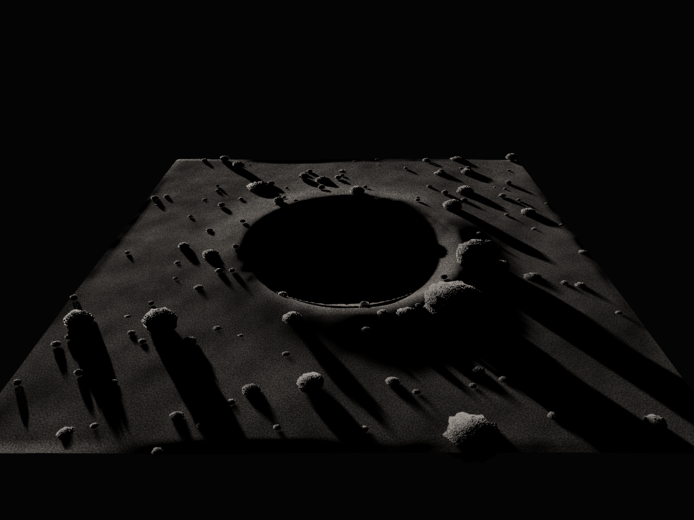
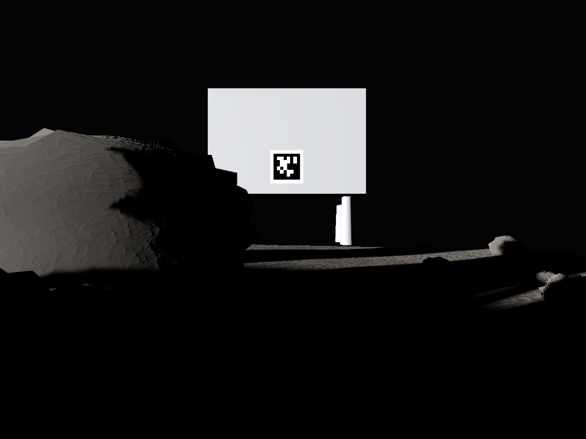
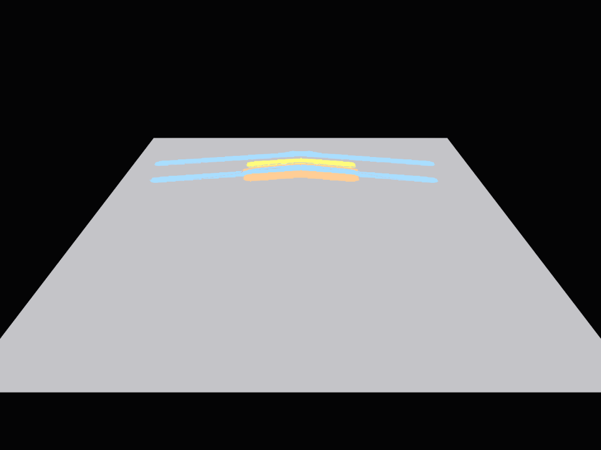
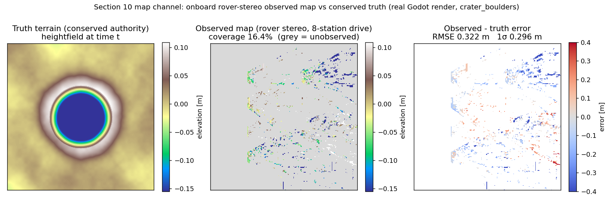
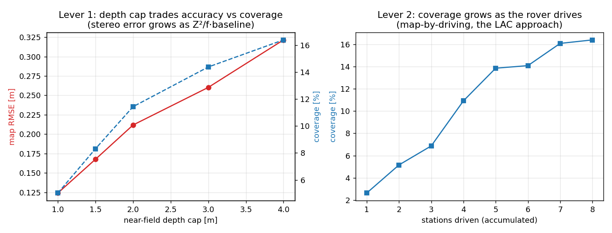
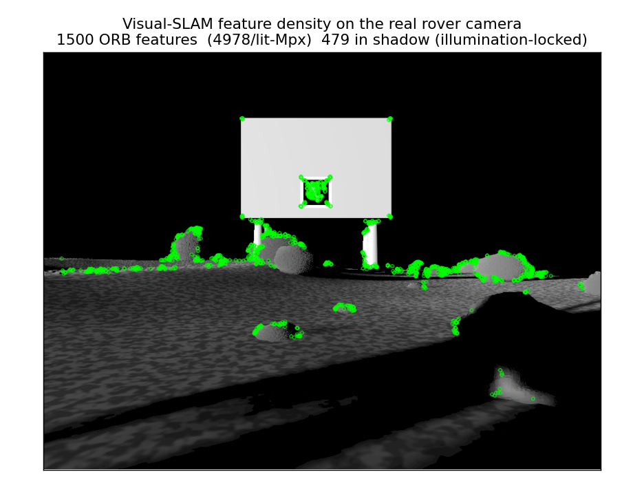
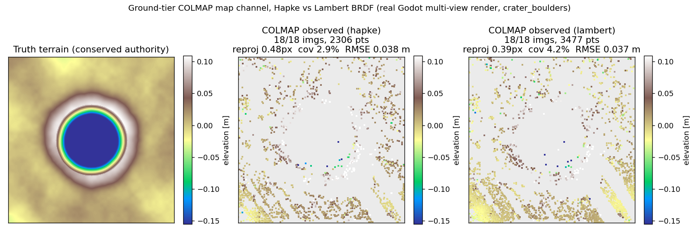

<!-- _paginate: false -->

# foss_ipex / dustgym
### Sensor-faithful lunar terramechanics and autonomy
**Update for NASA KSC GMRO, 2026-06-04**

John McCardle (author) · Aaron Storey (hosting and helping)

CC0. Independent Godot + Project Chrono + ROS2 stack; references the Lunar Autonomy Challenge as a benchmark, not the official entry.

---

## Where it stands

- **Conserved Tier-2 terramechanics authority** (numpy, sub-ms/step): mass-exact cut/fill, Bekker pressure-sinkage and the slip ladder are load-bearing, closed drive loop.
- **Autonomy:** Gymnasium RL envs + a planner; model-based search and search-distilled policies beat model-free RL on the exact cheap sim.
- **Render + sensor model:** Godot sidecar, Hapke photometry, the LAC 8-camera rig, AprilTag pose channel **closed at 12.7 mm / 7.15 deg**.
- **This update:** the Godot render track is now live on a GPU, and the section-10 map channel is closed with a real onboard producer.

---

## NEW: Godot render track live on the GPU

- Godot 4.6.3 headless on an RTX 3090 (Vulkan, forward+).
- Real `crater_boulders` scene: 143 clasts, 5 degree grazing sun, hard shadows.
- Hapke / Lommel-Seeliger BRDF (Sato 2014 LROC photometry), not Lambert.

---

## NEW: the sensor-bridge output (what perception consumes)

- The LAC 8-camera rig: front and rear stereo, side monos, two drum-arm cams.
- Rover's own drum in frame; AprilTag lander ahead = the pose-channel target.
- These are the literal `sensors.json` + PNG artifacts the ROS2 stack reads.

---

## NEW: state-field contract render (Seam 1, one scene)

- Gray undisturbed, blue wheel tracks, yellow excavated, orange spoil.
- The numpy authority writes `state_label`; the Godot shader samples it.
- Seam 1 (state fields) verified end to end on the GPU.

---

## NEW: section-10 map channel closed (onboard tier)

- Producer: rectified rover stereo (exact extrinsics) -> SGBM -> world heightfield -> `score_map` vs the conserved truth.
- Real render of `crater_boulders`, 8-station drive. No synthetic data.

---

## The honest perception result

- Passive rover stereo at ~0.15 m grazing eye-height: **~0.3 m (1 sigma) height precision**.
- Coverage grows **2.6 to 16.4 percent** as the rover drives (map-by-driving).
- The rover-scale scenes' ~0.05 m relief sits below that floor: it recovers the ground plane and coverage, not the cm micro-relief. This is the perception limit, and it motivates active sensing.

---

## Visual-SLAM readiness

- The render is feature-rich: ORB saturates, 6,600 to 11,000 features per lit megapixel.
- Features that land in shadow are illumination-locked (they move as the sun sweeps).
- So density is not the bottleneck; feature repeatability under sun motion is.

---

## Two perception tiers, both scored vs conserved truth

- **Onboard** rover stereo (cheap, real-time): RMSE **0.32 m**, 16 percent coverage over an 8-station drive.
- **Ground COLMAP** (offline, accurate): 18/18 images registered, RMSE **0.04 m**, 97 percent cell-pass, camera centers aligned to truth within **6 mm**. Sparse SfM here (~3 percent coverage); dense MVS would fill it.
- Only the simulator has the ground truth to score both. Mirrors how GMRO builds maps from the image corpus, now with a measurable error.

---

## Photorealism for SfM is the BRDF (Hapke vs Lambert)

- Physically-correct **Hapke** gives COLMAP **~33 percent fewer 3-D points and ~30 percent less coverage** than the idealized **Lambert** baseline, at higher reprojection error.
- The non-Lambertian regolith reflectance costs multi-view correspondences, exactly as on real lunar imagery. `--brdf lambert` is the built-in A/B, and only the sim can grade it against truth.

---

## Real now vs honestly deferred

- **Real:** conserved Tier-2 physics, closed loop, RL envs + planner, the Godot render track on GPU, the AprilTag pose channel, the onboard map-channel producer + scorer, and the **COLMAP ground tier scored against truth** (0.04 m, with the Hapke-vs-Lambert A/B).
- **Deferred (named, not hidden):**
  - Dense MVS for full coverage (sparse SfM today), and COLMAP on the rover's grazing ground-level moving-sequence (the harder, realistic capture).
  - Secondary illumination in shadows / PSR fill (shadows are near-black today).
  - Sensor model: read noise, motion blur, fitted lens distortion.
  - Live Chrono producer; slip-sinkage oracle calibration.

---

## Sources and lineage

- **IPEx** (ISRU Pilot Excavator), NASA KSC GMRO; **EZ-RASSOR** mesh (UCF/FSI, MIT license).
- **Lunar Autonomy Challenge** (JHU APL) as a scoring benchmark; independent stack here.
- **DS1 AutoNav** (Riedel/Bhaskaran, JPL) for the sense-estimate-replan autonomy pattern.
- Photometry: Hapke 1981/2002, Sato et al. 2014 (LROC global Hapke maps).
- LOLA Haworth south-pole DEM (PGDA); IPEx energy/battery from Schuler et al., ASCEND 2024 (NTRS 20240008162).
