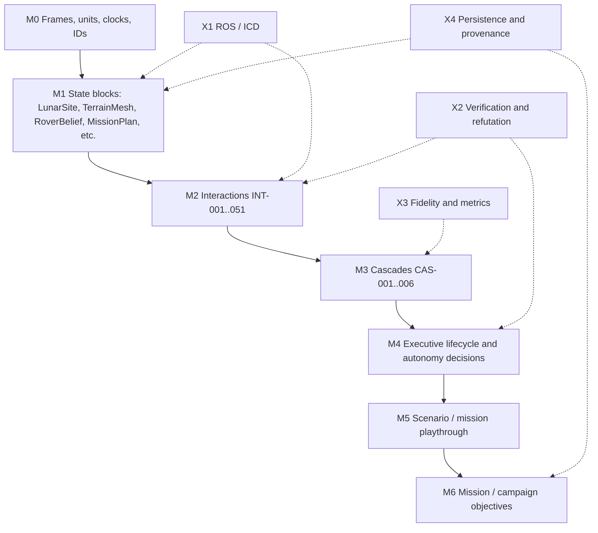

# STEWIE Layered Reference Architecture, Current Names

## 1. Purpose

This updates the earlier layered reference architecture to the names STEWIE actually uses today. The older
draft used placeholder volumes such as `LW-###` and `IPX-###`, placeholder frames such as `lunar_fixed` and
`site_local`, and target interaction IDs from the 60-entry spanning set. The current code and Graphify map
use a different live vocabulary:

- state blocks: `LunarSite`, `TerrainMesh`, `RegolithState`, `RoverBelief`, `MissionPlan`, and peers
- interactions: current implementation rows `INT-001` through `INT-051`
- cascades: `CAS-001` through `CAS-006`
- frames: `map`, `odom`, `base_link`, `imu_link`, and `camera_*`
- ROS topics: `/stewie/...`, `/cmd_vel`, `/tf`, `/tf_static`
- persistence: `TerrainMemory`, `TwinStore`, `TransactionLog`, `RuntimePacket`

The old architecture remains directionally correct, but this document is the one to use when checking where
STEWIE is right now.

## 2. Current Baseline

The Graphify map was regenerated from `docs/stewie_digital_twin_interaction_map_2026-06-28.md`.

| Item | Current value |
|---|---:|
| state blocks | 18 |
| interaction rows | 51 |
| Graphify nodes | 69 |
| Graphify directed hops | 102 |
| dangling endpoints | 0 |
| duplicate directed edges | 0 |
| collapsed directed edges | 0 |

Status of the 51 current interactions:

| Status | Count |
|---|---:|
| complete | 26 |
| partial | 10 |
| started | 9 |
| planned | 5 |
| sim_only | 1 |

The 60-entry Phase 1 spanning set is the right target taxonomy for a v2 committee-facing graph. The 51-row
current graph is the right implementation-status map.

## 3. Updated Architecture Map



This map keeps the earlier vertical logic but swaps in current STEWIE names. The `M*` names are used here to
avoid colliding with the existing digital-twin state layers `L0_orbital_base` through `L8_evaluation_truth`.

## 4. M0: Frames, Units, Clocks, IDs

### Current Frames

The active ROS/autonomy frame contract is in `stewie/bridge/autonomy_contract.py` and
`stewie/bridge/frames.py`.

| Frame | Current meaning | Status |
|---|---|---|
| `map` | global/local map frame for ROS topics | implemented in contract |
| `odom` | odometry frame in estimator chain | implemented in contract |
| `base_link` | rover body frame | implemented in contract |
| `imu_link` | IMU frame | implemented in contract |
| `camera_front_left` | front-left camera frame | implemented in contract |
| `camera_front_right` | front-right camera frame | implemented in contract |
| `camera_rear_left` | rear-left camera frame | implemented in contract |
| `camera_rear_right` | rear-right camera frame | implemented in contract |

The actual grid-to-ROS conversion is:

- grid `(row, col)` to REP-103: `x = col * cell_m`, `y = -row * cell_m`
- yaw is carried as planar quaternion `(0, 0, sin(yaw/2), cos(yaw/2))`
- conversion surface: `stewie.bridge.frames.grid_pose_to_rep103`

The older `lunar_fixed` and `site_local` names should be treated as target/reference terms, not current ROS
runtime names.

### Current Units

STEWIE is SI-first:

| Quantity | Current unit examples |
|---|---|
| distance and grid | `m`, `cell_m`, `heightmap`, `x_m`, `y_m` |
| orientation | `rad`, `yaw_rad`, `sun_azimuth_deg`, `sun_elevation_deg` |
| mass and density | `kg`, `mass_areal`, `density` |
| power and energy | `W`, `J`, `power_w`, `energy_J`, `soc_frac` |
| temperature | `K`, `C`, `surface_temp_k`, `sink_temp_c` |
| covariance | variance/covariance arrays in `dart.MeasurementFactor`; scalar `sigma_m` in current ROS message |

### Current Identifier Families

| Prefix / name | Current use |
|---|---|
| state block names | `LunarSite`, `Ephemeris`, `TerrainMesh`, `RegolithState`, etc. |
| `INT-###` | current directed interaction row |
| `CAS-###` | current ordered interaction path |
| `ExecutiveState` | mission lifecycle enum: `draft`, `analyzed`, `rehearsed`, `reviewed`, `released`, `armed`, `executing`, `holding`, `safed`, `completed`, `aborted`, `debriefed` |
| ROS node roles | `sensing`, `perception`, `localization`, `mapping`, `planning`, `control`, `vehicle_interface`, `diagnostics`, `mission_executive` |
| persistence records | `TerrainMemory`, `TwinStore`, `WorldTransaction`, `TransactionLog`, `RuntimePacket` |

## 5. M1: Current State Blocks And Variables

These are the 18 current Graphify state blocks. They replace the older `LW-###` and `IPX-###` node IDs.

| Block | Current variable names | Current source | Status |
|---|---|---|---|
| `LunarSite` | `site_id`, `lat_deg`, `lon_deg`, `dem_id`, `dem_origin_m`, `cell_m`, `body` | site DEM services, server DEM endpoints | complete for named sites |
| `Ephemeris` | `time_utc`, `time_delta_s`, `sun_azimuth_deg`, `sun_elevation_deg`, `solar_vector_world` | Godot sun, `/ephemeris`, sun sweep artifacts | started |
| `TerrainMesh` | `heightmap`, `slope_deg`, `normal_xyz`, `roughness`, `traversability`, `shadow_mask` | `ColumnState`, route maps, Godot render, `TerrainMemory` read-back | complete in sim |
| `RegolithState` | `mass_areal`, `density`, `cohesion_kpa`, `friction_angle_deg`, `bearing_strength_kpa`, `disturbance`, `ice_frac` | `stewie.physics.material`, `io_fields`, `ipex_specs` | partial |
| `ThermalEnvironment` | `sink_temp_c`, `surface_temp_k`, `heater_power_w`, `camera_operational` | `ipex_specs`, thermal model slots | started |
| `LightingModel` | `shadow_volume`, `scene_radiance`, `contrast`, `valid_disparity_fraction`, `exposure` | Godot, map channel, render products | started |
| `MutableTerrainLedger` | `events[]`, `ExcavationEvent.id`, `x`, `y`, `radius_m`, `dheight_m`, `t_s`, `robot_id`, `kind` | `WorldModel`, `TerrainMemory`, `TwinStore` adjacent paths | complete in code, not unified |
| `RoverPose` | `x_m`, `y_m`, `yaw_rad`, `row`, `col`, `frame_id`, `sequence_id` | `ros2_bridge.pose_to_odom`, RC contract | complete pure |
| `RoverBelief` | `x`, `y`, `pos_sigma_m`, `energy_J`, `energy_sigma_J`, `drum_kg`, `drum_sigma_kg`, `soc_frac`, `t_s` | `lode.autonomy.Belief` | complete in sim |
| `WheelDynamics` | `wheel_rate_rad_s`, `drive_torque_nm`, `slip`, `sinkage_m`, `drawbar_pull_n`, `entrapped` | `terramechanics`, `slip`, `drive` | complete in sim |
| `ExcavatorDrum` | `drum_speed_rpm`, `scoop_depth_m`, `torque_nm`, `current_a`, `fill_kg`, `regolith_per_cycle_kg` | `ipex_specs`, `rassor_mass_model` | partial |
| `ArticulationState` | `arm_front_pitch_rad`, `arm_back_pitch_rad`, `chassis_lift_m`, `camera_heights_m`, `posture_name` | `posture_kinematics`, `runtime_packet` | complete in sim |
| `CameraRig` | `camera_name`, `image`, `width`, `height`, `fx`, `fy`, `cx`, `cy`, `baseline_m`, `extrinsic_in_base_link` | sensor bridge contract, Godot egress | complete file seam |
| `PerceptionState` | `feature_count`, `disparity_confidence`, `height_uncertainty`, `factor_type`, `covariance` | `dart`, map channel, evidence ledger | partial |
| `MissionPlan` | `Mission`, `BuildOrder`, `PlanResult`, `trips`, `flows`, `per_trip`, `tl`, `totals`, `objective`, `algorithm` | `lode.mission_planner` | complete planner |
| `ExecutiveState` | `decision`, `reason`, `safe`, `safe_reason`, `cmd_vel`, `go_to`, `replan_required` | ROS bridge, mission executive, `stewie_msgs` | partial |
| `PowerThermalState` | `voltage_v`, `current_a`, `power_w`, `soc_frac`, `thermal_w` | `runtime_packet.power_channel`, battery model | started |
| `SurveyedMonuments` | `apriltag_id`, `tag_size_m`, `pose_in_lander`, `frame_id`, `map` | sensor bridge, lander/tag fixtures, frame registry target | started/partial |

## 6. M2: Current Interaction Layer

The current interaction layer is the 51-row implementation graph. It is not the full 60-entry target
taxonomy yet.

| Family in current map | Current edges | What they cover |
|---|---|---|
| site and environment | `INT-001`, `INT-002`, `INT-003`, `INT-004`, `INT-049` | DEM, sun, PSR/low light, terrain shadows, PSR power/thermal |
| mobility and terramechanics | `INT-005`, `INT-006`, `INT-007`, `INT-009`, `INT-015` | slope/slip, weak regolith, payload load, odometry drift, compaction |
| excavation and terrain mutation | `INT-012`, `INT-013`, `INT-014`, `INT-016`, `INT-018`, `INT-019`, `INT-039`, `INT-040`, `INT-046`, `INT-047` | cut/fill, event log, terrain read-back, protected zones, volatile slots |
| planning, power, and executive | `INT-020`, `INT-021`, `INT-041`, `INT-043`, `INT-045` | plan optimization, reserve policy, learned energy gap, operator/safe, watchdog |
| observation and factors | `INT-024`, `INT-025`, `INT-026`, `INT-027`, `INT-028`, `INT-029`, `INT-031`, `INT-032`, `INT-033`, `INT-034`, `INT-035`, `INT-036`, `INT-038`, `INT-051` | stereo, DEM factors, AprilTags, parallax, shadow yaw, loop closure, evidence gates |
| articulation and frames | `INT-030`, `INT-050` | posture/camera extrinsics, frame registry |
| hazards and semantics | `INT-010`, `INT-011`, `INT-037`, `INT-042` | obstacles, negative obstacles, uncertainty gates, rock classes |
| dust | `INT-048` | currently only regolith disturbance to camera degradation |

Rows not yet well-covered compared with the 60-entry target set:

- `DustDynamics` as its own state block
- `Communication`
- `MultiAgentCoordination`
- `HealthMonitoring`
- `FaultDetection`
- `ResourceModeling`
- `PredictionModels`
- `DigitalTwinSync`
- `PersistenceWorldState`

## 7. M3: Current Cascade Layer

The older CAS examples from the 60-entry set do not match the current IDs. Current cascades are:

| Cascade | Current path | Status | Meaning |
|---|---|---|---|
| `CAS-001 slip_to_replan` | `INT-006 -> INT-005 -> INT-009 -> INT-037 -> INT-020` | complete in sim | weak regolith raises slip, belief uncertainty, and replanning pressure |
| `CAS-002 excavation_mutates_shadow` | `INT-012 -> INT-013 -> INT-016 -> INT-017 -> INT-025` | started | digging changes terrain, which changes rendered/observed shadow quality |
| `CAS-003 articulation_parallax_fix` | `INT-030 -> INT-031 -> INT-032` | planned | posture change creates a local position cue, but accepted producer is needed |
| `CAS-004 dem_anchor_loop` | `INT-024 -> INT-026 -> INT-027 -> INT-037` | planned | stereo/depth becomes a DEM fix and lowers uncertainty |
| `CAS-005 build_plan_to_world_event` | `INT-019 -> INT-020 -> INT-012 -> INT-013 -> INT-016 -> INT-046` | partial | plan executes into terrain events, then routes update over changed terrain |
| `CAS-006 safety_timeout` | `INT-008 -> INT-044 -> INT-045 -> INT-043` | complete pure, live gated | command stream must publish odom and safe on timeout |

The 60-entry target cascades are still useful, but they should be imported into a v2 graph after adding the
missing state blocks for dust, communication, multi-agent coordination, and sync.

## 8. M4: Current Executive And Autonomy Layer

The current product state machine is not the simple `MODE-010..060` set from the older design. The actual
mission executive states are:

```text
draft -> analyzed -> rehearsed -> reviewed -> released -> armed -> executing
  -> holding | safed | completed | aborted -> debriefed
```

Current sources:

- `stewie.contracts.executive.ExecutiveState`
- `stewie.contracts.executive.MissionExecutive`
- `lode.executive.executive_step`
- `lode.sim_execution.run_sim_execution`

Current decision vocabulary from `lode.executive`:

| Decision action | Meaning |
|---|---|
| `fail_safe` | safety-critical fault, transition toward safe state |
| `pause` | command not acknowledged, plan not accepted, or reservation conflict |
| `relocalize` | covariance not acceptable |
| `replan_global` | global route or planner recovery needed |
| `reverse` | blockage recovery |
| `persist` | expected slope/slip slowdown, continue deliberately |
| `replan_local` | local detour |
| `continue` | nominal |

Current ROS message surface:

| Message | Current fields |
|---|---|
| `ExecutiveDecision.msg` | `decision`, `reason` |
| `SafeState.msg` | `safe`, `reason`, `detail` |
| `WorkGoal.msg` | `action`, `kind`, `x`, `y`, `footprint_m2`, `depth_m` |

Where we are:

- pure state machine exists and is tested
- SIM execution exists and is tested
- live ROS/pit execution is not product-complete
- route, persistence, and HMI wiring around `run_sim_execution` remain the next integration step

## 9. M5: Scenario Layer, Current Names

Current scenario records should be expressed as mission playthroughs over real STEWIE surfaces:

| Scenario | Current STEWIE expression | Edges exercised | Status |
|---|---|---|---|
| `SCN-001 as_built_flatten_then_replan` | plan mission, record terrain memory, plan another mission against remembered terrain | `INT-019`, `INT-020`, `INT-012`, `INT-013`, `INT-016`, `INT-046` | partially wired |
| `SCN-002 soft_soil_slip_replan` | weak regolith increases slip and belief uncertainty, planner responds | `INT-006`, `INT-005`, `INT-009`, `INT-037`, `INT-020` | complete in sim |
| `SCN-003 shadow_nav_degradation` | lighting and terrain shadows reduce stereo confidence and require covariance propagation | `INT-002`, `INT-004`, `INT-025`, `INT-033`, `INT-034` | started |
| `SCN-004 articulation_parallax_fix` | posture change produces a parallax factor for localization | `INT-030`, `INT-031`, `INT-032` | planned |
| `SCN-005 sim_execute_safety_timeout` | command/odom/watchdog path safes on timeout | `INT-008`, `INT-044`, `INT-045`, `INT-043` | pure complete, live gated |

The older scenarios involving relay passes, comm-loss crater descent, and multi-agent dust are v2 targets,
not current graph coverage.

## 10. M6: Mission And ConOps Layer

Current STEWIE mission objects are:

- `Mission`
- `BuildOrder`
- `PlanResult`
- `plan_ir`
- timeline `tl`
- trips and flows
- acceptance and endurance reports

Current mission lifecycle is split:

1. author mission inputs
2. compute deterministic `PlanResult`
3. generate report, timeline, and Plan IR as views over that result
4. optionally rehearse/SIM-execute
5. optionally record terrain memory
6. use as-built read-back in later planning

The mission-level gap is that steps 4 and 5 are not yet forced through `TransactionLog` as one product
runtime path.

## 11. X1: Current Interface Control

Current ROS/autonomy contract topics from `stewie.bridge.autonomy_contract`:

| Bound block or edge | Current topic | Message type | QoS class | Current status |
|---|---|---|---|---|
| `RoverPose`, sensing | `/stewie/wheel_odom` | `nav_msgs/Odometry` | sensor | contract |
| `RoverPose`, localization | `/stewie/odom` | `nav_msgs/Odometry` | default | pure bridge implemented |
| `CameraRig` | `/stewie/camera/front_left/image` | `sensor_msgs/Image` | sensor | contract |
| `CameraRig` | `/stewie/camera/front_right/image` | `sensor_msgs/Image` | sensor | contract |
| `PerceptionState` | `/stewie/perception/points` | `sensor_msgs/PointCloud2` | sensor | contract |
| `PerceptionState` | `/stewie/perception/rocks` | `stewie_msgs/RockArray` | default | message exists |
| `RoverBelief` / nav factors | `/stewie/nav/factors` | `stewie_msgs/NavFactorArray` | default | message too narrow |
| `TerrainMesh` | `/stewie/map/dem` | `grid_map_msgs/GridMap` | state | contract |
| `TerrainMesh` | `/stewie/map/occupancy` | `nav_msgs/OccupancyGrid` | state | contract |
| `MissionPlan` | `/stewie/plan/path` | `nav_msgs/Path` | default | plan lowering implemented |
| `MissionPlan` | `/stewie/plan/local_traj` | `stewie_msgs/Trajectory` | default | contract |
| `MissionPlan -> ExecutiveState` | `/stewie/plan/action_goal` | `stewie_msgs/WorkGoal` | command | plan lowering implemented |
| `ExecutiveState -> WheelDynamics` | `/cmd_vel` | `geometry_msgs/Twist` | command | pure bridge implemented |
| `ExecutiveState` | `/stewie/exec/decision` | `stewie_msgs/ExecutiveDecision` | default | message exists |
| safety | `/stewie/safe_state` | `stewie_msgs/SafeState` | state | message exists |
| frames | `/tf`, `/tf_static` | `tf2_msgs/TFMessage` | default/state | contract |

Critical mismatch:

- Python factor contract: `MeasurementFactor` has `factor_type`, `keyframe`, `value`, `covariance`, `frame`,
  `source`, `evidence_class`, `accepted`, `refusal_reason`, and `metadata`.
- ROS factor message: `NavFactor.msg` currently has only `kind`, `x`, `y`, and `sigma_m`.

That mismatch is one of the most important wiring gaps.

## 12. X2: Verification And Refutation, Current Tests

Current test-backed surfaces:

| Target | Current test surface | What it verifies |
|---|---|---|
| Graphify map | `scripts/export_stewie_interaction_graph.py`, `graphify diagnose` | all interaction rows retained, no collapsed directed edges |
| frame contract | `stewie/bridge/test_frames.py`, `test_ros2_bridge.py` | grid/REP-103 mapping, odom shape |
| autonomy contract | `stewie/bridge/test_autonomy_contract.py` | required roles/topics, truth-denial, command QoS |
| mission executive | `stewie/contracts/test_executive.py`, `lode/test_sim_execution.py` | legal lifecycle, SIM run, safing |
| terrain memory | `stewie/twin/test_terrain_memory.py`, `lode/test_terrain_delta.py` | as-built terrain deltas and memory |
| observed twin | `stewie/twin/test_versioned.py`, `stewie/twin/test_backup.py` | journaling, hash chain, undo, restore |
| transaction envelope | `stewie/twin/test_envelope.py` | linked world transaction and restore |
| factor model | `dart/test_factors.py` | typed factor validation and claim gates |

Missing verification:

- live ROS container command/odom/watchdog transaction run
- covariance-rich ROS `NavFactorArray` round trip
- truth-free `dem_xy` factor producer
- truth-free `parallax_xy` factor producer
- dust, comms, and multi-agent v2 interaction families

## 13. X3: Fidelity And Metrics, Current Names

Current metric names and artifacts should be tied to these variables:

| Metric target | Current variable or artifact | Status |
|---|---|---|
| terrain conservation | `mass_areal`, `density`, `datum`, `drum_inventory`, `authority_sha` | implemented |
| as-built delta | `TerrainMemory.cumulative_delta`, `net_volume_m3`, `max_cut_m`, `max_fill_m` | implemented |
| pose belief | `RoverBelief.pos_sigma_m`, `x`, `y`, `t_s` | complete in sim |
| energy belief | `energy_J`, `energy_sigma_J`, `soc_frac` | complete in sim |
| stereo confidence | `disparity_confidence`, `valid_disparity_fraction`, `height_uncertainty` | partial |
| factor evidence | `factor_type`, `covariance`, `evidence_class`, `accepted`, `refusal_reason` | Python contract complete, ROS transport partial |
| executive state | `ExecutiveState`, `decision`, `reason`, `safe`, `safe_reason` | pure complete, live partial |
| world transaction | `world_sha`, `chain_hash`, `twin_version`, `twin_hash`, `plan_id`, `belief` | library complete, runtime integration partial |

## 14. X4: Persistence And Provenance, Current Names

| Artifact | Current role | Status |
|---|---|---|
| `TerrainMemory` | per-site accumulated physical terrain delta, hash-chained chain records | implemented and used in `/plan` read-back |
| `TwinStore` | observed terrain patch log with provenance and undo-as-event | implemented |
| `TransactionLog` | DT-01 world-state transaction envelope | implemented as library, not mandatory runtime path |
| `WorldTransaction` | one linked snapshot of authority, twin, plan, belief, mission/site/body/time/provenance | implemented |
| `RuntimePacket` | canonical single-clock sensor packet | implemented |
| `SessionRecord` | session/stream record family | present in bridge/session surfaces |

Current gap:

`TerrainMemory`, `TwinStore`, `PlanResult`, `Belief`, runtime packets, and executive events can still be read
or written independently. The next architecture step is a route-level `WorldStateService` that makes
`TransactionLog.commit(...)` mandatory for meaningful state changes.

## 15. Old Name To Current Name Crosswalk

| Older design term | Current STEWIE name |
|---|---|
| `LW-030 RegolithState` | `RegolithState` |
| `IPX-110 WheelDynamics` | `WheelDynamics` |
| `Lunar World Model` | world-owned blocks: `LunarSite`, `Ephemeris`, `TerrainMesh`, `RegolithState`, `ThermalEnvironment`, `LightingModel`, `MutableTerrainLedger`, `SurveyedMonuments` |
| `IPEx Digital Twin` | robot/planner blocks: `RoverPose`, `RoverBelief`, `WheelDynamics`, `ExcavatorDrum`, `ArticulationState`, `CameraRig`, `PerceptionState`, `MissionPlan`, `ExecutiveState`, `PowerThermalState` |
| `lunar_fixed` | target global reference only; current ROS contract uses `map` |
| `site_local` | current grid/order-frame plus `map`; not a ROS frame name today |
| `cam_0..cam_5` | current contract names `camera_front_left`, `camera_front_right`, `camera_rear_left`, `camera_rear_right`; six-camera full naming remains a v2 expansion |
| `MODE-010..060` | `ExecutiveState` lifecycle plus `lode.executive` action vocabulary |
| target `INT-010`, `INT-030`, etc. | current implementation `INT-001..051`; v2 should add `legacy_current_id` rather than renumber in place |
| `PersistenceWorldState` | currently split across `TerrainMemory`, `TwinStore`, and `TransactionLog` |
| `DigitalTwinSync` | not yet a first-class state block; represented partly by `TransactionLog` and runtime bridge code |

## 16. Exactly Where STEWIE Is

Current claim:

STEWIE has a real conserved construction world model, an as-built terrain memory path feeding later planning,
a durable observed-twin journal, a tested DT transaction-envelope library, a pure ROS command/odom bridge, a
plan-lowering contract, typed Python navigation factors, and SIM-level executive execution.

Current not-yet:

- one mandatory `WorldStateService` product path
- composed `CurrentTerrainView` using base DEM, `TerrainMemory`, `TwinStore`, uncertainty, and provenance
- live ROS/pit execution end to end
- covariance-rich ROS `NavFactorArray`
- accepted truth-free `dem_xy` and `parallax_xy` producers
- first-class graph coverage for dust, communication, multi-agent coordination, health/fault monitoring, and
  digital-twin synchronization

## 17. Build Order From Here

1. Add `WorldStateService` and make plan, terrain record, resync, sim execution, belief update, and factor
   ledger update commit `WorldTransaction` records.
2. Define `CurrentTerrainView` and make `/plan` read that view instead of `TerrainMemory` alone.
3. Wire released plan to SIM execution to terrain memory to transaction log to cockpit/SSE.
4. Upgrade `stewie_msgs/NavFactor` and `NavFactorArray` to match `dart.MeasurementFactor`.
5. Build accepted `dem_xy` and `parallax_xy` producers with covariance and refusal paths.
6. Create interaction graph v2 from the 60-entry taxonomy, keeping `legacy_current_id` links to this current
   51-row implementation graph.
7. Add planned rows or minimal runtime seams for `DustDynamics`, `Communication`, `MultiAgentCoordination`,
   `HealthMonitoring`, `FaultDetection`, `PredictionModels`, `ResourceModeling`, `DigitalTwinSync`, and
   `PersistenceWorldState`.

## 18. Verification

Current checks run for this update:

```bash
python3 scripts/export_stewie_interaction_graph.py
graphify diagnose multigraph --graph graphify-out/graph.json --json
```

Result: Graphify retained 69 nodes and 102 directed hops, with zero dangling endpoints and zero collapsed
directed edges.
